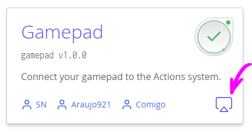

# Making your own ct.js modules: directory structure and manifest

Ct.js is moddable, and the process of making new modules is pretty easy! Modules, or catmods, can put new code into ct.js framework, hack on built-in events and procedures, add new project settings and editable fields for game assets.

Any module is a directory with `module.json` file inside and any additional files needed for your module to work.

:::warn
The name of the directory itself is the codename of your module. For example, if you look into ct.js folder/data/ct.libs, you will see that the codename of ct.place library is just `place`.

The name should be unique, should have lowercase latin letters and (optionally) dots in it, and must not contain underscores and other special characters, like quotes and commas.

There is also a list of reserved names:

* `core`
* names of the core ct.js library's objects: `templates`, `actions`, `rooms`, `inputs`, etc.
:::

Ct.js detects a following module structure, placed at `ct.js/data/ct.libs`:

```
mycatmod
  |
  |  (Core files)
  |-- index.js
  |-- module.json (required)
  |
  |  (Docs shown in the expanding panel on the right)
  |-- README.md
  |-- docs
      \-- (any number of .md docs)
  |-- CHANGELOG.md
  |-- LICENSE (plain text, strongly recommended)
  |-- types.d.ts (TypeScript declarations for in-editor code completions and type checks)
  |
  |-- includes
  |   \-- (files to be copied to a resulting game)
  |
  \-- injections
      \-- (injections go here)
```
(more about injections [here](./events-and-injections.html))

* `module.json` allows your module to be discoverable by ct.IDE, and contains basic info, list of authors and description of module settings. It is the only file that is required.

* `index.js` usually represents the main code of your module, and is bundled with all the remaining code of compiled game. A rule of thumb is to pack all your dependencies in one file. If your dependency is an another ct module, you can list this module as such in `module.json`. (See below for examples.) This file supports [templating](./events-and-injections.html#templating).

* `README.md` is a markdown file with general info, examples, special notes, etc. If present, it makes the module's header clickable in the panel with all the modules' docs.

* `CHANGELOG.md` should contain a history of changes, if any.

## Structure of `module.json`

`module.json` is the only required file for your modules. Its minimal version has the following format:

```json
{
    "main": {
        "name": "Module's name",
        "tagline": "A short description of a module",
        "version": "1.0.0",
        "authors": [{
            "name": "Cosmo Myzrail Gorynych",
            "mail": "admin@nersta.ru"
        }, {
            ...
        }]
    }
}
```

### Listing dependencies

Currently, catmods may express their dependency in other module with fields `dependencies` and `optionalDependencies` inside `module.json`. It allows ct.IDE to warn users about missing (disabled) modules. Please write info about getting custom modules in the "readme" section.

```json {9,10}
{
    "main": {
        "name": "An example module json with dependencies",
        "tagline": "Add dependencies to your modules!",
        "version": "1.0.0",
        "authors": [
            ...
        ]
    },
    "dependencies": ["tween"],
    "optionalDependencies": ["place"]
}
```

## Specifying a category

Modules can specify one or two categories in module.json so that they can be filtered on the project's settings page. Categories are written in an array under the `main.categories` key, and can be one of these strings:

* `customization`;
* `desktop` — modules for desktop builds;
* `fx`;
* `inputs` — modules that provide new input methods for the Actions system;
* `integrations`;
* `media`;
* `misc`;
* `mobile`;
* `motionPlanning`;
* `networking`;
* `tweaks`;
* `utilities`;

The first category is also used to create an icon in the bottom-right corner of a module's card:



**An example from `ct.flow` module:**

```json {10,11,12}
{
    "main": {
        "name": "Flow control and timing",
        "tagline": "Add high-level methods for asynchronous events, e.g. gate, cumulative delay, retriggerable delay.",
        "version": "0.0.0",
        "authors": [{
            "name": "Cosmo Myzrail Gorynych",
            "mail": "admin@nersta.ru"
        }],
        "categories": [
            "utilities"
        ]
    }
}
```

## Writing a mod

Depending on your needs, you will probably need to:

* Write your core logic in `index.js` file;
* [Inject custom code](./events-and-injections.html) into ct.js' events and procedures;
* [Add settings to your module](./events-and-injections.html) editable from ct.IDE and read them back though injections;
* [Add new editable fields](./events-and-injections.html) for templates and other few asset types;
* [Implement new input methods](./input-methods.html) to integrate them into [Actions system](./../actions.html);
* [Create new events for templates and rooms](./modded-events); 
* [Add typings](./typings-and-intellisense.html) for smart autocompletion and type checks.

Follow the links to find the examples and references on further implementation.
