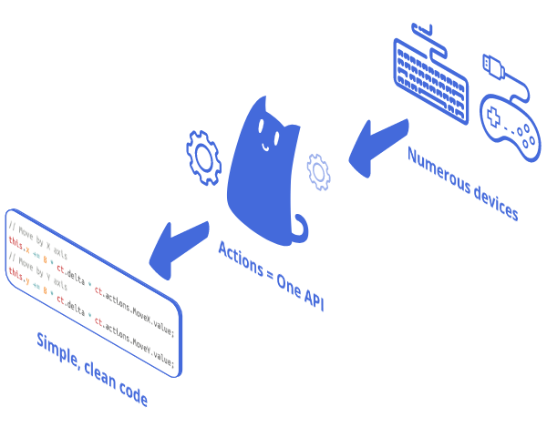

# Ações

Ações são uma camada de abstração sobre vários métodos de entrada que permite que você escreva um único código para vários dispositivos, seja ele um teclado, mouse, gamepad, controle virtual ou qualquer outra coisa que possa ser conectado ao ct.js. A vantagem é que uma ação não reage apenas a vários dispositivos de uma vez, mas, por exemplo, a vários botões de um dispositivo também. Por exemplo, você pode simultaneamente reagir as teclas WASD e as setas direcionais do teclado, e o código será como se você estivesse ouvindo por uma única coisa (e menos ainda). Se o controle de gamepad é adicionado lá, então uma grande quantidade do seu código não mudará.

Para a ação funcionar, você precisa conectar um módulo particular: provedores de métodos de entrada. As próprias ações são descritas na aba "Settings", atrás do botão "Actions and input methods". Ct.js vem com um número de provedores de entrada padrão: `ct.mouse` que rastreia clicks do mouse e `ct.keyboard` para o pressionamento de teclas.

Todos esses módulos devem estar habilitados por padrão para todos os projetos novos. Se não estiver, ative `ct.mouse` e `ct.keyboard` na aba "Catmods". Outros provedores de entrada são marcados com um ícone mágico:

## Criando novas ações

To create a new action, go to the "Settings" tab, and then click on the "Actions and input methods" button. A full-screen panel appears in which the actions themselves are specified in the left column, and input methods in the right column.

Click the "Add Action" button. For example, we will describe the standard and, perhaps, the most important feature in any game ­– "Movement". If you have a platformer, then you need only horizontal movement. If not, then you may need vertical movement, too. Define these actions `MoveX` and `MoveY` to move horizontally and vertically, respectively.

Add the first input method to the horizontal movement with the corresponding button. In the form that appears, locate the button `A` (you can enter it in the search bar), and then click "Select". Do the same for the `D`, `ArrowLeft` and `ArrowRight` buttons. It should look like this:

But wait, `A` and `D` point to different directions! How does the code understand where to move the game character? The fact is that in the code, actions take values ​​from -1 to 1, and by using negative numbers we can show that we need to go, say, to the left, and by using positive ones - to the right. This is done using the **multipliers** column. If you specify the multiplier -1 to the `A` button, then when you press it, the action will return the value -1, and if `D` is left at 1, then if you press `D`, it will be 1.

In ct.js, the `X` value grows from left to right, and the `Y` value changes from top to bottom. If you do not rotate the camera, and if you have a QWERTY keyboard, then `A` will lead to the left — against the movement of the `X` coordinate —, and `D` will point to the right along with the movement of the `X` coordinate. Therefore, we will assign `A` a -1 multiplier, as well to the left arrow.

Having added one more `MoveY` action, write -1 to `ArrowUp` and `W` buttons.

If we were defining an elementary action (for instance, a jump), then we would not need multipliers. If we would be using gamepad joysticks, then a multiplier could be needed in case the game character moved in the wrong direction.

## Examples

**A typical starting setup for a platformer**

**A typical setup for a top-down shooter**

