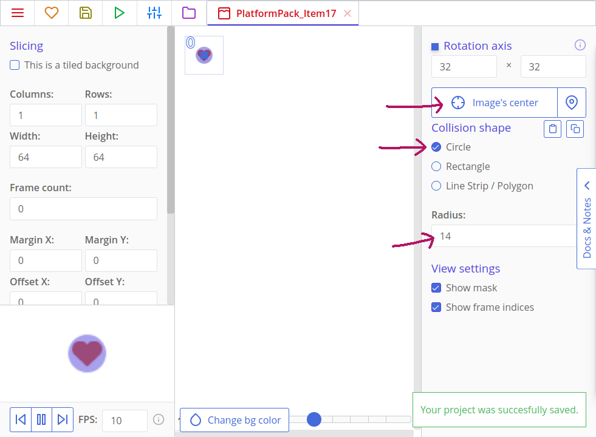
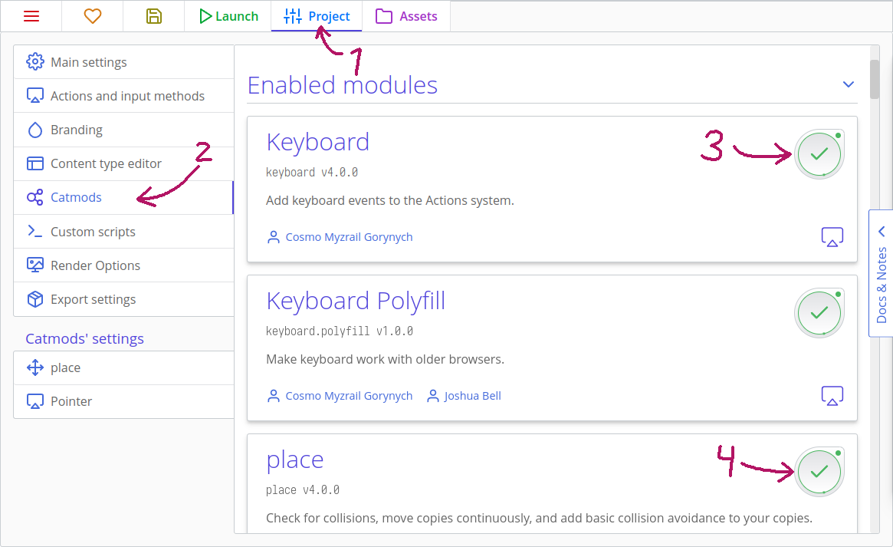
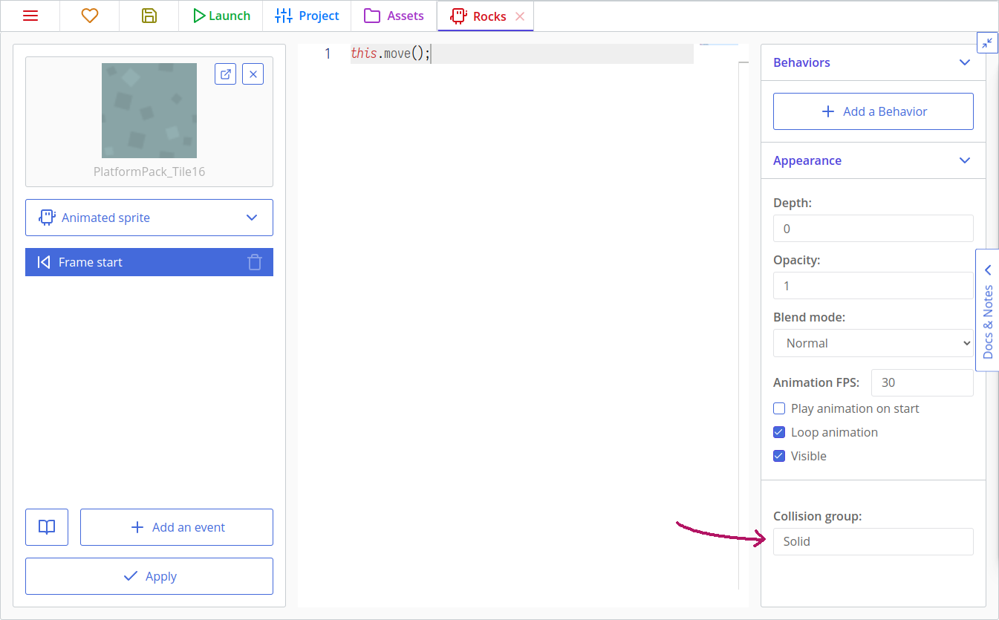
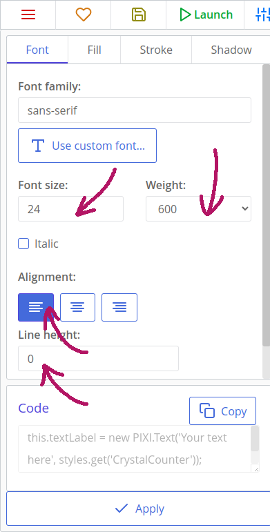
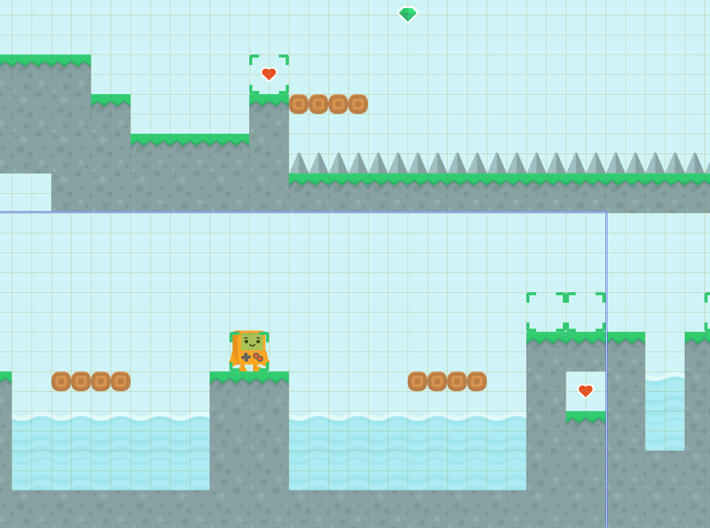
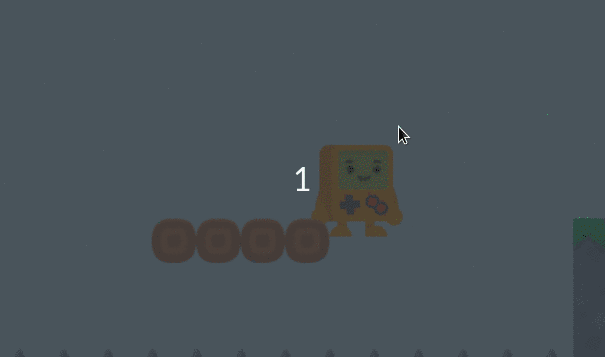

# Criando Jogos: Plataforma

Nesse tutorial criaremos um pequeno jogo de plataforma com diamantes, pontos de salvamento, plataformas que se movem e armadilhas! Você aprenderá como detectar colisões, e usar a mesma para criar uma visão de movimento lateral, além de manipular sprites e mover o jogador entre os níveis.


Aqui o que faremos:

[[toc]]

## Criando um Projeto

Abra o ct.js e entre com o nome do seu projeto no campo inferior da janela inicial. Vamos chamá-lo de "Platformer". Em seguida click no botão "Create" e escolha a pasta onde o ct.js o armazenará , por exemplo, dentro da sua pasta "Documents".


## Importando Texturas

Nós precisaremos de alguns assets que podem ser encontrados em [pacote simplificado de plataforma por Kenney](https://www.kenney.nl/assets/simplified-platformer-pack). Os assets já estão empacotados com o ct.js e são nomeados corretamente; Você pode encontrá-los na pasta `ctjs/examples/Platformer_assets/`.


Abra a aba "Textures", e pressione o botão "Import", navegue até a pasta `ctjs/examples/Platformer_assets/` e selecione todas as imagens. Elas aparecerão no painel de texturas.

A primeira coisa que nós precisamos notar é que a animação `Robot_Walking` é representada apenas por uma única imagem e, não com dois frames separados. Click no asset `Robot_Walking`.


A imagem é uma pequena faixa horizontal. Ela tem uma linha e duas colunas. Então podemos dizer ao ct.js para dividir a imagem especificando os campos `Columns`, `Rows` e ajustando o campo `Width`.

A imagem inteira tem 192 pixels, então um frame será 192 : 2 = 96 pixels. Então cada frame do robô agora deve ser de 96 pixels.


Vamos agora editar a máscara de colisão. Ela determina qual área de uma imagem deve ser tratada como sólida e qual não é, a máscara é mostrada em forma de um retângulo amarelo sobre o sprite.

Primeiramente, vamos mudar os eixos para o ponto médio do lado inferior.

::: tip Explicação
Como temos uma imagem de 96x96, nós precisamos de 48pixel na horizontal e de 96 na vertical. Os pixels são calculados do canto superior esquerdo, sendo o primeiro valor do ponto, um valor que representa a componente horizontal, X, e a segunda sendo a componente vertical, Y.
:::

O robô tem um formato retangular, então ele pode ser marcado como `Rectangle`. Tenha certeza de escolher essa opção, em seguida click no botão 'Fill' e por fim ajuste as dimensões para cobrir o corpo do robô com o retângulo amarelo representando a máscara de colisão.


Você pode cobrir tanto as mãos como o corpo do robô ou apenas cobrir o corpo.

Click no botão no "Save" no canto esquerdo inferior.

Precisamos agora definir a máscara de colisão para o `Robot_Idle` e `Robot_Jump`. Esteja certo de que você mudou os eixos para 48x96 e que ajustou as máscaras de colisão deles também.

::: tip Dica
É uma boa fazer com que a máscara de colisão seja a mesma para os três sprites, assim o robô não ficará surfando quando alternar entre as animações por causa das máscaras de colisão estarem diferentes.
:::

Agora vamos definir a máscara de colisão para os nossos cristais e para o coração bônus. Esses podem ser definidos como um círculo. Abra o `GreenCrystal` e, defina a sua máscara de colisão como um "Circle", então click no botão chamado "Image's center" para que os eixos se ajustem de forma automática para os valores necessários, e em seguida ajuste o raio da máscara de colisão.

Faça o mesmo para o asset `Heart`.




O último asset que precisamos modificar é o `Spikes`. Não precisamos mudar os seus eixos, porque senão ficariam desalinhados no mapa, mas ainda precisamos definir a sua máscara de colisão. Defina o lado superior com um valor negativo para que a parte superior não seja preenchida com o amarelo da máscara de colisão.


Salve o seu asset. Se você observar as outras texturas, você verá que todas elas têm uma forma retangular que preenche toda a imagem. Portanto vamos deixar as mesmas do jeito que estão por enquanto.

## Criando o Personagem Robô e o Chão

Abra a aba "Templates" e crie um novo template(modelo). Chame-o de "Robot", defina o sprite para `Robot_Idle`, e o salve.


::: tip Dica
Os templates(modelos) são usados para criar copies. Nós preenchemos nossos níveis (frequentemente chamadas de rooms em ct.js) com copies, e eles são as coisas que interagem uma com as outras na tela, mas cada copy foi criada a partir de um certo template(modelo).
:::

Crie templates adicionais do mesmo modo:

* Rocks;
* Rocks_Top;
* Rocks_Platform.

### Adicionando uma Room

Click na aba "Rooms" na parte superior da janela do ct.js e crie uma nova room. Chame essa room de "Level_01". Defina o seu tamanho para 1024x576.


Em seguida desenhe o nível clicando em um template à esquerda e com o seu mouse click na grande área a direita. Segure o `Shift` para adicionar várias copies de uma só vez. Não esqueça o nosso robô!

Você pode expandir o seu nível em qualquer direção, e as copies não precisam está dentro do quadro azul. Esse quadro é definido pelas dimensões `View width` e `View height` localizadas no canto superior esquerdo, e serve apenas para determinar a parte visível inicial do seu nível.

Aqui está um nível básico, você é livre para desenhar o seu, até porque o nosso objetivo nesse momento é o de ensinar a movimentar, pular e coletar itens. Por enquanto faça algo assim, bem simples, porque depois vamos adicionar alguns cristais e como mudar para uma outra room.


Vamos adicionar uma imagem de plano de fundo. Click na aba "Backgrounds" no lado esquerdo e em seguida click em "Add" e escolha o asset `BG`. Agora click na engrenagem em nosso plano de fundo e altere `Depth` para `-10`. Dessa forma diremos ao ct.js que o nosso plano de fundo deve ser desenhado 10 camadas abaixo da camada padrão, que é a camada 0 (zero).


Se salvarmos o nosso projeto agora e clicarmos no botão "Launch" localizado na parte superior da janela do ct.js, seremos capazes de vermos parte do nosso nível na janela de debugger. Não existe nenhuma interação, mas já é um bom começo!


::: tip Dica
O seu background(plano de fundo) está dividido em quadrados? Veja [Soluções de problemas: Minha imagem de fundo está didivida em quadrados!](./troubleshooting-teared-background.md)
:::

### Adicionando Módulos para Teclado(Keyboard) e Colisões

Precisaremos monitorar eventos de teclado e detectar as colisões entre o Robô e o chão. Para ter esse poder, precisaremos do Catmods! Click na aba "Project" e depois na aba "Catmods" à esquerda. Click no módulo keyboard na seção de módulos disponíveis que tem uma caixa de selação verde e um pequeno círculo giraório em torno dele. Talvez esse módulo já esteja habilitado, faça o mesmo com o módulo `place`.



::: tip DICA TOP ✨
Habilite o módulo chamado `fittoscreen`, em seguida click na aba "settings" e habilite a opção chamada "Fast scale with letterboxing" para um modo tela cheia.
:::

Cada módulo tem a sua própria documentação na aba "Reference". Destacaremos algumas de suas partes depois.

### Adicionando Actions (Ações) para Eventos de Keyboard (Teclado)

Ações permite monitorar eventos de teclado, mouse, gamepad e etc. Você pode lê mais sobre elas [aqui](./actions.md). Com elas, nós criamos monitoramento para as teclas WASD e para as setas de navegação.

Click na aba "Projects" localizada na parte superior da janela do ct.js, em seguida click na aba "Actions and input methods" localizada à esquerda.

Então crie um esquema de entrada como na imagem abaixo. Para fazer isso, primeiro click no botão "Add an action", dê um nome pra ela, e então adicione um método de entrada na coluna da direita. Você pode usar o campo de pesquisa para encontrar o método de entrada que você precisa e assim agilizar o processo.


::: tip Dica
Embora essa mecânica possa ser simplificado para apenas duas ações (veja [exemplos na página de ações](./actions.md#examples)), nesse tutorial teremos três ações, uma para o movimento de ir para a esquerda, outra para ir para a direita e a última para o pulo.
:::

### Codificando o Movimentação e a Detecção de Colisão

Agora vá para a aba "Templates"(Modelos) localizada no topo da janela do ct.js e abra o template `Rocks`. Na coluna da esquerda preencha o campo chamado "Collision group" com o nome `Solid`:



Isso diz ao catmod `ct.place` que esse tipo específico pertence ao grupo de colisões chamado "Solid". O nome desse grupo pode ser qualquer um, e a quantidade de grupos é ilimitado. Por hora, um grupo apenas já é mais que suficiente.

Faça a mesma coisa para os templates `Rocks_Top` e `Rocks_Platform`.

Agora abra o template `Robot`. Se você leu o tutorial "Space Shooter" primeiro, você deve lembrar que o movimento é feito manipulando diretamente os parâmetros de uma copy ou através de suas variáveis internas como `this.speed` e `this.direction`. Mas a verdade é que esse tutorial mencionando nunca trabalhou com plataformas, e portanto, mesmo que você use outra ferramenta que não seja o ct.js, precisaremos escrever algo um pouco mais elaborado. Esteja pronto para as dificuldades e que a força esteja com você! 😃

A ideia de um movimento de visão lateral (side-view) é que nós teremos um valor pelo qual é feito o movimento e então checamos se existe uma colisão ou não, essa verificação é feita pixel por pixel.

Vamos definir algumas variáveis na aba "On Create":

```js
this.jumpSpeed = -9;
this.gravity = 0.5;

this.hspeed = 0; // Velocidade horizontal
this.vspeed = 0; // Velocidade vertical
```

::: tip Dica
`this` é a copy que está executando o código escrito. E nesse caso, a copy é o nosso `Robot`.
:::

Agora vá para a aba "On Step". Apague a linha padrão `this.move();` e adicione o trecho de código abaixo:

```js
this.movespeed = 4 * ct.delta; // Velocidade máxima horizontal

if (ct.actions.MoveLeft.down) {
    // Se a tecla A ou a seta esquerda do teclado estiver pressionada, então mova para a esquerda
    this.hspeed = -this.movespeed;
} else if (ct.actions.MoveRight.down) {
    // Se a tecla D ou a seta direita do teclado estiver pressionada, então mova para a direita
    this.hspeed = this.movespeed; 
} else {
    // Não se mova horizontalmente se nenhuma ação foi feita pelo player
    this.hspeed = 0;
}

// Verifica se existe um chão sob o robô...
if (ct.place.occupied(this, this.x, this.y + 1, 'Solid')) {
    // …e se a tecla w ou espaço está pressionada...
    if (ct.actions.Jump.down) {
        // …então pula!
        this.vspeed = this.jumpSpeed;
    } else {
        // Reseta o nosso vspeed. Não queremos ficar presos sob o chão!
        this.vspeed = 0;
    }
} else {
    // Se não houver chão
    this.vspeed += this.gravity * ct.delta;
}
```

::: tip Dica
O código em "On Step" é executado a cada frame para cada copy. A lógica de movimento e outras lógicas do jogo normalmente vão aqui.
:::

::: tip Dica
`ct.actions.YourAction.down` verifica se qualquer tecla que você esteja monitorando nessa ação está atualmente pressionada. Existe também `ct.actions.YourAction.pressed` e `ct.actions.YourAction.released`.

`ct.place.occupied(copy, x, y, group)` verifica se a copy fornecida está colidindo nas coordenadas(x,y) com um grupo específico. Você pode omitir o grupo caso você não precise dele. Esse método retorna `false` no caso de não haver colisão ou uma copy que colidiu primeiro.
:::

::: tip Dica
`ct.delta` retorna o tempo decorrido desde o último frame. Se tudo estiver ok e o jogo executar a uma taxa de frames fluída, o valor dele será igual a `1`, e esse valor será maior se o jogo não conseguir executar a uma taxa de frames fluída.

Multiplicar o valor por `ct.delta` nos garante que tudo se mova de forma uniforme, independente de qual seja a taxa de frames por segundo.
:::

Isso definirá as variáveis ​​`hspeed` e `vspeed`, mas elas não farão nada como estão. E não queremos nos prender na parede ou nos mover quando estamos ao lado de um 'Solid'(Sólido). Adicione mais um pouco de código para realmente mover o robô:

```js
// Move no eixo horizontal pixel por pixel
for (var i = 0; i < Math.abs(this.hspeed); i++) {
    if (ct.place.free(this, this.x + Math.sign(this.hspeed), this.y, 'Solid')) {
        this.x += Math.sign(this.hspeed);
    } else {
        break;
    }
}
// Faz o mesmo para a velocidade na vertical
for (var i = 0; i < Math.abs(this.vspeed); i++) {
    if (ct.place.free(this, this.x, this.y + Math.sign(this.vspeed), 'Solid')) {
        this.y += Math.sign(this.vspeed);
    } else {
        break;
    }
}
```

::: tip
`ct.place.free` faz o mesmo que `ct.place.occupied`, só que em vez de verificar se existe algo no caminho, ele faz justamente o contrário, verifica se o caminho está livre. Ele tem os mesmos parâmetros e também retorna `true` ou `false`.

`Math.abs` retorna o valor absoluto do número fornecido, em outras palavras, se o número for negativo, retorna positivo, e se for positivo, retorna positivo mesmo. `Math.sign` retorna -1 se o número fornecido é negativo, 1 se for positivo, e 0 se ele for 0 (zero). Juntando tudo, eles criam um loop `for` que funciona em ambas as direções e verifica se existe colisão pixel por pixel.
:::

Agora nós podemos mover o nosso Robô por aí!

::: warning Alerta
O personagem pode apresentar falhas de colisão, caso isso aconteça você precisa ajustar a máscara de colisão, talvez a tornando mais estreita.
:::

### Fazendo a Câmera Seguir o Robô

Se você executar o jogo agora, você verá que agora podemos mover o nosso Robô. Mas existe um problema: a câmera não se move!

Isso não é um problema difícil. Se a gente for na documentação do ct.js e acessar a [seção `ct.camera`](ct.camera.html), notaremos a existência das propriedades `ct.camera.follow`, `ct.camera.borderX` e `ct.camera.borderY` que é exatamente o que precisamos para seguir uma copy.

Abra o tipo `Robot` e no código em "On Create" adicione o código abaixo ao final:

```js
ct.camera.follow = this;
ct.camera.borderX = 450;
ct.camera.borderY = 200;
```

Agora a câmera seguirá o Robô.

## Adicionando Armadilhas e Checkpoints(Pontos de Salvamento)

Agora vamos adicionar armadilhas mortais, fossos de água e pontos de salvamento para que o jagador reinicie o jogo a partir daí em caso de morte e não do início da fase.

Crie novos templates(modelos) para os assets `Water`, `Water_Top`, `Spikes` e `Checkpoint`.

Crie também uma nova room chamada de `Level_02`. Defina o seu tamanho para 1024x576 e adicione um background (plano de fundo). Crie uma fase perigosa com espinhos (spikes) e lagos (lakes).

Coloque o checkpoint (ponto de salvamento) antes e/ou depois dos lugares perigosos. Não tenha medo de pôr um monte deles, até porque, punir o jogador pelos seus erros nunca é uma boa ideia! 😉


Aqui o final da fase proposta está na plataforma média superior. Também foram colocados algumas outras plataformas fora da imagem capturada para adição de cristais futuros.

Agora vá para o template `Checkpoint` e edite o seu código em "On Step".

Vamos checar por uma colisão com o nosso Robô, e quando isso acontecer, nos armazenaremos as coordenadas de salvamento dentro da copy `Robot`. Remova a linha `this.move();` e adicione essa:

```js
var robot = ct.place.meet(this, this.x, this.y, 'Robot');
if (robot) {
    robot.savedX = this.x + 32;
    robot.savedY = this.y + 32;
}
```

::: tip Dica
A linha `this.move();` é responsável por mover as copies que usam as variáveis ct padrão. Sendo que nesse caso, o ponto de salvamento não deve se mover. 😉

`ct.place.meet` faz o mesmos que `ct.place.occupied`, mas em vez de verificar colisões contra um grupo, ela verifica a existência de uma colisão contra uma copy.
:::

Nós também adicionamos 32 pixels as coordenadas de salvamento, porque o eixo do ponto de salvamento está localizado no canto superior esquerdo, mas o eixo do nosso Robô está localizado no ponto médio inferior. Por causa disso, o Robô iria reaparecer um pouco a esquerda e acima do ponto central desejado.

Vá para a aba "On Create" de `Checkpoint` e adicione a linha `this.visible = false;`. Isso fará com que o `Checkpoint` fique invisível durante a execução do jogo.

Agora vá para o template `Spikes` e defina o seu grupo de colisão como "Deadly":

Faça o mesmo com `Water` e `Water_Top`.

Agora abra o template `Robot` novamente e adicione esse código no topo de `On Step`:

```js
if (ct.place.occupied(this, this.x, this.y, 'Deadly')) {
    this.x = this.savedX;
    this.y = this.savedY;
    this.hspeed = 0;
    this.vspeed = 0;
    return;
}
```

::: tip Dica
Aqui a instrução `return;` para a execução da função. Não precisamos de movimento e de outras verificações quando o Robô reaparecer em uma outra posição.
:::

Também precisamos escrever o código abaixo na aba "On Create" de `Robot` para o caso dele morrer antes de chegar em um ponto de salvamento:

```js
this.savedX = this.x;
this.savedY = this.y;
```

Para testar um room específica, abra a aba "Rooms" localizada na parte superior da janela ct.js e click com o botão direito do mouse sobre a room desejada e selecione a opção "Set as starting room". Note que se você estiver com uma room aberta, você precisará fechar essa room clicando no botão "Done" localizado no canto inferior esquerdo.

## Transformando e Animando o Robô

Nesse ponto, já é hora de adicionar uma pequena  animação ao nosso robô. Como você pode se lembrar, temos três diferentes assets chamados de `Robot_Idle`, `Robot_Jump`, e `Robot_Walking`.

Adicione o trecho de código abaixo ao template `Robot` em sua aba "On Create":

```js
this.animationSpeed = 0.2;
```

`0.2` determina que queremos que a animação execute a 0.2×60 (o qual é 12) frames por segundo. Para um valor mais confiável, poderíamos escrever também `12/60`.

Abra mais uma vez o template `Robot` e em sua aba "On Step" modifique o código na seção de movimentação alterando a textura a ser renderizada de acordo com a entrada do usuário e da posição do robô no espaço:

```js{4,5,6,7,8,9,13,14,15,16,17,18,22,38,39}
if (ct.actions.MoveLeft.down) {
    // Se a tecla A ou a seta esquerda do teclado estiver pressionada, então mova para a esquerda
    this.hspeed = -this.movespeed;
    // Define a animação e o flip(giro) horitonzal do robô para a esquerda
    if (this.tex !== 'Robot_Walking') {
        this.tex = 'Robot_Walking';
        this.play();
    }
    this.scale.x = -1;
} else if (ct.actions.MoveRight.down) {
    // Se a tecla D ou a seta direita do teclado estiver pressionada, então mova para a direita
    this.hspeed = this.movespeed;
    // Define a animação e o flip(giro) horitonzal do robô para a direita
    if (this.tex !== 'Robot_Walking') {
        this.tex = 'Robot_Walking';
        this.play();
    }
    this.scale.x = 1;
} else {
    // Não se mova horizontalmente se nenhuma ação foi feita pelo player
    this.hspeed = 0;
    this.tex = 'Robot_Idle';
}

// Verifica se existe um chão sob o robô...
if (ct.place.occupied(this, this.x, this.y + 1, 'Solid')) {
    // …e se a tecla w ou espaço está pressionada...
    if (ct.actions.Jump.down) {
        // …então pula!
        this.vspeed = this.jumpSpeed;
    } else {
        // Reseta o nosso vspeed. Não queremos ficar presos sob o chão!
        this.vspeed = 0;
    }
} else {
    // Se não houver chão
    this.vspeed += this.gravity * ct.delta;
    // Define a animação de pular!
    this.tex = 'Robot_Jump';
}
```

Como o nosso movimento vertical não depende do movimento horizontal, a animação é substituída para a animação de estado pulando se o robô não estiver no chão.

O robô agora terá a sua direção atual transformada e a sua textura alterada dependendo do movimento, por exemplo, se ele for para esquerda, então sua textura será transformada para a esquerda e o robô irá olhar para essa direção. Veja o nosso garoto em ação!


## Fazendo Transição Entre as Fases

Aqui está a ideia:

* Cada room armazenará o nome da próxima room em uma variável.
* Haverá uma saída da fase na qual o Robô irá colidir com ela.
* Quando houver a colisão, então a saída irá lê a variável da room atual que aponta para a próxima room.

Crie uma novo template(modelo) chamado `Exit`. Depois defina a sua textura. Então abra a sua aba "On Step" e escreva o código abaixo:

```js
// Existe uma room definida para a transição?
if (ct.room.nextRoom) {
    // Colidimos com o Robô?
    if (ct.place.meet(this, this.x, this.y, 'Robot')) {
        // Vá para a próxima room
        ct.rooms.switch(ct.room.nextRoom);
    }
}
```

::: tip Dica
Aqui `ct.room` aponta para a room atual. `ct.rooms.switch` sai da room atual e vai para a room fornecida por `ct.room.nextRoom`.
:::

Vamos agora para a aba "Rooms" localizada no topo da janela do ct.js e abra a room `Level_01`, click no botão chamado "Room's events" e escreva o seguinte código em sua aba "On Create":

```js
this.nextRoom = 'Level_02';
```

Agora resta apenas você pôr o nosso template `Exit` na room, faça isso.

Em seguida salve a room, para isso click no botão "Done", depois click com o botão direito do mouse sobre a room de nome `Level_01` e click sobre a opção "Set as starting room" e teste a transição.

::: tip Faça você mesmo!
Crie saídas adicionais levando a subfases secretas e libere todo o seu poder criativo. Se você precisar, obtenha [mais assets aqui](https://www.kenney.nl/assets/simplified-platformer-pack).
:::

## Coletáveis: Contando e Desenhando

### Adicionando Cristais

Crie um novo template chamado `GreenCrystal` e defina a sua textura. Em seguida escreva o trecho de código abaixo em sua "On Step":

```js
if (ct.place.meet(this, this.x, this.y, 'Robot')) {
    ct.room.crystals ++;
    this.kill = true;
}
```

::: tip Dica
`this.kill = true;` determina que a copy atual deve ser removida da room atual. Isso acontecerá depois de todos os eventos "On Step" mas antes do evento "Draw".
:::

Como você deve ter notado, a quantidade de cristais coletados serão armazenados na room.

Mas se continuarmos a adicionar mais características para uma room específica, cairemos na armadilha de acabar esquecendo de copiar e colar algum código em outras rooms. De qualquer forma, é um trabalho entediante ter que fazer a mesma coisa para mais de uma room. (E com certeza teremos mais de uma room!)

Então agora precisamos criar uma função reutilizável. Isso pode parecer estranho, mas na verdade não é difícil.

Vá para a aba "Project" na parte superior da tela e em seguida click na aba "Custom scripts" localizada no painel à esquerda. Click no botão "Add a New Script":


Chame o novo script de `inGameRoomStart`. E escreva o seguinte código:

```js
var inGameRoomStart = function (room) {
    room.crystals = 0;
    room.crystalsTotal = ct.templates.list['GreenCrystal'].length;
};
```

::: tip Dica
`ct.templates.list['TemplateName']` retorna uma lista de todas as copies do template definido na room. `length` retorna o tamanho da lista.
:::


Agora em cada aba "On Create" de cada room adicione a seguinte linha de código:

```js
inGameRoomStart(this);
```

Hmmm… Isso parece familiar! Como em `ct.place.free(this, this.x, this.y)`! Na verdade, é dessa forma como a maioria dos métodos em ct.js funcionam: Você tem um método, e você define que esse método deve fazer alguma coisa com uma copy ou com uma room.

Quando `inGameRoomStart(this);` é invocado, ele mesmo definirá as propriedades `crystals` e `crystalsTotal`, sem a necessidade de escrever o código diretamente na room.

Então, é dessa forma que coletamos e contamos os cristais, mas precisaremos também criar uma interface simples para desenhar a contagem deles e faremos em grande *style*(estilo). ✨

Felizmente, existe uma ferramenta para desenhar texto estilosos dentro do próprio ct.js. Abra a aba "UI" localizada no topo da tela e crie um novo estilo. Chame-o de `CrystalCounter`.

Então na seção "Font", defina o tamanho da fonte para 24 e a sua espessura para 600. Alinhe à esquerda.



Depois abra a aba "Fill", ative-a e defina a sua cor de preenchimento para verde. Eu escolhi `#00A847`. Outras boas escolhas incluem as cores principais dos cristais como `#2ECC71` e `#28B463`.


Podemos adicionar também uma linha grossa branca para o nosso texto. Abra a aba "Stroke" e em seguida defina cor para branca e a largura da linha para 5. Se você não conseguir ver o resultado a direita, tente alternar para o tema escuro clicando no ícone de menu em forma de hamburger localizado no topo da janela.


Devemos agora criar um novo template chamado `CrystalsWidget`. Ele exibirá um ícone de cristal e um contador. Defina a textura `GreenCrystal` e em seguida escreva o seguinte código em sua aba "On Create":

```js
this.text = new PIXI.Text('0 / ' + ct.room.crystalsTotal, ct.styles.get('CrystalCounter'));
this.text.x = 32;
this.text.anchor.y = 0.5;

this.addChild(this.text);
```

Aqui criamos um novo rótulo de texto e o adicionamos ao nosso ícone. `this.text.anchor.y = 0.5;` determina que o eixo vertical do rótulo deve ser alinhado ao meio do nosso ícone.

Para finalizar, adicione o trecho de código abaixo na aba "On Draw" de `CrystalsWidget`:

```js
this.text.text = `${ct.room.crystals} / ${ct.room.crystalsTotal}`;
```

Agora devemos criar uma room especial para elemento de UI(Interface de Usuário). Vá para a aba "Rooms" localizada na parte superior da janela do ct.js e crie uma nova room chamada `LayerUI`. Defina o seu tamanho para 1024x576. Em seguida adicione o recém-criado `CrystalsWidget` no canto superior esquerdo dessa room:


Adicionar elementos de UI para uma room sepadara permite que você construa a sua UI de forma visual e importar a mesma para outras rooms via código. Ct.js tem uma flag(indicação) especial que bloqueia as camadas de UI no local, assim você pode livremente mover, redimensionar e rotacionar a câmera que os seus elementos de UI continuarão do mesmo jeito. Agora para importar a room de UI para uma outra, vá para o nosso script `inGameRoomStart` criado anteriormente na aba "Project" -> "Custom scripts", e adicione o trecho de código abaixo antes da chave, "}", de fechamento da função:

```js
ct.rooms.append('LayerUI', {
    isUi: true
});
```

Ele deve parecer com isso:


::: tip Dica
O método `ct.rooms.append` (assim como `ct.rooms.prepend`) também pode ser usado reutilizar outras coisas além de camadas de UI. Por exemplo, podemos adicionar todos os backgrounds(planos ded fundo) para uma room separada, e então chamar `ct.rooms.prepend("YourBackgroundRoom");` para importá-los. Isso é especialmente útil ao criar uma complexa camada de backgrounds com parte de um efeito de paralaxe.

Mas o mais importante é a flag `isUi: true`. Esse parâmetro específico diferencia uma camada de UI da outras, por exemplo, daquela room de background.
:::

Se você executar o seu jogo agora, você verá um contador de cristais no canto superior esquerdo:


### Adicionando Vidas e Corações Extras

Isso é semelhante a coleta de cristais, embora haja algumas mudanças:

* Começamos com 3 vidas.
* Não teremos mais de 3 vidas por vez.
* Se perdemos a última vida, a fase será reiniciada.

::: tip Faça você mesmo!
Tente fazer tudo sozinho, se você se perder, apenas siga as instruções abaixo. Agora pare de enrolação e mãos à obra! 😃
:::

Crie um novo template chamado `Heart` e defina a sua textura. Adicione o seguinte código em sua aba "On Step":

```js
if (ct.place.meet(this, this.x, this.y, 'Robot')) {
    if (ct.room.lives < 3) {
        ct.room.lives++;
        this.kill = true;
    }
}
```

Não esqueça de pôr corações extras em sua fase!

Precisamos de um contador de vidas estiloso. O processo de criação é o mesmo que o anterior, apenas escolha essa cor `#E85017` em vez de verde. Podemos até duplicar o estilo anterior para agilizar o processo de criação, para isso, vá até a aba "UI" novamente, caso o estilo anterior esteja aberto, feche clicando no botão "Apply" e em seguida click com o botão direito do mouse sobre o estilo criado anteriormente e selecione a opção "duplicate", depois defina o nome como sendo `HeartCounter` e click em "Ok", pronto, agora é só editar o estilo. :-)

Precisaremos de um outro widget para a nossa barra de vidas. Crie um novo template chamado `HeartsWidget` e defina a sua textura para `Heart`, na sua aba "On Create" escreva o código abaixo:

```js
this.text = new PIXI.Text(ct.room.lives, ct.styles.get('HeartCounter'));
this.text.x = -32;
this.text.anchor.y = 0.5;
this.text.anchor.x = 1;

this.addChild(this.text);
```

Adicione o código abaixo em sua aba "Draw":

```js
this.text.text = ct.room.lives;
```

Em seguida adicione uma copy desse template na room `LayerUI`.

Agora modifique o código de morte do `Robot` para que assim ele perca um coração para cada vez que ele morrer:

```js
if (ct.place.occupied(this, this.x, this.y, 'Deadly')) {
    this.x = this.savedX;
    this.y = this.savedY;
    this.hspeed = 0;
    this.vspeed = 0;
    // remove uma vida
    ct.room.lives --;
    if (ct.room.lives <= 0) {
        // Reinicia a room: mudando para ela mesma
        ct.rooms.switch(ct.room.name);
    }
    return;
}
```

É isso aí! Agora é hora de testar. Execute o jogo.

## Adicionando Plataformas Móveis

Crie um novo template chamado `Platform` e selecione a textura correspondente. Crie uma nova fase chamada `Level_03` com características de fossos mais compridos, armadilhas mais longas e com plataformas que se movimentam.



A movimentação das plataformas será dessa forma:

* Elas se movem horizontalmente, iniciando o movimento, digamos, indo para a direita.
* Se uma plataforma detectar que ela colidiu com um objeto `Solid` no próximo frame, então ela mudará de direção.
* As plataformas também moverá o nosso robô quando ele estiver sobre a plaforma.

Vamos abrir o template `Platform` e em sua aba "On Create" defina a sua velocidade:

```js
this.speed = 2;
```

Defina também o seu grupo de colisão como `Solid` na coluna à esquerda.

Agora vá para a sua aba "On Step" e adicione o código abaixo que moverá o nosso Robô quando ele estiver sobre a plataforma:

```js
var robot = ct.place.meet(this, this.x, this.y - 1, 'Robot');
if (robot) {
    robot.x += this.speed;
}
```

Adicione também a lógica de momimento abaixo para quando a plataforma colidir com um objeto sólido:

```js
if (ct.place.occupied(this, this.x + this.speed * ct.delta, this.y, 'Solid')) {
    // Inverte a direção
    this.direction += 180;
}
this.move();
```

Veja como é simples, simples até demais. E aqui temos um problema: Se o Robô encostar no lado direito ou esquerdo da plataforma ele ficará preso. Precisamos fazer com que as platoformas sejam sólidas apenas no caso do Robô está sobre elas.



Aqui vai um código melhor:

```js
var robot = ct.place.meet(this, this.x, this.y, 'Robot');
if (robot) {
    this.cgroup = undefined;
} else {
    this.cgroup = 'Solid';
    robot = ct.place.meet(this, this.x, this.y - 1, 'Robot');
    if (robot) {
        robot.x += ct.u.ldx(this.speed, this.direction);
    }
}

if (ct.place.occupied(this, this.x + this.speed * ct.delta, this.y, 'Solid')) {
    // Inverte a direção
    this.direction += 180;
}
this.move();
```

O que está acontecendo aqui? Primeiro de tudo, verificamos se um robô está colidindo com uma plataforma. Se isso acontecer, definimos que a plataforma deve parar de ser sólida com `this.cgroup = undefined;`, assim o robô pode cair sobre a plataforma sem ficar preso nela. `cgroup` é aquele campo sobre o grupo de colisão que editamos na coluna esquerda do editor de template! Se não existir nenhuma colisão entre a plataforma e robô, a plataforma torna-se sólida com (`this.cgroup = 'Solid';`), E procuramos pelo robô mais uma vez, só que dessa vez, um pixel acima da plataforma. Como temos uma colisão pixel-perfect, um pixel será mais que suficiente.

::: tip Faça você mesmo!
Adicione plataformas de movimento vertical! E verifique se elas não vão esmagar o nosso robô. 😉 
:::

## É isso aí pessoal!

Ufa! Esse foi um tutorial bastante longo. Mas ainda existem muitas melhorias que podem ser adicionadas.

Aqui vai uma lista de algumas delas que você pode implementar:

* Adicionar inimigos e motoserras mortais! Você pode obter esses sprites e muito mais [aqui](https://www.kenney.nl/assets/platformer-art-deluxe).
* Crie uma história e conte através de NPCs, seja por placas de madeira ou via legendas!
* Melhore o processo de reaparecer após a morte do Robô. Certifique-se que o Robô não caia em alguma armadilha ao reaparecer. Isso pode ser feito bloqueando por alguns instantes a entrada do usuário ou certificando-se que o ponto de salvamento está em uma área segura.
* Adicione sons! Nada como uma boa trilha e efeitos sonoros para dá vida e uma boa qualidade ao jogo.
* Certifique-se que o Robô reapareça caso ele caia fora da fase.
* Apenas adicione mais fases. 😉 Decorando elas com plantas e criando um mundo de cores diferentes.

::: tip Uma observação à parte
Note como as novas características em seu código aparecem de forma gradual nas fases! Essa é uma ótima maneira de introduzir novos recursos ao jogador. Ofereça ao jogador um conceito novo de cada vez, mas preserve o que já foi adicionado aumentando o grau de dificuldade aos poucos. *Essa foi uma dica profissional de level design do Comigo* 😎
:::

**Feliz Codificação!**  
Comigo
