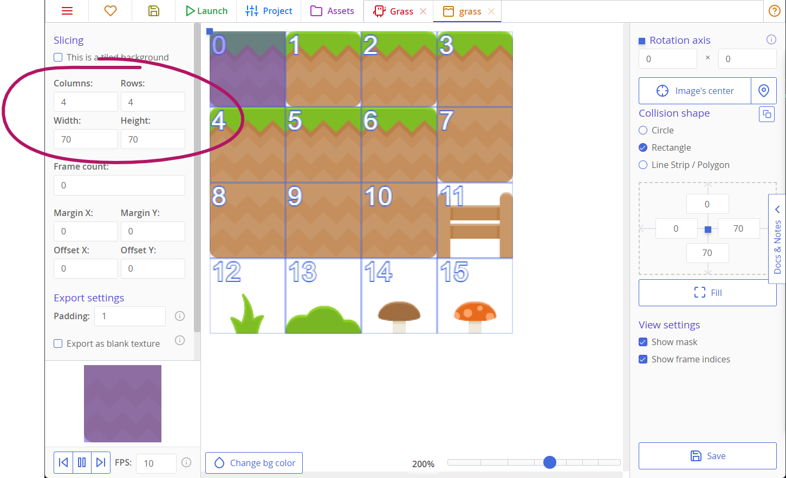
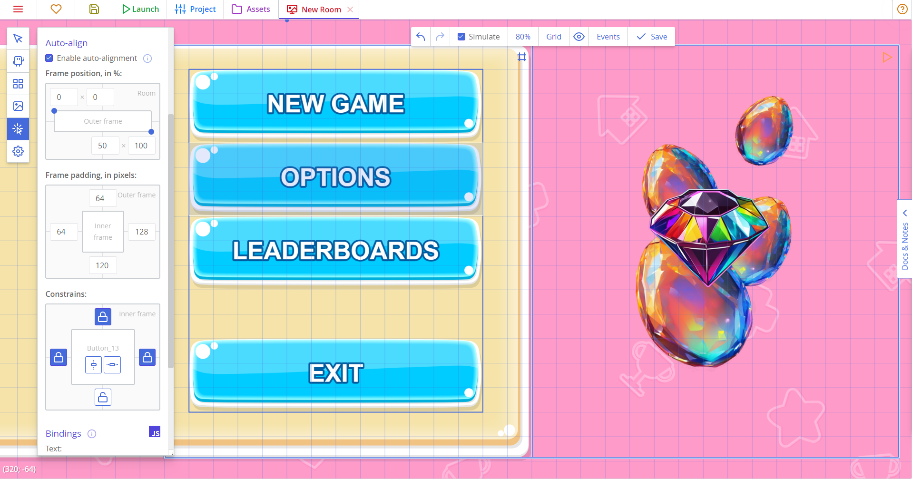
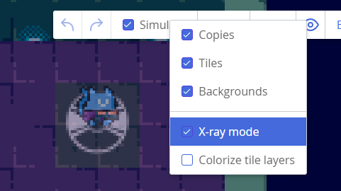

# Using the room editor

Rooms are the spaces where your actual game happens. A room can represent a level, a menu, a UI widget, and is a place where you place your copies (instances of your templates), backgrounds, and tiles. Knowing how to use it to the fullest will ease the level design process.

As of version 3.0, room editor has five tools located in the left panel:

* Selection tool for moving, scaling, rotating and tweaking your objects in other ways. It supports both copies and tiles.
* "Add copies" tool to place new copies in the level — instances of your templates.
* "Add tiles" for placing immobile texture pieces for making your level structure, and just for decoration.
* "Manage backgrounds" tool that opens a panel in which you can add and manage your backgrounds — repeating backdrops with decorative purposes.
* "Room properties" tool with room's and camera's settings.

## Navigating around the room

Moving around:

* Hold the middle mouse button (the wheel) down and move the cursor to move the camera.
* You can zoom in and out with mouse wheel — it will zoom into the place you point at.

::: tip
If you get lost, you can press `H` key to return to the center of your level and reset zoom. You can also find this command in the zoom dropdown:

:::

## Adding copies and tiles

Tools for adding new copies and tiles have pretty similar functionality.

* By default, you can draw multiple copies or tiles by pressing your mouse and making a stroke with it. If you have grid enabled, every copy and tile will snap to it; otherwise, they will be placed freely with spacing depending on your previously configured grid size.
* If you hold the `Shift` key before starting placing a tile or a copy, your copies and tiles will form a straight line — diagonal, vertical, or horizontal.
* If you hold the `Alt` key, grid snapping will be disabled temporarily.
* Lastly, if you hold the `Ctrl` key, you will be able to remove stuff with your cursor, like with an eraser.

### Working with tiles

To work with tiles, you need a texture that is setup properly — make sure that you've set a proper frame size and the count of columns and rows in your tilesets. In any way, any ct.js texture can work as a tile, even if it has just one frame. You can use it to place static decorations inside your rooms.

Here is an example of a properly set tileset:

To start working with tiles, press the "Add tiles" tool in the left toolbar of the room editor and press the "Find a Tileset" button. Make sure you have a tile layer — they are listed right under the selected texture. If you don't have one, click the "Add tile layer" button and input its depth.

Then select a tile on the texture you've imported and place it inside the room with a click. You can also select multiple tiles by pressing and dragging your pointer across several frames. After that, draw with tiles with your mouse.

:::tip
Remember that each tile is placed on a tile layer of a particular depth — placing every tile on an arbitrary depth level is not possible.

Creating a ton of layers is also not recommended, because 1) it is dumb, and 2) each tile layer caches its contexts to boost rendering performance, and if you do use tons of layers, it nullifies the performance boost and worsens the situation with RAM.
:::

## Selection tool

Selection tool is probably the most powerful creative instrument in the room editor — it works sililarly to image editors, as you can reposition, rotate, scale, and even recolor multiple entities at once.

When the select tool is active, drag your mouse around copies or tiles to draw a rectangle and select them. You can also select individual objects by clicking on them.

::: tip
You can change which entities are selected, and which are ignored, by toggling them next to the "Select:" heading.
:::

When you have something selected, a rectangle with several colored handles will appear:

* Handles in the corners of the rectangle will scale the selection when you drag them;
* Handles on the sides scale the selection either horizontally or vertically.
* A handle floating on the right side rotates the selection.

While working with the scale handles, you can use these modifier keys:

* Holding `Shift` key will make diagonal handles scale your selection proportionately;
* Holding `Alt` key will ignore grid;
* Using `Ctrl` key will make the selection scale in both directions.

While rotating objects, hold the `Shift` key to rotate by a muliple of 15 degrees.

You can also change values in the properties panel on the left, but note that contrary to the selection frame which transforms everything as a group, the properties panel changes values for each object individually.

## Adding backgrounds

Backgrounds are added in the fourth tool of the room editor. Inside it, there is a button "Add a Background" that opens a texture selector. There are several things to consider while using backgrounds:

* A texture should be marked as a background; otherwise it will have rips and holes in its seams. There will be a warning message if you try to use a regular texture.
* Multi-frame backgrounds are not supported, at least yet.

You can change background's texture by clicking on the current texture. Other properties are hidden in a panel that you can open by clicking the ⚙ cog icon.

* Depth changes the drawing order relative to copies, tiles, and other backgrounds. Setting it to higher value will cause it to be drawn on top of other things.
* Shift fields position your background in the room.
* Scaling fields stretch your background. Values smaller than 1 will make it smaller, while values greater than 1 will make it larger. Using negative values will flip the background.
* Movement speed allows making moving backgrounds. This can be used to create effects of rain falling down, or clouds moving.
* Parallax changes how the background moves relative to the camera. You can make the values lower than 1 to create a sense of depth. Values greater than 1 are usually used for foregrounds.
* The "Repeat" box lets you choose how the background will be tiled:
  * `repeat` means that the background will tile in both directions.
  * `repeat-x` will tile the background only horizontally.
  * `repeat-y` will tile the background vertically.
  * `no-repeat` won't tile the background at all.

## UI tools

This panel tweaks the look and position of copies, and is mainly used to configure elements of graphical user interface. UI tools have different contents depending on which copy is selected.

These tools can:

* Change the font and text of buttons and text labels;
* Align copies relative to a room frame (or the one you defined), so they realign themselves to suit different screen dimensions;
* Add bindings to common properties with JavaScript expressions.

### Auto-align tool

The tool is enabled with a checkbox, and **only works for UI rooms**. (You can change the type of the room in its properties panel.)

The tool has three editable charts, that describe the position and padding of the frame you reference to, and how you align the copy relative to this frame.

The charts are:

* **The outer frame position.** It is defined by top-left and bottom-right points, and their position is measured in percents of room's viewport dimensions.
* **The frame padding**, defined for each of the four sides in pixels.
* **The constraints.** Vertical and horizontal constraints affect the copy separately.
  * Each locked side means that the distance from copy's corresponding side to the edge of the frame won't change when screen dimensions change. Locking one side will stick a copy to it, locking both opposite sides will make the copy stretch with fixed gaps around it.
  * Clicking the central buttons will make a copy position itself relative to the center of the frame.
  * Disabling every lock and center alignment will make a copy scale relative to the frame.

:::tip Tip
Once you've changed your room to be a UI layer, you can test the auto-alignment settings by changing the room's viewport dimensions.
:::

If you want to align a copy relative to the viewport's edges, you can skip the first two charts. But with them, for example, you can align a copy relative to a column that occupies 50% of the screen.

Consider this horrible tasteless example:

The panel that is underneath the buttons occupies exactly 50% of the screen. Its alignment frame has default settings, as it is positioned relative to the viewport, and its constraints lock top and bottom sides, so there is no gap, and horizontal constraints are disabled, so the panel stretches with the viewport and continues to cover exactly 50% of the screen.

The buttons will have to be positioned relative to the panel, so their frame position is set to 0;0 – 50;100. This makes the outer frame match the panel. (Note the frame with a `#` symbol.)

The panel also has padding, so we add that padding to buttons' frame padding. The outline inside the panel will show the resulting reference frame for the buttons.

All the buttons have horizontal constraints so they stretch horizontally nicely. Top buttons have top-side constraints, and the bottom one has bottom-side constraint. This makes them stick to top and bottom sides of the panel respectively.

### Bindings

Bindings are used to automatically change properties of copies once the value in the binding expression changes. This can be used to make dynamic text labels without having to create a separate template, or to, say, change button's color when certain conditions are met.

Bindings must be written in JavaScript. For example:

* `rooms.current.score` for a text label that shows current score.
* `'Score: ' + room.current.score` shows the current score plus a "Score: " label before it.
* `` `Score: ${rooms.current.score}` `` uses a JS string template that does the same thing.
* `rooms.current.money < 50` can be used in the "Disable" field of a button to forbid using it when a player doesn't have enough money.

## Room properties

The "Properties" tab of the room editor has options for render and camera tweaks.

* View width/height define the starting size of the camera — the area it shows. As resolution and the size of the rendered canvas is a stretchy thing in ct.js, thanks to `ct.fittoscreen`, these do not correspond to screen resolution — they only set how much your camera shows and what aspect ratio it has. Everything else is done by `ct.fittoscreen` (and you can change its settings in the Project tab).
* The checkbox "Keep camera in a rectangle" shows controls to limit what a camera can show. By default, rooms and cameras in ct.js are boundless, but when enabled, camera borders won't exceed the specified region.
* "Background color" sets the color of the areas not covered by copies, tiles, or background textures.
* The checkbox "Is a UI layer" tells how the room should be positioned if used inside another room. UI layers follow the camera and are not affected by zooming, perfect for UI controls.

:::tip
To read more about UI layers, see [the reference for append/prepend methods](ct.rooms.html#ct-rooms-append-nameoftheroom-ext-and-ct-rooms-prepend-nameoftheroom-ext), or [see how it is done in the JettyCat tutorial](tut-making-jettycat.html#creating-menus).
:::

## Additional tools

There are several additional tools at the top bar of the room editor.

* First two buttons undo or redo your latest changes in the room (`Ctrl+Z`, `Ctrl+Shift+Z` hotkeys). Remeber that history size is limited to about 30 actions!
* "Simulate" switch enables or disables animations of sprites and backgrounds in the room.
* Zoom selector allows you to change zoom if you don't have a pointer with a wheel input, and also has an option to return to the center of the room.
* "Grid" button has a submenu with several items:
  * Enabling/disabling the grid (`Ctrl+G` hotkey);
  * Enabling diagonal grid. If you want a pseudo-isometric grid, you will need to set the grid size to 1:2 ration;
  * Changing the grid size.
* The "eye" menu has switches to hide/show specific entities in the level. It also has two special view options:
  * X-ray mode: makes everything transparent, allowing to see through objects. Useful for placing secrets and for finding overlap issues.
  
  * Colored tile layers: color-codes each tile layer to visually distinguish which tiles are where.
  
* "Events" button opens a script editor with all the events of the current room.

## Hotkeys

* `Q`, `W`, `E`, `R`, `T` keys switch tools — `Q` will enable the select tool, `W` will switch to adding copies, and so on.
* `Ctrl+Z` undos the latest change. `Ctrl+Shift+Z` redos it.
* `Ctrl+C` copies the current selection, `Ctrl+V` pastes it (works with the select tool only).
* `Ctrl+G` toggles the grid.
* When you have objects selected, you can use arrow keys to move them. Use arrow keys + `Ctrl` key to disable snapping to the grid.