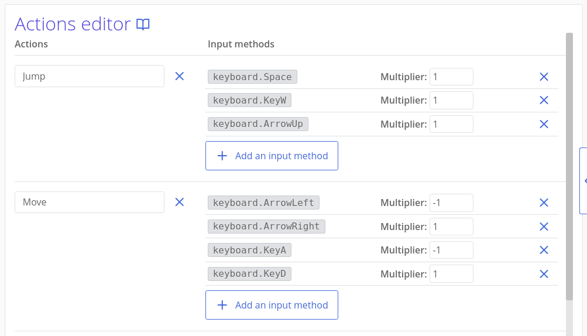

# Действия

Действия (Actions) — это абстрагирующая прослойка над различными методами ввода, позволяющая писать единый код для различных устройств — клавиатуры, мыши, геймпада, виртуальных клавиш и всего того, что можно подключить к ct.js. Преимущество действий в том, что одно действие слушает события не только сразу нескольких устройств, но и, например, сразу несколько кнопок одного устройства. Например, можно одновременно слушать WASD и стрелки клавиатуры, а код будет такой, как если бы вы слушали что-то одно (и даже меньше). Если сюда добавится управление с геймпада, то количество вашего кода не изменится.

Чтобы действия работали, нужно подключить модули — провайдеры методов ввода —, а сами действия описываются во вкладке "Настройки", под кнопкой "Действия и методы ввода". Ct.js поставляется с рядом провайдеров ввода по-умолчанию:

* `ct.mouse` для отслеживания нажатий кнопок мыши;
* и `ct.keyboard` для нажатий клавиатуры.

Все эти модули должны быть включены по-умолчанию для всех новых проектов. Если же нет, активируйте ct.mouse и ct.keyboard во вкладке "Котомоды". Другие котомоды помечаются волшебной иконкой:

## Создание новых действий

Чтобы создать новое действие, зайдите во вкладку "Настройки", а затем нажмите на кнопку "Действия и методы ввода". Появится полноэкранная панель, в которой в левой колонке задаются сами действия, а в правой — методы ввода.

Нажмите кнопку "Добавить действие". Для примера опишем стандартное — и, пожалуй, самое важное в любой игре — действие "Движение". Если у вас платформер, то понадобится всего одно — движение по горизонтали —, а если нет, то может понадобиться и движение по вертикали. Назовите эти действия MoveX и MoveY, для движения по горизонтали и вертикали соответственно.

Добавьте первый метод ввода к движению по горизонтали соответствующей кнопкой. В появившейся форме найдите кнопку `A` (можно ввести её в строку поиска), а затем нажмите "Выбрать". Проделайте то же самое для кнопок `D`, `ArrowLeft` и `ArrowRight`. Должно получиться такое:

Но ведь кнопки `A` и `D` ведут в разные стороны! Как в коде понять, куда вести игрового персонажа? Дело в том, что в коде действия принимают значения от -1 до 1, и с помощью отрицательных чисел мы можем показать, что нужно идти, скажем, влево, а положительные — вправо. Делается это с помощью колонки **множителей**. Если указать кнопке `A` множитель -1, то при её нажатии действие вернёт значение -1, а если у `D` оставить 1 — то при нажатии `D` будет единица.

В ct.js значение `X` растёт слева направо, значение `Y` — сверху вниз. Если не вращать камеру, и если у вас QWERTY-клавиатура, то `A` будет вести влево — против движения координаты `X` —, а `D` — вправо — вдоль движения координаты `X`. Поэтому `A` мы назначим множитель -1, и так же поставим этот множитель стрелке влево.

Добавив ещё одно действие `MoveY`, множитель -1 нужно будет поставить кнопкам `ArrowUp` и `W`.

Если мы описываем какое-то элементарное действие (например, прыжок), то множители нам не понадобятся. Если мы используем джойстики геймпада, то множитель может понадобиться, если игровой персонаж движется не в ту сторону, в которую бы хотелось.

## Примеры

**Типичная стартовая настройка платформера**

**Типичная настройка действий для шутера с видом сверху**

