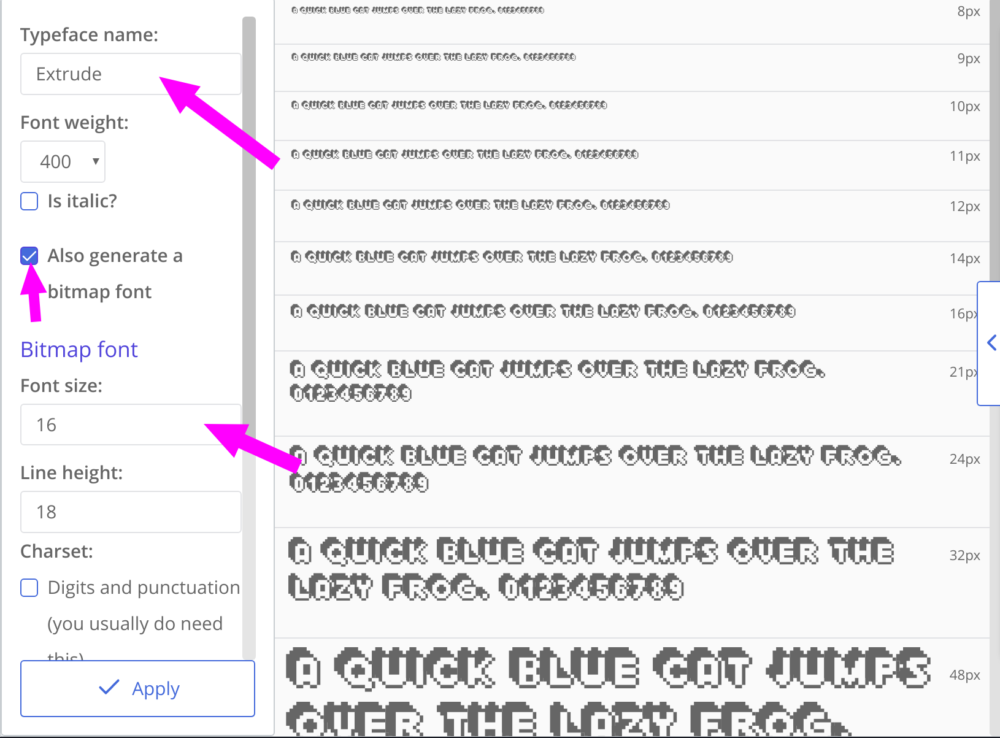

# Использование шрифтов в формате битмап

::: note Автоматически переведённая страница
К сожалению, на полный ручной перевод у нас не хватает ресурсов.
Если вы увидели ошибку — отправьте пул-риквест с исправлениями (ссылка для редактирования в конце страницы).
:::

В ct.js существуют два типа текстовых меток: шрифты в формате битмапа и шрифт, основанный на холсте. Первый тип подходит для динамического, движущегося и изменяющегося текста, в то время как второй тип лучше всего подходит для больших объемов статического текста. Выбор правильного типа оптимизирует работу вашей игры. Необходимо отметить, что обе текстовые метки могут обрабатываться как единое целое без каких-либо последствий для производительности, например, могут быть перемещены, вращены или закрашены с помощью свойства `this.tint`.

Кроме того, шрифты в формате битмапа гораздо лучше подходят для игр в стиле пиксель-арт, так как браузеры имеют тенденцию размывать текстовые метки на холсте и тем самым портить все мелкие детали.

## Импорт шрифта и включение шрифтовой сетки

Вам понадобится шрифт в формате TTF. Убедитесь, что у вас есть законные права на использование его в играх.

В вкладке "Ассеты" нажмите "Новый ассет", а затем выберите опцию "Шрифт". Найдите файл для импорта и щелкните по импортированному шрифту, чтобы открыть просмотр шрифтовой сетки.


Введите его правильное имя, а затем выберите флажок "Также создать шрифтовой ресурс". Откроется множество настроек. Вот сначала следует ввести размер шрифта. Примечание: большинство крошечных шрифтов пикселей, например, 7x5 пикселей, на самом деле требуют большего размера шрифта, обычно 16 пикселей. Возможно, вам придется немного поиграть с размером шрифта, чтобы добиться идеальных результатов.



Нижний ряд полей "Размер шрифта" и "Высота строки" содержит несколько флажков, которые позволяют включить подмножество символов. Если выбрать несколько символов вместо использования "Нарисовать все, что поддерживает шрифт", его размер уменьшится, что позволит вашим играм быстрее загружаться.

Если вам не нужен шрифт для отображения одного слова без пробелов, необходимо проверить флажок "Цифры и знаки пунктуации" — он включает пробелы, запятые, точки и другие разделители слов и предложений.

После настройки шрифта вы можете взять имя этого шрифта в качестве ресурсовой шрифтовой сетки, которую мы будем использовать в нашем коде. Нажмите кнопку "копия" рядом с именем ресурса в нижней части столбца.

## Использование шрифтов в виде битовых карт в коде

Процесс создания этикетки с битовой картой аналогичен процессу, основанному на canvas: мы создаем дочерний элемент с помощью `new PIXI.BitmapText()` и добавляем его к родительскому элементу — типу или комнате.

::: code-tabs#tutorial
@tab JavaScript
```js
this.label = new PIXI.BitmapText('Initial text', {
  font: {
    name: 'Void_400',
    size: 16
  },
  align: 'left'
});
this.addChild(this.label);
```
@tab CoffeeScript
```coffee
textSettings =
    font:
        name: 'Void_400'
        size: 16
    align: 'left'

@label = new PIXI.BitmapText 'Initial text', textSettings
@addChild @label
```
:::

Размер шрифта может отличаться от указанного в ct.IDE. При добавлении нескольких шрифтов с разными размерами, но с одним именем, ct.js выберет оптимальный из них.

Мы можем манипулировать шрифтом аналогично копиям, используя цвет, масштаб и вращение этой этикетки:

::: code-tabs#tutorial
@tab JavaScript
```js
this.label.tint = 0xff0000; // Покрасить в красный цвет
this.label.rotation = 15; // Немного наклонить
this.label.scale.y = 1.25; // Сделать более высоким
```
@tab CoffeeScript
```coffee
@label.tint = 0xff0000 # Покрасить в красный цвет
@label.rotation = 15 # Немного наклонить
@label.scale.y = 1.25 # Сделать более высоким
```
:::

Чтобы изменить текст, следует указать параметр `text`:

::: code-tabs#tutorial
@tab JavaScript
```js
this.label.text = 'Score: ' + this.score;
```
@tab CoffeeScript
```coffee
@label.text = 'Score: ' + @score
```
:::

Наконец, когда надпись больше не нужна, ее можно удалить с помощью метода `destroy()`:

::: code-tabs#tutorial
@tab JavaScript
```js
this.label.destroy();
```
@tab CoffeeScript
```coffee
@label.destroy()
```
:::
