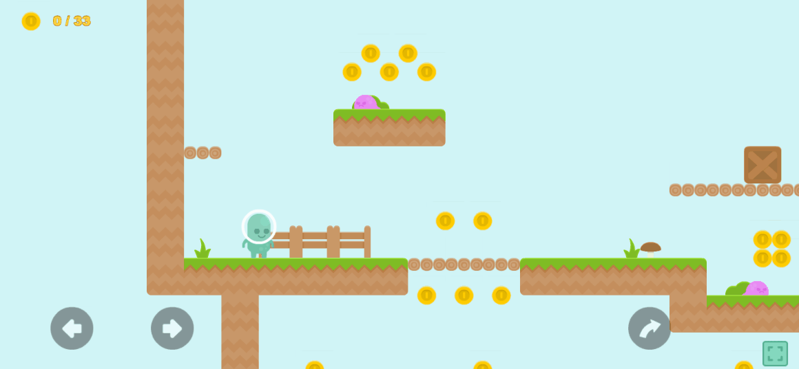

# camera

::: note Автоматически переведённая страница
К сожалению, на полный ручной перевод у нас не хватает ресурсов.
Если вы увидели ошибку — отправьте пул-риквест с исправлениями (ссылка для редактирования в конце страницы).
:::

::: tip Привет!
На этой странице описаны методы и параметры объекта `камера` в формате справочного руководства. Вы можете узнать о техниках и использовании в более свободной форме на ["Странице советов по работе с окном просмотра"](/tips-n-tricks/viewport-management.html).
:::

## Геометрия камеры

### `camera.х`, `camera.у`

Реальные координаты Х и У камеры. Он не применяет эффект дрожания экрана и может отличаться от `targetX` и `targetY`, если камера находится в переходе.

### `camera.targetX` и `camera.targetY`

Координаты X и Y целевой точки. Перемещение камеры вместо простого использования параметров X/Y будет вызывать эффект дрожания.

### `camera.computedX`, `camera.computedY`

Текущее положение камеры в игровых координатах. Эти значения включают в себя вибрацию экрана и `camera.shiftX`, `camera.shiftY`.

### `camera.width`, `camera.height`

Ширина и высота камеры неуменьшенного отображаемого региона. Эти значения являются только для чтения.

### `camera.rotation`

Значение в градусах, которое вращает камеру.

### `camera.scale.x`, `camera.scale.y`

Масштабирующие значения, которые масштабируют захватывающее прямоугольник. Если сравнивать с инструментами просмотра изображений, "1" и "1" означает отсутствие масштабирования, "0,5" будет увеличивать до 200% зрения, а "3" уменьшит и даст 33% масштабирования.

### `camera.left`, `camera.top`, `camera.right` и `camera.bottom`

Эти значения представляют собой расположение конкретной стороны камеры в игровых единицах. Их нельзя изменять вручную.

### `camera.moveTo(x, y)` и `camera.teleportTo(x, y)`

Оба метода перемещают камеру в новое положение. `camera.moveTo` подходит для сцен с диалогами и плавными переходами между объектами, так как он работает вместе с `camera.drift`. `camera.teleportTo` не вызывает переходов и сбрасывает эффект тряски экрана. Он подходит для мгновенных точных перемещений, например, при перемещении камеры на большое расстояние.

### `camera.uiToGameCoord(x, y)` и `camera.gameToUiCoord(x, y)`

Преобразует точку из одной системы координат в другую. Возвращает объект (`PIXI.Point`) со свойствами `x` и `y`.

Есть также методы `u.uiToGameCoord` и `u.gameToUiCoord`, которые вызывают эти методы у текущего объекта `camera`.

### `camera.getTopLeftCorner()`, `camera.getTopRightCorner()`, `camera.getBottomLeftCorner()`, `camera.getBottomRightCorner()`

Возвращает объект (`PIXI.Point`) с двумя свойствами: `x` и `y`. Они находятся в координатной системе игры и учитывают вращение и масштабирование.

### `camera.getBoundingBox()`

Возвращает ограничивающую рамку камеры в игровых координатах. См. [PIXI.Rectangle](https://pixijs.download/release/docs/PIXI.Rectangle.html) для свойств.

## Следование за Копией

### `camera.follow`

Если установлено, камера будет следовать за указанной копией.

### `camera.followX`, `camera.followY`

Функционирует, если параметру `follow` назначена копия. Установка одного из этих полей на `false` отключит автоматическую камеру в заданном направлении.

### `camera.borderX`, `camera.borderY`

Работает, если параметру `follow` назначена копия. Задает рамку, в которой будет содержаться копия, в системе координат интерфейса. Может быть установлен в `null`, чтобы копия была размещена в центре экрана.

## Тряска экрана

### `camera.shake`

Текущая мощность эффекта вибрации экрана относительно максимальной стороны экрана (100 — это 100% эффекта вибрации экрана). Если установить значение 0 или меньше, это отключит эффект.

### `camera.shakePhase` 

Текущая фаза колебаний экрана.

### `camera.shakeDecay`

Количество единиц "shake", вычитаемых в секунду. По умолчанию равно 5.

### `camera.shakeFrequency`

Основная частота эффекта тряски экрана. По умолчанию — 50.

### `camera.shakeX`, `camera.shakeY`

Множитель для эффекта тряски экрана. По умолчанию равен 1.

### `camera.shakeMax`

Максимальное допустимое значение для свойства `shake`, чтобы защитить игроков от потери монитора, в единицах `shake`. По умолчанию равно 10.

### `camera.minX`, `camera.maxX`, `camera.minY` и `camera.maxY`

Эти параметры ограничивают перемещение камеры внутри прямоугольника. По умолчанию камера может перемещаться без ограничений, если только не настроено иначе в редакторе комнаты.

Вы можете установить все эти свойства или некоторые из них.

Чтобы сбросить определенное значение, например, `delete camera.minX;`, или напишите `camera.minX = undefined;`.

## Прочее

### `camera.drift`

Если установить значение от 0 до 1, это сделает движение камеры более плавным.

### `camera.shiftX`, `camera.shiftY`

Эти значения сдвигают камеру в UI-единицах, но не изменяют `camera.x` и `camera.y`.

### `camera.realign(room)`

Вычисляет все копии в комнате на основе новых размеров камеры. Это полезно для быстрого позиционирования элементов интерфейса на разных экранах. Новое положение является результатом интерполяции на основе параметров `xstart` и `ystart` копий, поэтому оно не будет работать с перемещающимися элементами. Вы можете пропустить реалинование для некоторых копий, если установите их параметр `skipRealign` в значение `true`.

Этот метод обычно применим только к режимам "Fittoscreen: Расширение" и "Масштабирование без обрезки".

Без `camera.realign` | С `camera.realign`
-|-
 | 

:::tip
Для ct.js v4 и более поздних версий мы рекомендуем использовать инструменты редактора комнат с автоматическим выравниванием для корректировки копий при необходимости адаптации к разным размерам экранов.

Этот метод все еще полезен для полностью динамически создаемых элементов интерфейса.
:::

#### Пример: Переставьте элементы пользовательского интерфейса в комнате

Код конца кадра для вашего UI-комнаты:

::: code-tabs#tutorial
@tab JavaScript
```js
camera.realign(this);
```
@tab CoffeeScript
```coffee
camera.realign this
```
:::

Ну да, это всё!

### `camera.manageStage()`
Это выровняет все не UI слои в игре согласно трансформациям камеры. Это автоматически вызывается внутри, и вы редко будете его использовать.

