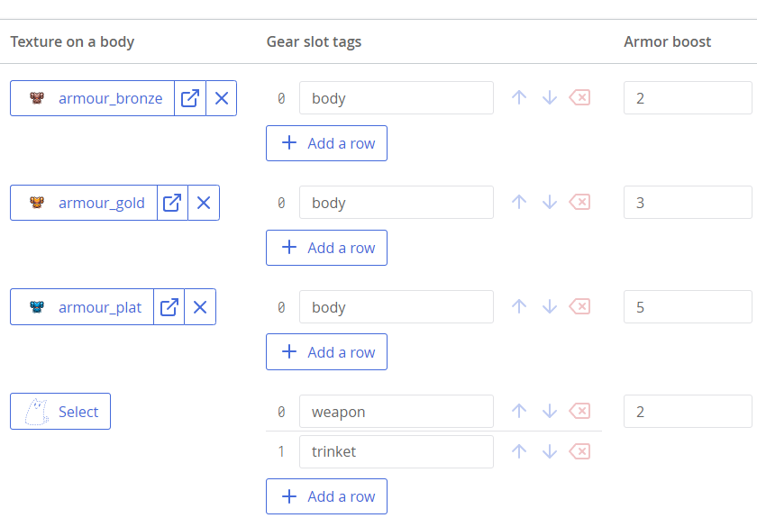
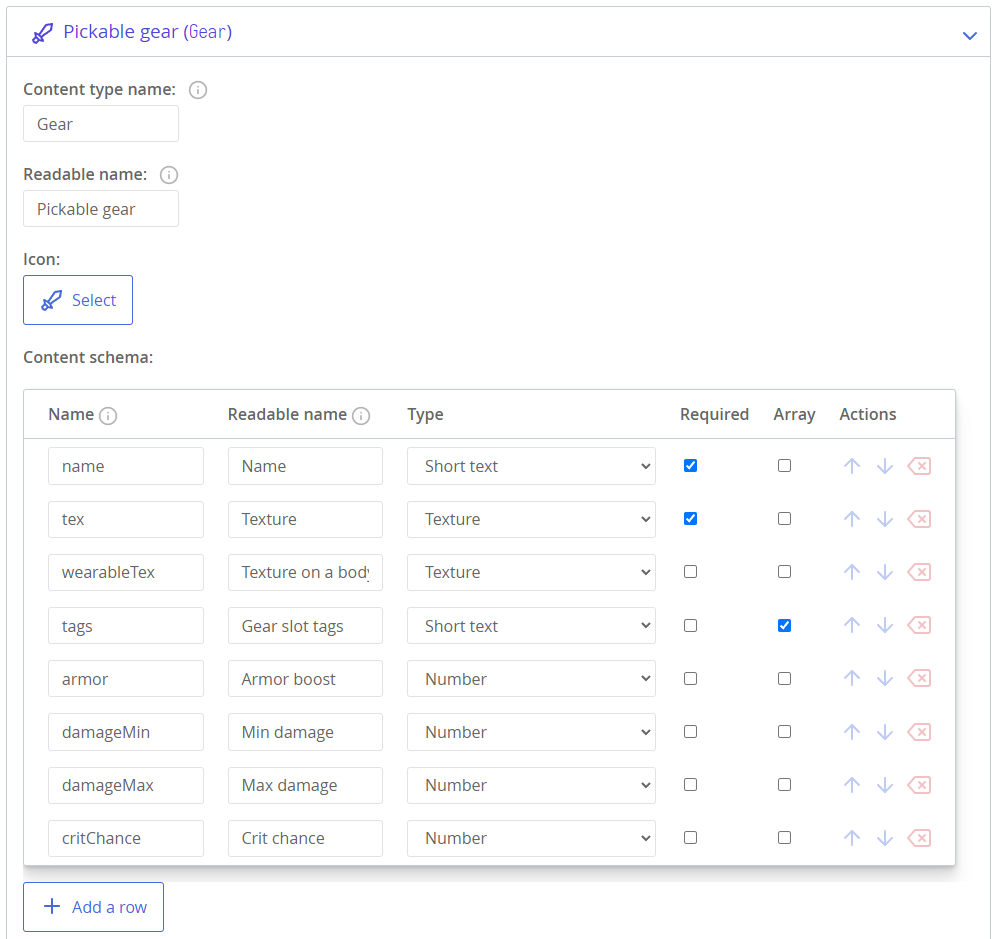
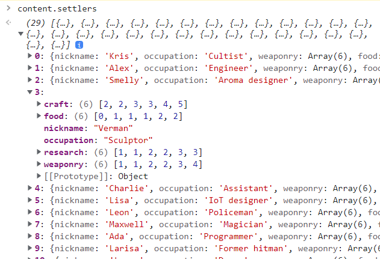

# Система контента (редактор контента и content)

::: note Автоматически переведённая страница
К сожалению, на полный ручной перевод у нас не хватает ресурсов.
Если вы увидели ошибку — отправьте пул-риквест с исправлениями (ссылка для редактирования в конце страницы).
:::

Система контента представляет собой набор редакторов и процедур экспорта, позволяющих создавать, редактировать и использовать структурированные данные для вашей игры. Его можно рассматривать как локальную базу данных для вашего проекта. Например, его можно использовать для разработки механик лута, уровней или волн в игре в жанре " башня обороны", или квестов и диалогов в RPG-играх, или любых других структур, представленных в виде таблицы.

Система контента может хранить простые значения, такие как числа, строки, логические значения, а также ссылки на ваши ассеты, например шаблоны и комнаты.

По сути, Система контента включает в себя:

* Редактор типов контента, позволяющий создавать структуры данных;
* Редактор элементов типа контента, позволяющий создавать и изменять контент в интерфейсе, похожем на таблицу;
* Экспортные данные, доступные в пространстве имен `content`.

## Проектирование данных

Вы можете создавать новые типы контента в вкладке «Проект» -> «Редактор типов контента».

У каждого типа контента есть следующие поля:

* **Название типа контента.** Это название свойства, которое вы будете использовать в своем коде JS, поэтому подумайте о нем и запишите простое название без пробелов. Например, если вы назовете свой тип контента «Quests», вы сможете получить к нему доступ в игре с помощью `content.Quests`.
* **Читаемое название.** Если ваше основное название не совсем читаемо, например, «BuffsNCurses», вы можете записать другое имя, которое будет отображаться в интерфейсе ct.IDE. Это не влияет на ваш код.
* **Иконка**, которая отображается в интерфейсе ct.IDE.
* **Схема контента.** Это список всех полей для каждого примера вашего типа контента.

Схема контента описывается в таблице. Каждая строка будет полем в объекте. Подобно самим типам контента, поля имеют обычное и читаемое название. Если вы назовете поле «title», вы сможете получить доступ к названию первого примера вашего типа контента с помощью `content.Quests[0].title`.

Помимо названия, каждое поле имеет тип. Поля могут иметь простые значения, такие как строки, числа и логические значения, но они также могут ссылаться на ассеты в вашем проекте: как текстуры, шаблоны, звуки, частицы, комнаты и т.п.. В коде такие ссылки станут строками — названиями ваших ассетов.

Есть также два чекбокса для каждого поля: «Обязательно» и «Массив».

* Поля, помеченные как **обязательные**, должны быть заполнены, иначе они будут предупреждать в интерфейсе ct.IDE.
* Если **массив** включен, в каждом примере будет редактор списка, позволяющий добавлять произвольное количество значений.



Вот пример типа контента «Оборудование»:



### Использование перечислений в типах контента

Каждый созданный вами ассет перечисления будет доступен как тип поля в редакторе схемы контента. Использование их в поле типа создаст раскрывающиеся списки в редакторе записей с вариантами, определенными перечислением. Это очень удобно для создания настроек и инструментов для дизайнеров, поскольку они будут видеть раскрывающийся список с вариантами, установленными вами, что минимизирует ошибки человека по сравнению с ручным вводом значений с клавиатуры.

## Редактирование данных

Редактирование данных довольно просто — после того, как вы спроектировали свои данные, вы можете начать создавать записи для своих контент-типов. Для каждого контент-типа, который вы создаете, в вкладке "Проект" под настройками модулей появляется новый раздел.


Создавайте записи, нажав кнопку "Добавить строку", и заполняйте таблицу. Обратите внимание, что вы можете удалять или добавлять поля, если вам нужно изменить схему, но помните, что удаление полей из контент-схемы является необратимым действием.

## Использование данных

Самый простой способ изучить структуру полученных данных — это ввести `content.TypeName` в консоль отладчика и раскрыть его поля:



Вы можете использовать данные так, как вам удобно — все представлено в виде объектов внутри массива. Если вы еще не знаете, как работать с объектами и массивами, прочитайте [третью главу введения к JS](learn-js/jsintro_pt3.html). Вам также, вероятно, понадобится ознакомиться с [циклами здесь](learn-js/jsintro_pt2.html).

### Пример: поиск записи контента с конкретным именем

Предположим, у вас есть тип контента "loot" с полем "name".

::: code-tabs#tutorial
@tab JavaScript
```javascript
var lootedItem = content.loot.find((loot) => {
  return loot.name === 'Divine shield';
});
console.log(lootedItem);
```

@tab CoffeeScript
```coffee
lootedItem = content.loot.find (loot) => loot.name is 'Divine shield'
console.log lootedItem
```
:::

### Пример: Получение всех предметов с уровнем снаряжения 5-10 из контент-типа

Предположим, у вас есть контент-тип "loot" с полем "level".

::: code-tabs#tutorial
@tab JavaScript
```js
var possibleItems = content.loot.filter((loot) => {
  return loot.level >= 5 && loot.level <= 10;
});
console.log(possibleItems);
```
@tab CoffeeScript
```coffee
possibleItems = content.loot.filter (loot) => 5 <= loot.level <= 10
console.log possibleItems
```
:::

В данном примере мы используем метод filter для фильтрации массива контента-типа "снабжение". Мы выбираем только те предметы, у которых уровень снаряжения находится в диапазоне от 5 до 10 (включая оба значения). Затем мы выводим массив возможных предметов в консоль.

