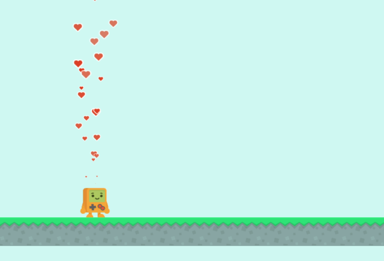
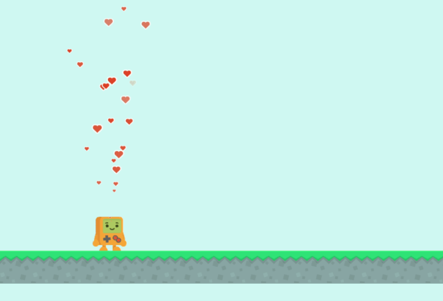

# emitters

::: note Автоматически переведённая страница
К сожалению, на полный ручной перевод у нас не хватает ресурсов.
Если вы увидели ошибку — отправьте пул-риквест с исправлениями (ссылка для редактирования в конце страницы).
:::

Модуль `emitters` позволяет запускать эффекты частиц, присоединять их к копиям или делать так, чтобы они следовали за чем-то.

Внутри него используется модуль [`particle-emitter`](https://github.com/pixijs/particle-emitter).

::: warning
Если у вас нет ассетов-эмиттеров в вашем проекте, то `emitters` не будут доступен. Он включен только в том случае, если у вас есть системы частиц в вашем проекте, чтобы сделать браузерные сборки меньшими по размеру.
:::

## Создание эффектов

Существует три метода с разным логическим построением, каждый из которых подходит для конкретных ситуаций:

- `emitters.fire('NameOfTheTandem', x, y)` создает эффект в заданном месте и ничего больше. Это полезно для создания эффектов, которые не должны следовать за чем-либо или перемещаться, например, для взрывов, вспышек света или эффекта воздействия.
- `emitters.follow(parentCopy, 'NameOfTheTandem')` подходит для длинных эффектов, которые должны быть подключены к копии. Они оставляют частицы при перемещении. Это хорошо подходит для эффекта дыма, пузырьков и т. д.
- `emitters.append(parentCopy, 'NameOfTheTandem')` похож на «follow», но старые частицы перемещаются вместе с эмиттером. Это полезно при создании магических бубенчиков или частиц, которые должны оставаться внутри копии (подумайте о движущемся котле с кипящей жидкостью и паровыми пузырьками внутри).

Давайте рассмотрим все они на практике (обратите внимание, как реагирует трассировка к движениям робота):

`emitters.fire` | `emitters.follow` | `emitters.append`
-|-|-
 |  | 

::: code-tabs#tutorial
@tab JavaScript
```js
// Код из примера "fire"
emitters.fire('HeartTrail', this.x, this.y - 70);
```
@tab CoffeeScript
```coffee
# Код из примера "fire"
emitters.fire 'HeartTrail', @x, @y - 70
```
:::

::: code-tabs#tutorial
@tab JavaScript
```js
// Пример "follow"
emitters.follow(this, 'HeartTrail', {
    position: {
        x: 0,
        y: -70
    }
});
```
@tab CoffeeScript
```coffee
# Пример "follow"
followSettings =
    position:
        x: 0
        y: -70
emitters.follow this, 'HeartTrail', followSettings
```
:::

::: code-tabs#tutorial
@tab JavaScript
```js
// Пример "append"
emitters.append(this, 'HeartTrail', {
    position: {
        x: 0,
        y: -70
    }
});
```
@tab CoffeeScript
```coffee
# Пример "append"
appendSettings =
    position:
        x: 0
        y: -70
emitters.append this, 'HeartTrail', appendSettings
```
:::


## Дополнительные параметры

Вы, возможно, заметили, что эти три метода принимают дополнительный аргумент (например, `emitters.fire('NameOfAnEffect', x, y, options)`). Это объект, который позволяет настроить внешний вид и поведение эффекта:

- `scale` — масштабирование объекта с параметрами `x` и `y`.
- `position` — установите это значение, чтобы смещать эмиттер-тандем относительно копии, к которой он прилип, или относительно копии, за которой он следует. Этот метод не работает с `emitter.fire`.
- `prewarmDelay` — если значение меньше 0, он будет предварительно нагревать эмиттер-тандем, имитируя заданное количество секунд до появления частиц в мире. Если значение больше 0, эффект будет отсрочен на указанное количество секунд.
- `tint` — цвет, примененный ко всему эффекту, например, 0xff0000 для красного цвета.
- `alpha` — непрозрачность всего эффекта, от 0 (непрозрачный) до 1 (полностью непрозрачный, как в ct.IDE).
- `rotation` — угол вращения в градусах.
- `isUi` — если установить значение true, будет использоваться временной масштаб слоев пользовательского интерфейса. Это влияет на то, как эффект имитируется во время медленной передачи и паузы в игре.
- `depth` — глубина тандема. По умолчанию это бесконечность (эффект наложит все остальные эффекты).
- `room` — комната, к которой будет прикреплен эффект. По умолчанию используется текущая основная комната (`rooms.current`). Он не влияет на `emitters.attach`, поскольку вы уже указываете родителя эффекта в первом аргументе.

Каждое свойство является опциональным. Например, если мы хотим создать меньший красный эффект над копией, который имеет ту же глубину, что и копия, мы напишем:

:::code-tabs#tutorial
@tab JavaScript
```js
emitters.follow(this, 'Debuff', {
    scale: {
        x: 0.75,
        y: 0.75
    },
    position: {
        x: 0,
        y: -80
    },
    tint: 0xff9999,
    depth: this.zIndex
});
```
@tab CoffeeScript
```coffee
followSettings =
    scale:
        x: 0.75
        y: 0.75
    position:
        x: 0
        y: -80
    tint: 0xff9999
    depth: @depth
emitters.follow this, 'Debuff', followSettings
```
:::

## Манипуляции с эмиттерами

Созданные эффекты будут хорошо себя вести по умолчанию: они останутся и будут автоматически прекращены, когда истечет их время жизни или когда будет уничтожен их владелец, оставив приятный след частиц. Но иногда нам нужно полностью очистить эффект, приостановить его или возобновить позже, или остановить его раньше обычного.

Каждый из `emitters.fire`, `emitters.append` и `emitters.follow` возвращает ссылку на созданный эффект, которую мы можем использовать:

::: code-tabs#tutorial
@tab JavaScript
```js
// Давайте создадим защитную пузырьковую оболочку!
this.shield = emitters.append(this, 'BubbleEffect');

// Позже, когда нам больше не нужен щит:
this.shield.stop();
this.shield = null; // Забудьте об эффекте, чтобы освободить память
```
@tab CoffeeScript
```coffee
# Давайте создадим защитную пузырьковую оболочку!
@shield = emitters.append this, 'BubbleEffect'

# Позже, когда нам больше не нужен щит:
@shield.stop()
@shield = null # Забудьте об эффекте, чтобы освободить память
```
:::

Существует несколько свойств, которые мы можем использовать таким образом:

* `emitter.stop();` предотвращает создание новых частиц. Когда предыдущие частицы исчезают, эмиттер-пар будет сам уничтожаться.
* `emitter.clear();` немедленно очищает все частицы.
* `emitter.kill` — это свойство, аналогичное свойству «копий» «убить»: если установить его в значение true, эффект с всеми своими частицами будет немедленно уничтожен.
* `emitter.frozen` останавливает обновление эффекта при установке в значение true.
* `emitter.pause()` останавливает создание новых частиц, но оставшиеся частицы по-прежнему анимированы. Вы можете возобновить создание с помощью `emitter.resume();`.

