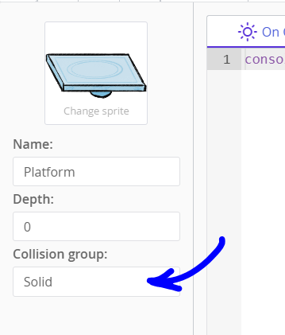

# Добавление настроек в ваш котомод и новые поля для ассетов

::: note Автоматически переведённая страница
К сожалению, на полный ручной перевод у нас не хватает ресурсов.
Если вы увидели ошибку — отправьте пул-риквест с исправлениями (ссылка для редактирования в конце страницы).
:::

Добавление новых полей позволяет пользователям настраивать ваш мод изнутри ct.IDE, на вкладке «Настройки» вашего мода. Вы можете иметь любое количество полей и использовать их внутри вашего основного кода или инъекций. Кроме того, любые дополнительные поля, определенные для шаблонов и других ассетов, будут доступны во время игры в событиях и инъекциях. Это обеспечивает гибкость как вам, так и вашим пользователям.

## Добавление настроек

В настоящее время настройки отображаются на панели каждого модуля в вкладке «Настройки». Это может выглядеть так:


Настройки определяются в файле `module.json` в ключе `fields`, и они представляют собой массив объектов, каждый из которых является полем или графическим элементом.

На скриншоте выше реализовано следующим образом:

```json Пример из модуля по умолчанию ct.place
{
    "main": {
        "name": "ct.place",
        "version": "3.1.0",
        "authors": [{
            "name": "Cosmo Myzrail Gorynich",
            "mail": "admin@nersta.ru"
        }]
    },
    "fields": [{
        "name": "Разделение",
        "type": "h2"
    }, {
        "name": "Размер сетки X",
        "help": "Указывает ct.place, как группировать копии в пространстве. Это должно быть не меньше, чем горизонтальная сторона самого большого коллизионного спрайта в вашей игре.",
        "key": "gridX",
        "default": 512,
        "type": "number"
    }, {
        "name": "Размер сетки Y",
        "help": "Указывает ct.place, как группировать копии в пространстве. Это должно быть не меньше, чем вертикальная сторона самого большого коллизионного спрайта в вашей игре.",
        "key": "gridY",
        "default": 512,
        "type": "number"
    }, {
        "name": "Режим отладки",
        "type": "h2"
    }, {
        "name": "Включить",
        "help": "Отображает формы коллизии, группы коллизии и разделения. Он также будет записывать дополнительные ключи в большинство коллизионных объектов. Не работает на скрытых объектах.",
        "key": "debugMode",
        "default": false,
        "type": "checkbox"
    }, {
        "name": "Размер текста отладки",
        "key": "debugText",
        "default": 16,
        "type": "number"
    }]
    /* ... */
}
```

На самом деле существует и другие типы ввода; все они, а также описание других ключей можно найти на странице [Декларация полей](fields-declaration.md).

Значения настроек используются для шаблонизации в вашем index.js и инъекциях. Инъекции позволяют размещать ваш код в определенных событиях ct.js. Дополнительную информацию об этом и шаблонизации можно найти [здесь](events-and-injections.md).

## Добавление расширений к встроенным ресурсам

Вы можете определить дополнительные поля, которые будут доступны в редакторах ресурсов. В настоящее время вы можете определить эти поля для шаблонов, комнат, копий и плиточных слоев. Вот где расположены такие поля в редакторе шаблонов:



И вот как их определить внутри `module.json`:

```json
{
    "main": {
        /*...*/
    },
    "typeExtends": [{
        "name": "Название поля в интерфейсе",
        "type": "text",
        "key": "varName"
    }]
}
```

В настоящее время у нас есть два ключевых слова, с помощью которых вы можете определять новые поля:

- `templateExtends`, для шаблонов (применяется непосредственно к копиям);
- `tileLayerExtends` для плиточных слоев (записывается в поле `layer.extends`);
- `copyExtends` для отдельных копий (применяется непосредственно к копиям);
- `roomExtends` для ваших уровней (применяется непосредственно к комнатам).

См. страницу [Декларация полей](./fields-declaration.md) для получения дополнительной информации.

С помощью `templateExtends` определенные поля будут доступны в объекте `this.extends`, чтобы избежать переопределения встроенных полей (их много). Например, если у вас есть поле с ключом `tag`, вы сможете прочитать его значение по адресу `this.extends.tag`. Большинство случаев использования этих полей будут требовать [инъекций](./events-and-injections.md), хотя это не обязательно.

С помощью `tileLayerExtends` параметры применяются непосредственно к плиточному слою. Вы можете получить список всех плиточных слоев с помощью `ct.templates.list['TILELAYER']`.

