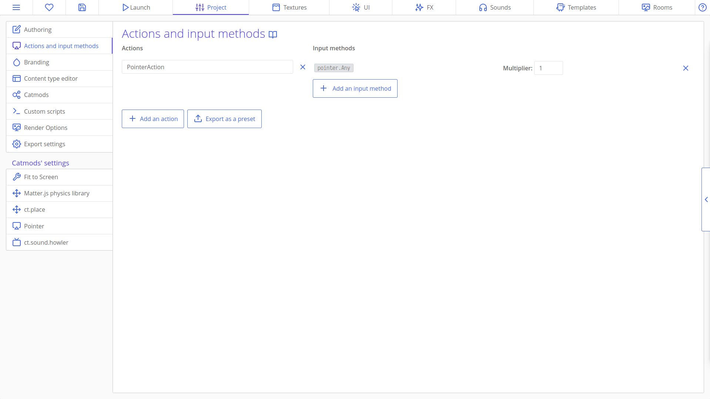

# Перетаскивание копий

::: note Автоматически переведённая страница
К сожалению, на полный ручной перевод у нас не хватает ресурсов.
Если вы увидели ошибку — отправьте пул-риквест с исправлениями (ссылка для редактирования в конце страницы).
:::

В этом руководстве мы рассмотрим, как реализовать функцию перетаскивания копий в ct.js!

У нас есть шаблон блока-заглушки, который мы будем перетаскивать. Давайте начнем с перехода в меню "Catmods" в разделе "Проект" и включим catmod `pointer`. Этот мод позволяет легко работать с вводом мыши и сенсорного экрана.


Теперь нам нужно добавить действие указателя из меню "Действия и методы ввода". Нажмите кнопку "Добавить действие" и назовите его "PointerAction". Теперь нажмите кнопку "Добавить метод ввода" и выберите `pointer.Any` из списка. В итоге должно выглядеть так:



Мы будем использовать только что созданное действие для регистрации событий нажатия/нажатия указателем.

Сначала нам нужно узнать, когда объект перетаскивается. Перейдите на вкладку "Создание" в шаблоне и объявьте переменную `this.dragging`.

```js
this.dragging = false;
```

Эта переменная будет иметь значение `true`, если копия в процессе перетаскивания, а в противном случае — `false`.

Теперь давайте перейдем на вкладку "Start кадра" и сделаем это. Нам нужно, чтобы перетаскивание начиналось, когда пользователь нажимает кнопку мыши, пока она находится над копией. Мы можем проверить это с помощью действия "PointerAction", которое мы объявили в меню "Действия и методы ввода", и условного оператора.

```js
if (pointer.hovers(this) && actions.PointerAction.pressed) {
    this.dragging = true;
}
```

Мы также хотим, чтобы перетаскивание заканчивалось, когда пользователь отпускает кнопку мыши при перетаскивании копии. Просто отпустить его.

```js
if (this.dragging && actions.PointerAction.released) {
    this.dragging = false;
}
```

И мы хотим установить позицию нашей копии на текущее положение указателя во время перетаскивания.

```js
if (this.dragging) {
    this.x = pointer.x;
    this.y = pointer.y;
}
```

Теперь мы можем протестировать это:


Изи!

## Добавление смещений

Мы успешно реализовали функцию перетаскивания в ct.js, но нам нужно сделать еще одно вещь. Как вы можете увидеть на картинке выше, когда мы нажимаем на копию, чтобы перетащить ее, копия устанавливается в положение, где находится верхний левый угол курсора. Мы можем исправить это, используя две переменные: одну для смещения по оси X и другую для смещения по оси Y мыши относительно положения копии при захвате.

Давайте перейдем на вкладку «Создание» и объявим эти переменные.

```js
this.xOffset = 0;
this.yOffset = 0;
```

Теперь мы хотим изменить эти переменные, когда копия захватывается. Давайте вернемся на вкладку «Старт фрейма» и изменим их внутри условия, где начинается перетаскивание (когда копия захватывается).

```js
if (pointer.hovers(this) && actions.PointerAction.pressed) {
    this.dragging = true;
    this.xOffset = pointer.x - this.x;
    this.yOffset = pointer.y - this.y;
}
```

Теперь нам нужно использовать эти переменные, чтобы определить положение копии при перетаскивании. Давайте перейдем к условию, где происходит перетаскивание, и изменим две строки внутри него.

```js
if (this.dragging) {
    this.x = pointer.x - this.xOffset;
    this.y = pointer.y - this.yOffset;
}
```

Теперь мы можем перезапустить игру, чтобы протестировать ее.


Отлично! Все работает идеально. Теперь, когда мы захватываем блок, он захватывается и перемещается так же, как реальный объект.

