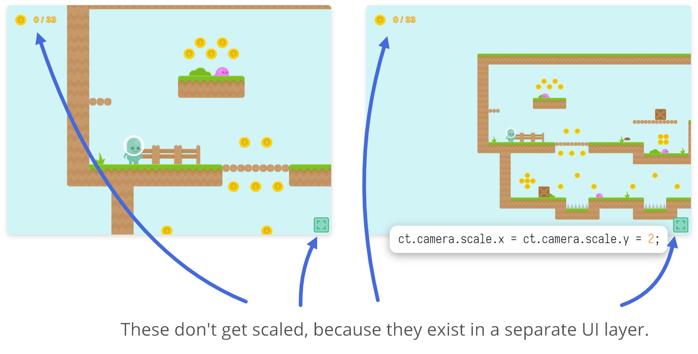

# Координаты игры и интерфейса, и их различия

::: note Автоматически переведённая страница
К сожалению, на полный ручной перевод у нас не хватает ресурсов.
Если вы увидели ошибку — отправьте пул-риквест с исправлениями (ссылка для редактирования в конце страницы).
:::

В ct.js есть две системы координат: для элементов интерфейса (координаты UI) и для игровых элементов, которые находятся на отдельной сетке координат. По умолчанию они совпадают, но когда вы начинаете перемещать камеру, поворачивать и масштабировать ее, они будут разными. Например, вы можете масштабировать представление и получить больше содержимого на экране, захватывая большую прямоугольную область в *пространстве игры*, но всегда показывая одну и ту же прямоугольную область в *пространстве UI*.

Используя эти координаты, вы можете разделить слои интерфейса и игры, повторно использовать интерфейс в разных комнатах и упростить разработку интерфейса, поскольку координаты UI обычно постоянны, и вы можете создавать меню и другие элементы в редакторе комнаты.

::: tip
*Слои* — это обычные комнаты, добавленные с помощью `rooms.append` и `rooms.prepend`. Вместе с основной комнатой они образуют *сцена*.
:::

## Вход в пространство интерфейса

Любые новые комнаты, добавляемые или помещаемые перед основной комнатой, могут быть установлены в координатах интерфейса с помощью `rooms.append('NameOfTheRoom', {isUi: true})` и `rooms.prepend('NameOfTheRoom', {isUi: true})` (см. соответствующую справку для методов [здесь](../rooms.md)). Вам нужно только эта строка!

::: tip
Техически, ct.js будет преобразовывать каждый слой на сцене в зависимости от положения камеры, а слои интерфейса останутся без изменений. Это означает, что глобальные координаты Pixi на самом деле являются координатами интерфейса, что может показаться нелогичным, но так работает объект камеры. Мораль: не используйте глобальные координаты Pixi.

Что это значит для вас? Во-первых, вы не можете перемещать эти комнаты, которые используют игровые координаты, самостоятельно, поскольку они управляются камерой и будут перезаписаны. Вы можете манипулировать камерой вместо этого — у нее есть некоторые крутые функции для упрощения управления видом. Более подробная информация см. в [документации по управлению видом](./viewport-management.md).

Во-вторых, вы можете перемещать слои интерфейса! Это можно использовать для создания виджетов, которые перемещаются на экране, и для анимации слайдов.
:::

## Игровое пространство

Это пространство, в котором перемещается камера, и по умолчанию все находится в игровых координатах. Уровни, игровые копии и так далее существуют в игровом пространстве. Он практически безграничен и простирается во всех направлениях.

## Пространство пользовательского интерфейса

Пространство пользовательского интерфейса — это прямоугольник от 0 до `camera.width` по горизонтали и от 0 до `camera.height` по вертикали. Если вы не используете режимы просмотра «Расширение» или «Масштабирование без обрезки», то это будет прямоугольник, равный тому, что вы определяете как размер просмотра в своей комнате. В противном случае он будет соответствовать экрану («Режим расширения») или быть выше или шире в зависимости от вашего экрана («Масштабирование без обрезки»).

Чтобы обновить положение ваших элементов пользовательского интерфейса, чтобы они аккуратно выстраивались на разных экранах, используйте `camera.width` и `camera.height`. Для автоматического выравнивания базовых интерфейсов используйте `camera.realign(room);`.

## Перевод координат из одной системы в другую

Вам понадобятся следующие методы для преобразования координат из одной системы координат в другую:

- `u.uiToGameCoord(x, y)`, и
- `u.gameToUiCoord(x, y)`.

Они вернут массив из двух элементов, координаты `x` и `y`. Эти методы можно использовать для выравнивания элементов интерфейса с копиями в игровом пространстве и для других задач, связанных с наложением объектов.

У камеры также есть ряд функций и переменных, которые возвращают ее положение в игровом пространстве:

- `camera.left` — представляет собой x-координату левого края камеры;
- `camera.right`;
- `camera.top`;
- `camera.bottom`.

Эти значения можно использовать, например, для определения того, видим ли мы копию или нет.

Для повёрнутых камер используйте следующие методы:

- `camera.getTopLeftCorner()`
- `camera.getTopRightCorner()`
- `camera.getBottomLeftCorner()`
- `camera.getBottomRightCorner()`

Они возвращают массив из двух элементов — координаты `x` и `y`.

