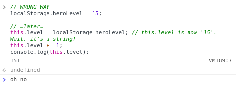
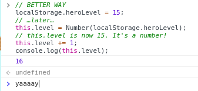

# Сохранение и загрузка игр с помощью LocalStorage

::: note Автоматически переведённая страница
К сожалению, на полный ручной перевод у нас не хватает ресурсов.
Если вы увидели ошибку — отправьте пул-риквест с исправлениями (ссылка для редактирования в конце страницы).
:::

Сохранение состояния игры — необходимая функция для игр с протяжённым геймплеем. Возможно, вы также хотите сохранить лучший счет и никнейм для игры с короткими сессиями. LocalStorage придёт на помощь! Этот глобальный объект позволяет хранить различные строковые значения и обращаться к ним позже. Эта функция работает как в современных браузерах, так и в скомпилированных играх. В сочетании с другими полезными функциями мы можем хранить практически любой тип данных!

## Сохранение простых значений

Сохранение и чтение строковых значений довольно просто:

::: code-tabs#tutorial
@tab JavaScript
```js
// Запись значений в localStorage
localStorage.heroName = 'Isaac Newcat';
localStorage.heroTitle = 'The Allmighty';

// Чтение значений обратно
if ('heroName' in localStorage) { // было что-то сохранено раньше?
    // Чтение значений
    this.name = localStorage.heroName;
    this.title = localStorage.heroTitle;
} else {
    // Делать что-то с отсутствующими данными
    requestNameAndTitle();
}
```
@tab Civet
```coffee
# Запись значений в localStorage
localStorage.heroName = 'Isaac Newcat';
localStorage.heroTitle = 'The Allmighty';

# Чтение значений обратно
if 'heroName' of localStorage # было что-то сохранено раньше?
    # Чтение значений
    @name = localStorage.heroName;
    @title = localStorage.heroTitle;
else
    # Делать что-то с отсутствующими данными
    requestNameAndTitle();
```
:::

Когда дело доходит до чисел, дат, логических значений и прочего, нам нужно преобразовать считанные значения перед их использованием.

::: code-tabs#tutorial
@tab JavaScript
```js
// НЕПРАВИЛЬНЫЙ ПРИМЕР
localStorage.heroLevel = 15;

// ...позже...
this.level = localStorage.heroLevel;
// this.level теперь '15'. Ожидайте, это строка!
this.level += 1;
console.log(this.level);
```
@tab Civet
```coffee
# НЕПРАВИЛЬНЫЙ ПРИМЕР
localStorage.heroLevel = 15

# ...позже...
@level = localStorage.heroLevel
// this.level теперь '15'. Ожидайте, это строка!
@level += 1
console.log @level
```
:::



`this.level` теперь `'151'`! Это определенно не то, что мы бы ожидали. Причина в том, что `localStorage` может хранить только строки, и все прочее преобразуется в них. Из-за этого нам нужно преобразовывать значения из `localStorage` в нужные типы.

::: code-tabs#tutorial
@tab JavaScript
```js
// ПРАВИЛЬНЫЙ ПРИМЕР
localStorage.heroLevel = 15;

// ...позже...
this.level = Number(localStorage.heroLevel);
// this.level теперь 15. Это число!
this.level += 1;
console.log(this.level);
```
@tab Civet
```coffee
# ПРАВИЛЬНЫЙ ПРИМЕР
localStorage.heroLevel = 15

# ...позже...
@level = Number(localStorage.heroLevel)
# this.level теперь 15. Это число!
@level += 1
console.log @level
```
:::



Вот как мы можем преобразовать объекты Date и логические значения:

::: code-tabs#tutorial
@tab JavaScript
```js
localStorage.gameStartTime = new Date();
localStorage.hardcoreMode = false;

// ...позже...

this.startTime = new Date(localStorage.gameStartTime);
this.hardcoreMode = localStorage.hardcoreMode === 'true';
```
@tab Civet
```coffee
localStorage.gameStartTime = new Date()
localStorage.hardcoreMode = false
# ...позле...
@startTime = new Date localStorage.gameStartTime
@hardcoreMode = localStorage.hardcoreMode == 'true'
```
:::

## Хранение сложных объектов

Для всего, что выходит за рамки простых строк и чисел, нам нужны специальные функции кодирования и декодирования. К счастью, в JavaScript есть такие функции! Они `JSON.parse(encodedString)` и `JSON.stringify(complexObject)`.

::: code-tabs#tutorial
@tab JavaScript
```js
var inventory = [{
    name: 'A rusty axe',
    type: 'weapon',
    twoHanded: true,
    durability: 0.87,
    damage: [8, 11],
    effects: {
        poison: 1,
        duration: 5
    },
    icon: 'BattleAxe_Old'
    stack: 1
}, {
    name: 'Health Potion',
    type: 'consumable',
    effects: {
        regen: 5,
        duration: 15
    },
    icon: 'Potion_Red',
    stack: 15
}, {
    // …other stuff
}];

// Save the inventory
localStorage.heroInventory = JSON.stringify(inventory);

// …later

// Load the inventory from the previously saved string
this.inventory = JSON.parse(localStorage.heroInventory);
```
@tab Civet
```coffee
inventory = [
    {
        name: 'A rusty axe'
        type: 'weapon'
        twoHanded: true
        durability: 0.87
        damage: [
            8
            11
        ]
        effects:
            poison: 1
            duration: 5
        icon: 'BattleAxe_Old'
        stack: 1
    }
    {
        name: 'Health Potion'
        type: 'consumable'
        effects:
            regen: 5
            duration: 15
        icon: 'Potion_Red'
        stack: 15
    }
    {
        # …other stuff
    }
]
# Save the inventory
localStorage.heroInventory = JSON.stringify inventory
# …later
# Load the inventory from the previously saved string
@inventory = JSON.parse localStorage.heroInventory
```
:::

Это довольно сложная вещь! Здесь мы сохраняем массив, но вы можете передать как массивы, так и объекты в `JSON.stringify`.

Нельзя сериализировать функции, объекты Date в исходном виде и цикличные ссылки. Но в большинстве случаев вам и не надо будет сохранять такие данные в своих играх!
