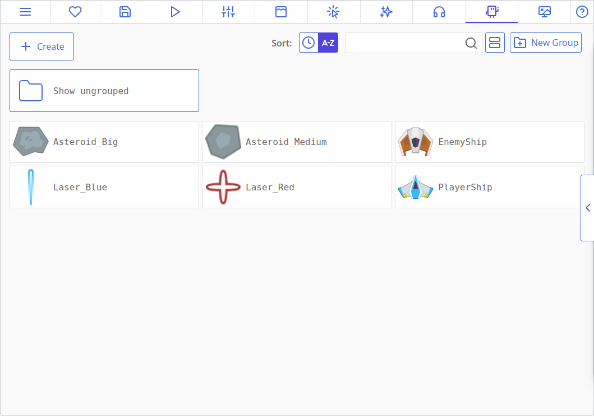
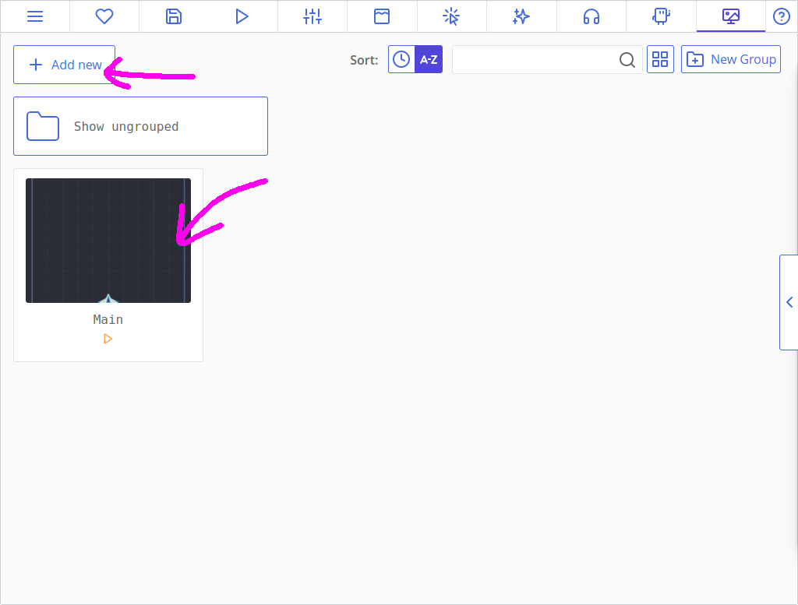
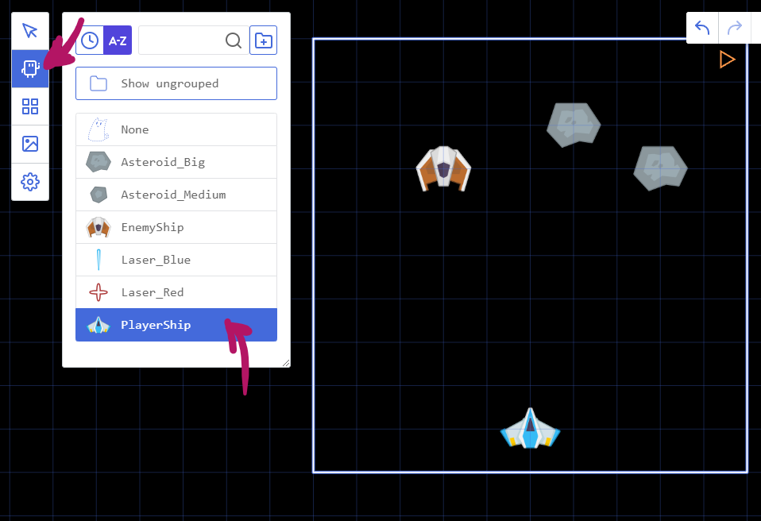
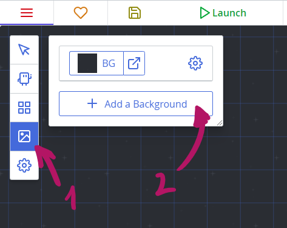
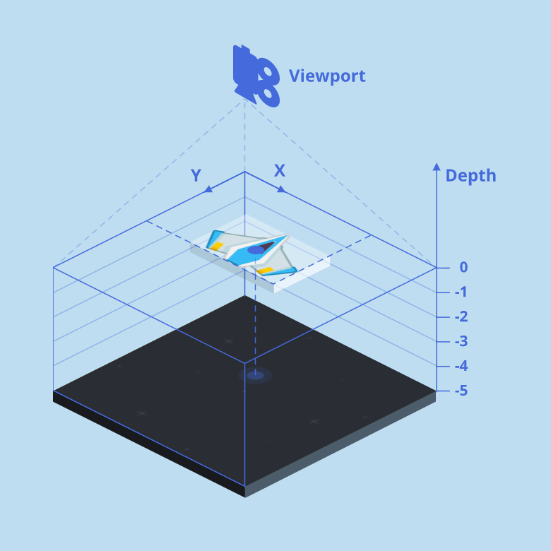
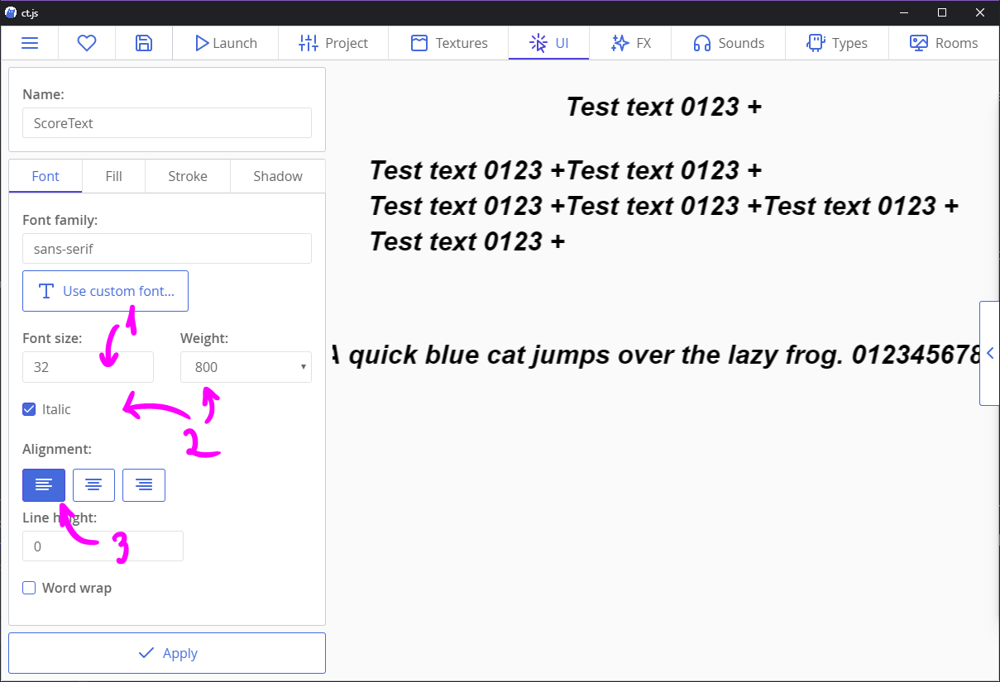

# Делаем игры: Космический шутер

Давай сделаем небольшую космическую стрелялку с астероидами, лазерами и вражескими кораблями! Этот туториал научит тебя добавлять ассеты, работать со вводом с клавиатуры, перемещать копии и реагировать на столкновения.


Вот что нам предстоит сделать:

[[toc]]

## Импорт текстур

Открой ct.js и создай новый проект под названием "SpaceShooter".


Далее, [скачай набор ассетов для космической стрелялки](http://www.kenney.nl/assets/space-shooter-redux) с сайта Kenney. Он бесплатен и хорош для создания прототипов, обучения, и даже для полноценных игр.

Также эти ассеты можно найти в папке `ct.js/examples/SpaceShooter_assets`.

Вот ассеты, которые нам сегодня понадобятся:


Нажми вкладку "Текстуры" вверху окна редактора, а затем мышью перетащи файлы из папки в редактор. Также можно нажать кнопку "Импорт" и найти файлы самостоятельно.

Для каждого изображения появится карточка ресурса. Открой карточку `PlayerShip`, чтобы настроить её. В открывшемся окне можно увидеть полупрозрачную фигуру, покрывающую корабль — это маска столкновений. Сейчас она покрывает слишком много пространства — особенно над крыльями. Чтобы это исправить, нам нужно будет изменить маску столкновения в левой колонке.

Сначала надо нажать на кнопку "По центру", чтобы ось вращения была идеально посередине текстуры.

После этого выбери пункт "**Ломаная / многоугольник**" под заголовком "Маска столкновения". Добавь несколько точек и перемести их на текстуре, чтобы достаточно похоже обвести форму корабля.


Далее нажми кнопку "Сохранить" и перейди к другой текстуре — `LaserRed`. Как и с кораблём, нужно переместить центр вращения этого снаряда в центр текстуры с помощью кнопки "По центру". После выбери маску столкновения **Круг** аккурат под этой кнопкой. Полупрозрачная форма столкновения станет круглой.

Следующая текстура, `Laser_Blue`, тоже должна быть отцентрована, и т.к. форма столкновения должна покрывать всю текстуру, мы можем нажать кнопку "Заполнить", чтобы не настраивать маску вручную.


Астероиды лучше всего обозначить как многоугольники. Поменяй их форму столкновения на **Ломаная / многоугольник** и процентрируй их.


Вражеский корабль `EnemyShip` тоже можно настроить как **Ломаная / многоугольник**.

Фон игры можно оставить как есть — он не будет участвовать в столкновениях и поэтому не требует дополнительной настройки.

## Создание первых шаблонов и их расстановка в комнате

**Текстуры** сами по себе могут немногое, и чтобы отобразить их в комнате, нам понадобятся **шаблоны**. Шаблоны нужны для создания **копий**, а копии уже помещаются в **комнаты**, где уже могут взаимодействовать друг с другом и выполнять игровую логику.

Нажми вкладку "Шаблоны" вверху экрана и создай новый шаблон. Это будет корабль игрока. После того, как нажмёшь кнопку "Создать", нажми на большого призрачного кота в левой колонке. Откроется окно со всеми текстурами — в нём надо будет выбрать синий корабль игрока. Текстура применится по щелчку и будет после этого отображаться в левой колонке.

Давай также переименуем шаблон в `PlayerShip`, чтобы потом не вспоминать всякие цифры в имени шаблона.


По аналогии создай шаблоны для остальных текстур, кроме фона. Фоны позднее нужно будет добавить отдельно в **комнате**, чтобы они могли повторяться и заполнять весь экран.



Давай теперь создадим комнату и разместим там созданные объекты. Открой вкладку "Комнаты" и нажми кнопку "Добавить". Откроется редактор комнат.



Вкратце расскажу, что где находится в этом редакторе. Расширенное описание можно найти [здесь](/room-editor.html), но сейчас все инструменты знать необязательно. Сначала нужно поменять название комнаты и размер отображаемой области. Это можно сделать в свойствах комнаты, нажав на кнопку с гайкой слева экрана.

Комнаты в ct.js бесконечны и могут простираться в любую сторону. Можно помещать копии и другие элементы как внутри начального вида, так и вне него.

Передвигаться по комнате можно, зажав колёсиком. Если колёсико покрутить, камера приблизится или отдалится от уровня — то же самое можно сделать через меню зума вверху экрана. Если ты вдруг потеряешься, нажми кнопку "Сбросить вид" в меню зума — она перейдёт в координаты в (0, 0), т.е. к центру начального вида. Также для этого можно нажать на клавиатуре английскую `H`.

Для начала давай добавим корабль игрока, вражеский корабль, и несколько астероидов. Выбери инструмент "Добавить копии" в левой панели, выдели шаблон кликом по нему, а затем размести копию внутри комнаты нажатием мыши.



После добавь фон. Нажми на инструмент "Управление фонами" слева и нажми кнопку "Добавить фон", после чего выбери текстуру `BG`. Она появится как фон, заполняющий всю комнату.



Хоть фоны и рисуются обычно на слой ниже копий (`0` по умолчанию), будет разумно изменить у фона глубину. Нажми на гайку напротив иконки фона и поставь значение поля "Глубина" на `-5`. Этим мы покажем движку, что фон располагается на 5 слоёв ниже других объектов в комнате. Глубина — это третье измерение в системе координат ct.js, которое идёт к камере, когда X и Y идут по горизонтали и вертикали.



После этого сохрани проект и нажми кнопку "Пуск" вверху экрана. У нас должна отобразиться наша комната. Пока что ничего не двигается, но это всё равно хорошее начало!


## Добавляем движение космическому кораблю

Ввод пользователя — самая важная тема при создании игры. В этой части урока мы сделаем передвижение корабля с помощью клавиш WASD и стрелок.

Чтобы обрабатывать ввод с клавиатуры, нам нужен для этого специальный модуль ct.js — котомод. Обычно модуль для клавиатуры включен в новых проектах по умолчанию. Проверить это можно во вкладке "Проект", разделе "Котомоды" слева. Модуль для обработки нажатий клавиш с клавиатуры так и называется — Клавиатура. Переключить его можно нажатием на крупную кнопку в правом верхнем углу карточки котомода. У работающих модулей отображается зелёная галочка с крутящимся шариком.

Помимо клавиатуры, нам также понадобятся модули `pointer`, `random` и `ct.place` — их можно включить сейчас, или же сделать это позже.


### Добавляем действия

Действия в ct.js — это то, что объединяет несколько методов ввода в одни события. Они позволяют слушать события клавиатуры и других устройств через код. Подробнее о них можно прочитать [здесь](/actions.html).

Сейчас мы сделаем простую схему управления для нашего шутера. Открой вкладку "проект", затем перейди в раздел "Действия и методы ввода" во вкладке слева. Нам понадобится три действия: для стрельбы лазером, для передвижения по горизонтали и для вертикального движения.

Сначала нажми кнопку "+ Создать с нуля". После впиши название первого действия. Затем нажми кнопку "Добавить метод ввода", чтобы привязать к этому действию определённые клавиши. Быстро найти нужные можно с помощью поиска. Остальные действия нужно будет добавить кнопкой "+ Добавить действие".


Создай три действия так, как изображено на скриншоте выше. Поставь множитель `-1` для `keyboard.ArrowUp`, `keyboard.KeyW`, `keyboard.ArrowLeft` и для `keyboard.KeyA`, чтобы эти клавиши двигали корабль в противоположном направлении.

### Кодим движение

Теперь перейди во вкладку "Шаблоны" вверху экрана, открой шаблон `PlayerShip` и перейди в событие `Начало кадра`.

::: tip
`Начало кадра` — это событие жизненного цикла копии. Оно случается каждый кадр перед прорисовкой, а событие `Конец кадра` происходит после всех событий `Начало кадра` в комнате для прорисовки нового кадра. `Создание` вызывается при создании каждой копии, а `Уничтожение` — перед событием `Конец кадра`, когда копия удаляется.
:::

Напиши следующий код:

```js
/**
 * Передвижение корабля
 * Смотри панель настроек Проект > Действия и методы ввода
 * и страницу "Действия" в документации.
 */

this.x += 8 * ct.delta * ct.actions.MoveX.value; // Передвижение по оси Х


/**
 * Проверка, выпал ли корабль за край экрана
 */
if (this.x < 0) { // Вышел ли корабль за левую границу?
    this.x = 0; // Перепрыгнуть на левую границу
}
if (this.x > ct.camera.width) { // Вышел ли корабль за правую границу?
    this.x = ct.camera.width; // Вернуться на правую границу
}

this.move();
```

Тут мы используем действия, которые создали ранее. Сначала мы передвигаем корабль по горизонтали (по оси `x`, строка 6). В игре `ct.actions.MoveX` вернёт `1`, если мы нажмём клавишу "D" или стрелку вправо, и `-1`, когда нажмём "A" или стрелку влево. Если мы ничего не нажмём, то будет `0`, и никакого движения не произойдёт.

`ct.delta` нужно для компенсации внезапных лагов и низкого FPS. В обычных условиях оно равно `1` и особо ничего не делает, но оно увеличится при низкой частоте кадров и скомпенсирует скорость.

Наконец, мы перемножаем получившееся значение с числом `8`, которое будет нашей желаемой скоростью (8 пикселей за кадр).

Далее мы проверяем, вышел ли корабль за пределы экрана. `0` — это левая кромка экрана, а `ct.camera.width` — это размер камеры по горизонтали, что для нас является также правой кромкой экрана, т.к. камеру в игре мы не передвигаем.

::: tip Теперь — самостоятельно!
Добавь кораблю движение по вертикали. Затем попробуй ограничить движение корабля так, чтобы он не мог улететь выше середины экрана.
:::

## Передвигаем противников и астероиды

Противники тоже должны двигаться. В этом уроке корабли у нас будут двигаться сверху вниз, а астероиды будут летать случайным образом.

### Вражеские корабли

Открой вкладку "Шаблоны" и нажми на `EnemyShip`. Добавь событие `Creation` и впиши этот код:

```js
this.speed = 3;
this.direction = 90;
```

Здесь мы уже используем встроенные свойства копий для движения. Редактировать координаты корабля игрока было удобно, но для большинства других задач есть смысл использовать эти параметры для автоматизации рассчётов. Например, с `this.speed` и `this.direction` не нужно использовать `ct.delta`. `this.speed` — это скорость копии, а `this.direction` — направление движения.

::: tip
В ct.js, направление измеряется в градусах, начинаясь справа и продолжаясь по часовой стрелке. 0° указывает направо, 90° — вниз, 180° — налево, а 270° — вверх.


:::

Если мы зайдём в событие `Начало кадра`, там уже будет эта строчка кода:

```js
this.move();
```

Она читает встроенные свойства для задания движения и передвигает копию согласно их значениям. Без неё свойства `this.speed` и `this.direction` были бы бессмыссленны.

Есть и другие свойства — их можно найти на странице [`класс Copy`](/Copy.html).

Мы расширим код события `Начало кадра` так, чтобы корабли уничтожались, когда выходят за нижнюю рамку экрана — мы не хотим, чтобы они оставались там навсегда и съедали оперативную память.

```js
this.move();

if (this.y > ct.camera.height + 80) {
    this.kill = true;
}
```

::: tip Попробуй сделать самостоятельно!
Как насчёт того, чтобы сделать противникам движение по диагонали? Зигзагами?
:::

### Астероиды

У астероидов будет такой же код в событии `Начало кадра`, но их направление — `direction` — будет назначаться случайным образом.

Открой шаблон `Asteroid_Medium` во вкладке "Шаблоны" и напиши следующий код в событие `Создание`:

```js Событие "Создание"
this.speed = ct.random.range(1, 3);
this.direction = ct.random.range(90 - 30, 90 + 30);
```

Код события `Начало кадра` будет такой же, как и в шаблоне `EnemyShip`:

```js Событие "Начало кадра"
this.move();

if (this.y > ct.camera.height + 80) {
    this.kill = true;
}
```

Сделай то же самое для другого астероида.

Сохрани проект и нажми кнопку "Пуск" вверху экрана. Вражеские корабли будут медленно передвигаться сверху вниз, а астероиды будут плыть случайным образом — это можно заметить, перезапуская проект.

::: tip
Если ты получаешь ошибки, связанные с `ct.random`, проверь, что у тебя включен модуль `ct.random` во вкладке Проект -> разделе Котомоды.
:::


## Снаряды и коллизии

Пора принести пушки 😎

Открой шаблон `PlayerShip` и добавь событие "Нажатие действия". Откроется окно, в котором можно будет вписать желаемое событие — нам понадобится событие "Shoot". Примени настройки. Внутри события "При нажатии Shoot" добавь этот код:

```js
ct.templates.copy('Laser_Blue', this.x, this.y);
```

Ура! Мы впервые создаём новые копии программным путём!

::: tip
`ct.templates.copy` — очень важный метод, который создаёт новую копию в текущей комнате. Сначала мы в скобках пишем имя шаблона, с которого создаётся копия — обязательно в кавычках. Далее прописывается расположение копии по горизонтали и вертикали. `this.x` — это текущее расположение нашей копии (корабля) по горизонтали, а `this.y` — по вертикали.
:::

С этими значениями у нас будет создаваться синяя пуля под кораблём. Мы ранее привязали к действию Shoot пробел клавиатуры, поэтому пули будут создаваться при нажатии на него.

Теперь надо передвигать сами копии шаблона `Laser_Blue`. Для их движения будем использовать встроенные свойства копий.

```js Код события "Создание"
this.speed = 18;
this.direction = 270;
```

Также нужно удалять ненужные снаряды, которые вылетели за пределы экрана. Так как пули летят только вверх, достаточно проверять только верхнюю грань.

```js Событие "Начало кадра"
if (this.y < -40) {
    this.kill = true;
}

this.move();
```

Следующая задача — отлов столкновений. Разумно будет описать эти события в астероидах и вражеских кораблях, т.к. реакция у них будет разная. Также мы таким образом не будем захламлять код лазерной пули.

Перейди в шаблон `EnemyShip` и создай событие "Столкновение с шаблоном", затем выбери в настройках шаблон `Laser_Blue`. В коде пропиши следующее:

``` js
other.kill = true;
this.kill = true;
```

::: tip
`other` — это специальная переменная, используемая в событиях столкновения. `other` указывает на ту копию, с которой сталкивается наша. Такие особенные переменные, доступные в определённых событиях, можно найти под заголовком "Локальные переменные" в левой колонке!
:::

Когда пуля сталкивается с кораблём, удаляются как пуля, так и корабль.

Скопируй то же самое в шаблон `Asteroid_Medium`. Такой код понадобится и в шаблоне `Asteroid_Big`, но мы также добавим две линии, чтобы он разбивался на два астероида поменьше:

``` js
other.kill = true;
this.kill = true;
ct.templates.copy('Asteroid_Medium', this.x, this.y);
ct.templates.copy('Asteroid_Medium', this.x, this.y);
```

Если сейчас запустить игру, корабль и астероиды можно будет уничтожить лазером. Большие астероиды должны распадаться на два поменьше.

### Вражеские пули

Вражеские корабли тоже должны стрелять. Добавь следующий код в событие "Создание" шаблона `EnemyShip`:

``` js
this.timer1 = 1;
```

Этой строкой мы взведём таймер, по которому будет стрелять вражеский корабль. `timer1` — это специальный параметр, отслеживаемый ct.js автоматически. Таймер исчисляется в секундах, т.е. `this.timer1 = 1` взводит таймер на одну секунду. А событие `Таймер 1` сработает, когда таймер дойдёт до нуля (когда пройдёт одна секунда).

Добавь этот код в событие `Таймер 1`:

```js
this.timer1 = 3;
ct.templates.copy('Laser_Red', this.x, this.y + 32);
```

Когда переменная `timer1` доходит до нуля, мы снова заводим таймер, ставя ему значение 3 (три секунды), и создаём красную пулю. Следующая пуля будет создаваться автоматически с интервалом в 3 секунды. Также, за счёт маленькой формулы `this.y + 32`, мы создаём пулю чуть ниже центра корабля.

Теперь напишем код для самих пуль. Добавь этот код в событие `Создание` шаблона `Laser_Red`:

```js
this.speed = 8;
this.direction = 90;

this.angle = ct.random.deg();
```

`this.angle` визуально поворачивает текстуру. `ct.random.deg()` возвращает случайное значение от 0 до 360, что полезно для рассчёта случайных направлений.

::: tip
Есть также `this.scale.x` и `this.scale.y`, которые меняют размер копии, а также `this.alpha` для прозрачности (0 — полностью прозрачный, 1 — полностью видимый).
:::

Код события `Начало кадра` будет выглядеть следующим образом:

``` js
if (this.y > ct.camera.height + 40) {
    this.kill = true;
}

this.move();

this.angle -= 4 * ct.delta;
```

`this.angle -= 4 * ct.delta;` будет поворачивать копию на 4 градуса каждый кадр против часовой стрелки. `ct.delta` сгладит движение при нестабильном FPS.

Уничтожение корабля игрока мы напишем немного позднее. Сейчас же самое время сделать автоматическое создание копий астероидов и вражеских кораблей с течением времени.

## Генерация объектов с течением времени

Открой комнату `Main` во вкладке "Комнаты". Удали существующие копии, выделив их мышью и нажав кнопку `Delete`.

Далее нажми на кнопку "События" вверху комнаты.

У комнат тоже есть события, похожие на те, что есть в шаблонах.

* `Старт комнаты` вызывается при запуске игры или при переходе в эту комнату;
* `Начало кадра` вызывается каждый кадр после такого же события у всех копий;
* `Конец кадра` вызывается после всех других событий в текущем кадре. Оно полезно для обновления интерфейса;
* `Конец комнаты` вызывается перед переходом в другую комнату.

Противники и астероиды будут создаваться по аналогии с красными снарядами вражеских кораблей. Мы добавим несколько таймеров и будем создавать новые копии чуть выше текущего вида.

Для этого сначала взведём два таймера в событии `Старт комнаты`:

```js
this.timer1 = 0.3; // таймер для астероидов
this.timer2 = 3; // таймер для кораблей противников
```

После добавь этот код в таймер `Timer 1`, чтобы создавать астероиды по истечению таймера:

```js
// Астероиды
this.timer1 = ct.random.range(0.3, 3);
ct.templates.copy(ct.random.dice('Asteroid_Big', 'Asteroid_Medium'), ct.random(ct.camera.width), -100);
```

После добавь этот код в таймер `Timer 2`, чтобы создавать вражеские корабли по истечению таймера:

```js
// Вражеские корабли
this.timer2 = ct.random.range(3, 6);
ct.templates.copy('EnemyShip', ct.random(ct.camera.width), -100);
```

Это всё, что нужно для создания кораблей и астероидов!

::: tip
`ct.random.dice` возвращает один из написанных аргументов случайным образом. Туда можно писать что угодно — строки, числа, сложные объекты. В нашем случае мы с шансом в 50% получим `'Asteroid_Big'`, и с шансом 50% — `'Asteroid_Medium'`.

`ct.random.range(a, b)` возвращает случайное значение между `a` и `b`.

`ct.random(b)` — это то же самое, что и `ct.random.range(0, b)`.
:::

## Жизни, очки и графический интерфейс

Пора добавить подсчёт очков и реакцию корабля на столкновение со снарядами и астероидами.

### Счёт и его отображение

Счёт — это глобальное числовое значение для подсчёта очков, которое должно быть доступно всем. Лучше всего его записать внутрь комнаты. Открой комнату `Main` и нажми на кнопку "События" вверху комнаты. Добавь этот код в событие `Старт комнаты`:

```js
this.score = 0;

this.scoreLabel = new PIXI.Text('Score: ' + this.score);
this.addChild(this.scoreLabel);
this.scoreLabel.x = 30;
this.scoreLabel.y = 30;
this.scoreLabel.depth = 1000;
```

Здесь сначала задаётся свойство `score`. После этого создаётся сам объект-надпись с помощью `new PIXI.Text('Стартовый текст')`, который мы сразу записываем в свойство `this.scoreLabel` и добавляем в комнату с помощью `this.addChild(this.scoreLabel);`. После этого мы смещаем через x и y эту надпись, чтобы она была в левом верхнем углу, с отступом в 30px пикселей с каждой стороны. Мы также задаём глубину (`depth`) — это та же глубина, что и у фонов и шаблонов, и написав 1000, наша надпись будет рисоваться поверх всех элементов в комнате.

Нам также понадобится добавить эту строчку кода в событие `Конец кадра`, чтобы надпись обновлялась:

```js
this.scoreLabel.text = 'Score: ' + this.score;
```

Теперь перейди в шаблон `EnemyShip`, в событие `Столкновение с Laser_Blue`, и добавь код `ct.room.score += 100;`, чтобы счёт добавлялся при уничтожении вражеского корабля. Код целиком будет выглядеть так:

```js
other.kill = true;
this.kill = true;
ct.room.score += 100;
```

::: tip
`ct.room` — это текущая комната.
:::

Сделай то же самое для астероидов. Можно поменять количество счёта, которое они добавляют.

После всего этого в запущенном проекте можно будет увидеть небольшую надпись, меняющуюся при уничтожении объектов в комнате. Но она стрёмно выглядит. Пора добавить стили!

Текст можно рисовать с помощью стилей, которые задают тексту цвет, стиль обводки, настройки шрифта, тень. Они создаются во вкладке `Интерфейс` сверху. Создай один с помощью кнопки `+ Создать`. Откроется редактор стилей, у которого есть панель настроек с вкладками слева и окно предпросмотра справа. Назови созданный стиль `ScoreText`.

Давай увеличим шрифт и сделаем его жирнее. Поменяй **размер шрифта** и поставь **толщину** на 800.



Затем зайди во вкладку `Заливка`, активируй её и выбери сплошную заливку. Выбери подходящий цвет; я выбрал что-то около цвета корабля игрока.


Потом можно добавить тень или обводку. Или и то, и другое! Когда закончишь, нажми кнопку "Применить" в левом верхнем углу.

После этого надо будет вернуться в событие `Старт комнаты` у нашей единственной комнаты, чтобы поставить созданный стиль тексту. Надо будет изменить код следующим образом:

```js{5}
this.timer1 = 0.3; // астероиды
this.timer2 = 3; // вражеские корабли

this.score = 0;
this.scoreLabel = new PIXI.Text('Score: ' + this.score, ct.styles.get('ScoreText'));
this.addChild(this.scoreLabel);
this.scoreLabel.x = 30;
this.scoreLabel.y = 30;
```

::: tip
Команда `ct.styles.get('Style');` загружает определённый стиль. Его можно использовать внутри конструктора PIXI.Text для стилизации надписей.
:::

Если сейчас запустить игру, счёт будет отображаться в твоём стиле. Ура!

### Создание жизней и их отображение

Управление жизнями похоже на управление счётом. Добавь этот код в событие `Старт комнаты`, чтобы создавалась надпись для жизней и создавалось свойство комнаты для этих жизней:

```js
this.lives = 3;
this.livesLabel = new PIXI.Text('Lives: ' + this.lives, ct.styles.get('ScoreText'));
this.addChild(this.livesLabel);
this.livesLabel.x = ct.camera.width - 200;
this.livesLabel.y = 30;
this.livesLabel.depth = 1000;
```

::: tip Попробуй самостоятельно!
Сделай новый стиль и примени его к надписи с количеством жизней.
:::

После нам надо задать алгоритм, который будет менять жизни при столкновении со снарядами и астероидами. Можно было использовать событие "столкновение с шаблоном", чтобы это сделать, но лучше объединить все опасные шаблоны в одну _группу столкновений_. Это позволит нам писать меньше кода, и его количество не увеличится, если мы решим добавить новых противников или новые снаряды.

Чтобы добавить шаблон в группу столкновений, нам нужно прописать имя группы в свойства шаблона, которые обычно располагаются в правой колонке редактора шаблонов. Давай напишем группу `Hostile` (т.е. "вражеский"). Сделай это для всех астероидов, лазера и вражеского корабля.

После этого в шаблоне — корабле игрока — сделай событие "Столкновение с группой". Напиши группу "Hostile". Затем добавь этот код в получившееся событие `Столкновение с группой Hostile`:

```js
if(ct.templates.isCopy(other)) {
    other.kill = true;
}

ct.room.lives --;
if (ct.room.lives <= 0) {
    this.kill = true;
    ct.u.wait(1000)
    .then(() => {
        ct.rooms.restart();
    });
}
```

`ct.rooms.restart` перезагружает текущую комнату.

`ct.u.wait` выполняет действие в `then` после истечения указанного времени (в миллисекундах). Здесь мы ждём одну секунду (1000 миллисекунд) и перезапускаем комнату.

::: tip
`ct.u.wait` может казаться более удобным методом работы с таймерами, нежели чем через события. Разница в том, что события-таймеры существуют, пока существует копия, а `ct.u.wait` выполнится в любом случае, даже если копия, которая вызвала эту функцию, была удалена.

В нашем случае нужно перезапустить комнату после удаления корабля игрока, и поэтому мы используем `ct.u.wait` вместо событий. Таймеры-события мы использовали в кораблях противника потому, что пули должны создаваться только пока жив вражеский корабль.
:::

Сохрани свой проект и проверь его. Если всё хорошо, то у тебя будет маленький, но свой собственный шутер! Вот варианты, как его можно сделать лучше и интереснее:

* поменяй существующие параметры — частоту стрельбы противников, скорость кораблей и астероидов, чтобы улучшить геймплей;
* добавь больше видов противников;
* улучши процесс стрельбы, чтобы достаточно было зажать пробел, а не жмакать его кучу раз;
* добавь бонусы и разные пушки;
* создай главное меню и экран победы;
* добавь звуки;
* сделай боссов и компаньонов.

Вот итог моих доработок этого проекта: [Котстероиды](https://comigo.itch.io/catsteroids).

Также, если тебе не нравятся космические шутеры, можно начать новый проект :D
