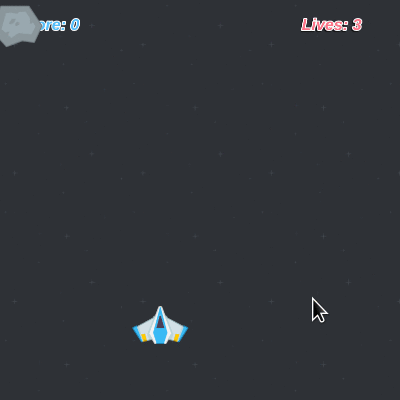
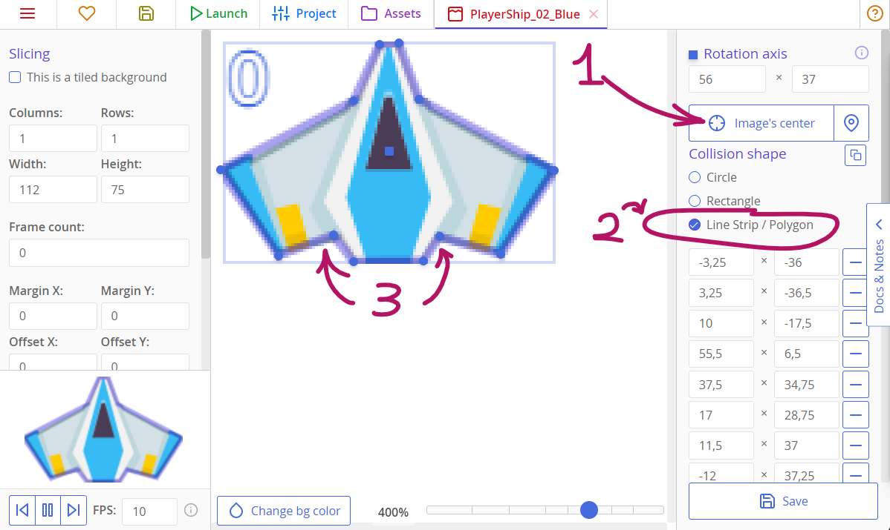
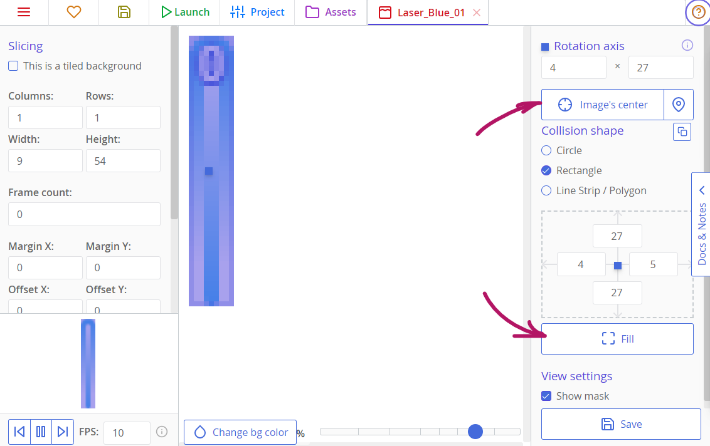
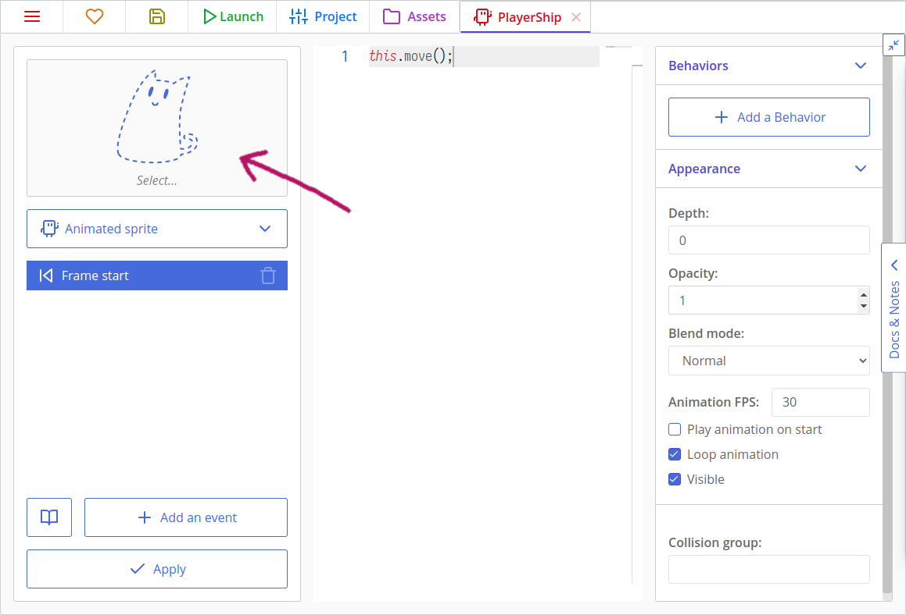
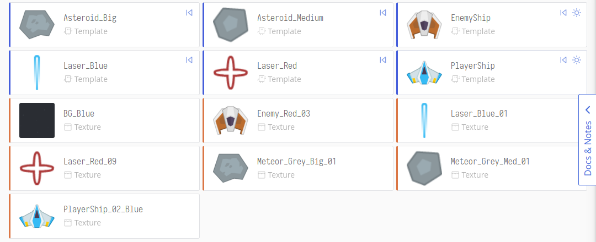
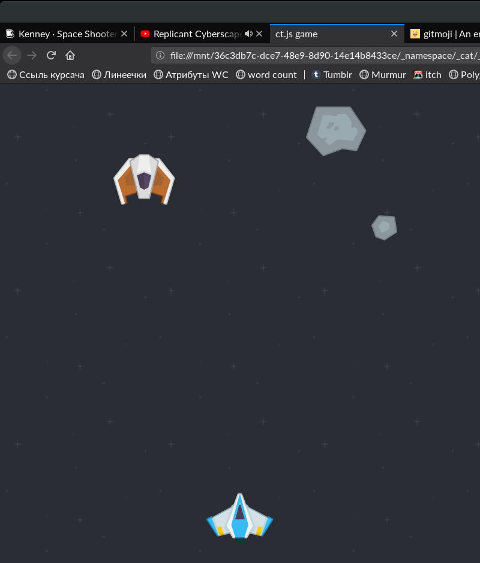
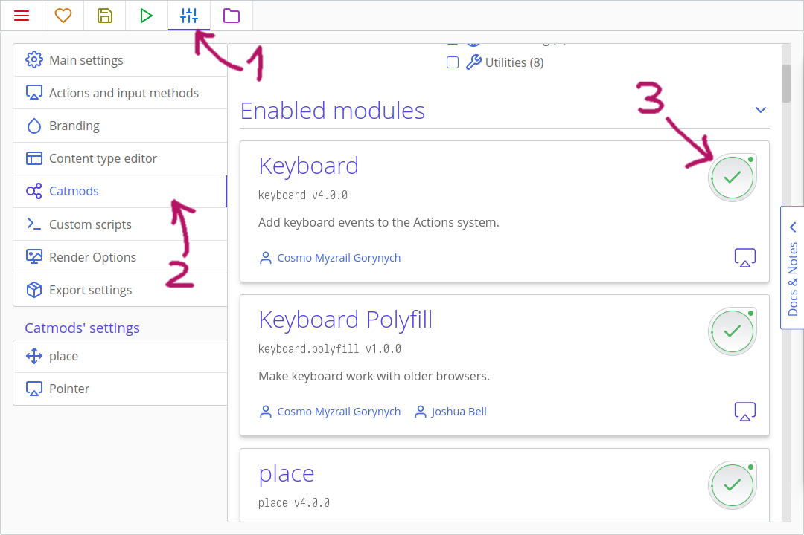
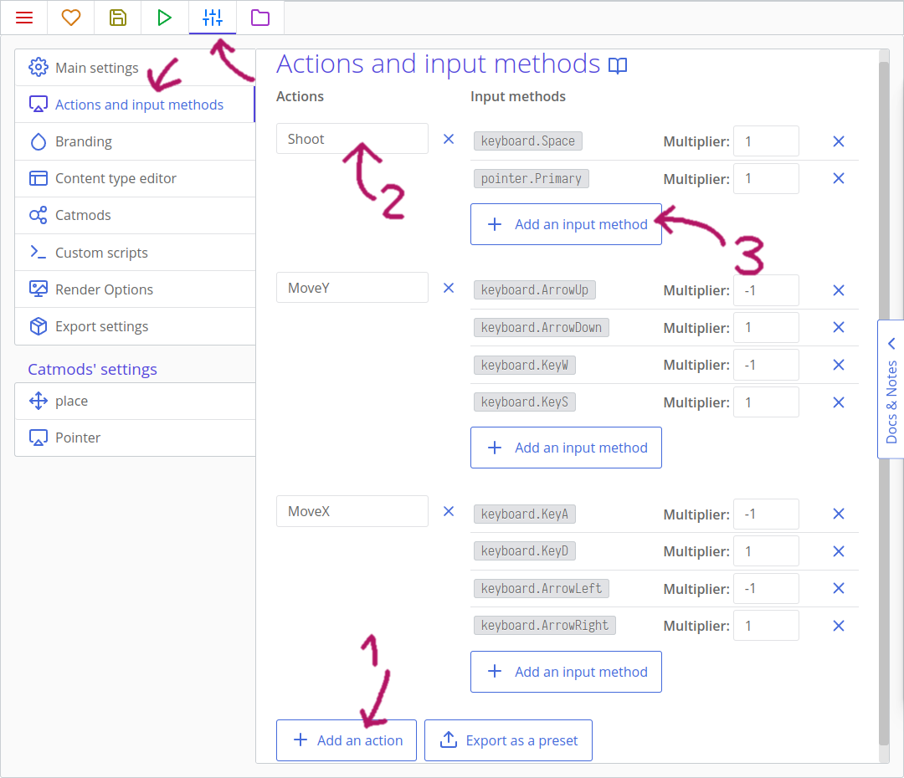
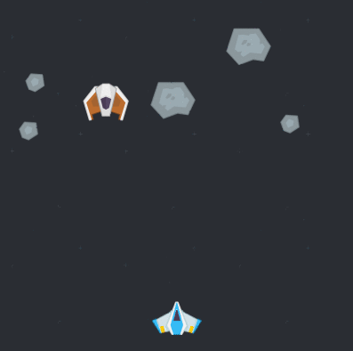
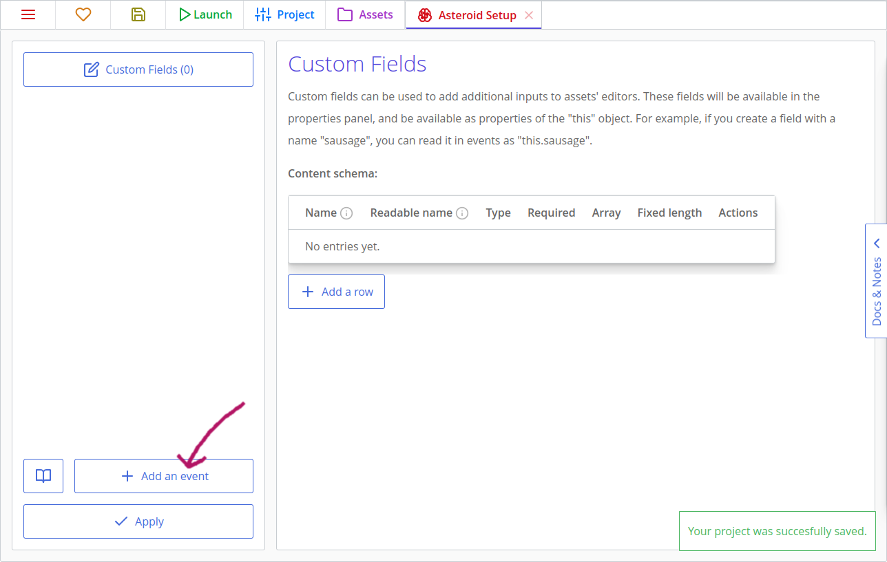

::: note Автоматически переведённая страница
К сожалению, на полный ручной перевод у нас не хватает ресурсов.
Если вы увидели ошибку — отправьте пул-риквест с исправлениями (ссылка для редактирования в конце страницы).
:::

# Создание игр: космический шутер

Давайте создадим небольшую игру в космосе со шутерами, астероидами, лазерами и враждебными истребителями! В этом руководстве мы научим вас импортировать ресурсы, обрабатывать входные данные пользователей, перемещать объекты и реагировать на столкновения.



Вот что нам нужно сделать:

[[toc]]

## Импорт текстур

Откройте ct.js и кликните на вкладку "Создать новое". Создайте новый проект, указав его имя (например, "SpaceShooter"), выбрав язык программирования и нажав кнопку "Создать".


Нам понадобятся некоторые спрайты для этой задачи. В верхнем правом углу найдите кнопку "Новый ассет", нажмите ее и выберите "Внутренняя галерея ассетов" в меню.


В галерее найдите пакет ассетов **"Kenney's Space Shooter"** и добавьте эти (или похожие) текстуры, наведя курсор мыши на нужные текстуры и нажав кнопку импорта в правом верхнем углу:


Когда вы закончите, закройте галерею, нажав на кнопку "X" в правом верхнем углу.

Теперь вы увидите карты для каждой импортированной текстуры. Откройте карту `PlayerShip` и настройте ее, нажав на ее карту ассета. Мы увидим синюю прозрачную форму, которая определяет его коллизионную форму. Эта форма определяет, какие области считаются частью корабля, а какие нет. Пока она покрывает слишком много пустого пространства, особенно над крыльями. Чтобы исправить это, нам нужно изменить эту коллизионную форму в правой колонке.

Сначала нажмите кнопку **"Центр изображения"**, чтобы поставить ось в центр корабля.

Далее выберите **«Линейная полоса / Полигон»** в качестве формы коллизии под меткой "Коллизионная форма". Добавьте пару дополнительных точек и переместите их мышкой, чтобы результирующий полигон напоминал форму корабля.



Нажмите "Сохранить" и перейдите к следующей текстуре — `Laser_Red`. Как и с кораблем, поставьте ее ось в центр, нажав кнопку **"Центр изображения"**. Затем выберите **«Круг»** в качестве формы коллизии прямо под этой кнопкой. Теперь синяя форма коллизии нарисована как круг.


Следующая текстура, `Laser_Blue`, также должна быть центрирована. Поскольку форма коллизии должна покрывать все изображение, вы можете нажать кнопку "Заполнить", чтобы автоматизировать этот процесс.



Оба астероида лучше определить как полигоны из-за их вогнутых или острых форм. Установите для них форму коллизии **«Линейная полоса / Полигон»** и не забудьте поставить их ось в центр.

Форма `Enemy_Red` может быть обработана как **«Полигон»**.

Фоновое изображение может остаться без изменений, так как оно не будет коллизией с другими объектами в игре. Но вы должны перейти к его редактированию и проверить флажок "Это тиленое заднее изображение", чтобы избежать швов при мозаике при запуске игры.

## Создание первых шаблонов и размещение вещей

**Текстуры** сами по себе не имеют особого смысла, и чтобы отобразить их в игре, нам нужно создать **шаблоны** с этими ресурсами. Шаблоны используются для создания **копий**, а копии — это те самые объекты, которые вы помещаете в **комнаты**, которые взаимодействуют друг с другом и реагируют на ваши действия.

Перейдите в вкладку "Ресурсы" в верхней части экрана, нажмите кнопку "Новый ресурс" и создайте новый шаблон для корабля игрока. Назовите шаблон "PlayerShip", чтобы нам не пришлось запоминать какие-то номера при программировании. Если вы забыли изменить название при создании шаблона, вы можете перейти обратно к вкладке "Ресурсы" и щелкнуть правой кнопкой мыши по шаблону, и там будет возможность переименовать его.

Щелкните по большой призрачной кошке в левой колонке, чтобы выбрать текстуру для нее. Нажмите на карту с вашим кораблем — после этого он появится в левой колонке редактора.



Создайте шаблоны для всех остальных текстур, кроме фонового изображения. Фоновые изображения обычно не перемещаются и не взаимодействуют с другими объектами и часто повторяются, поэтому они не являются шаблонами. Мы добавим его позже в **комнате**.

Вот как должен выглядеть ваш список ресурсов:



Теперь поместим созданные шаблоны на карту. Чтобы создать эту карту или комнату, еще раз нажмите кнопку "Новый ресурс" и выберите "Комната". Назовите ее "Главная" и создайте.


Здесь мы немного остановимся, чтобы объяснить, как использовать редактор комнат. Более подробное описание можно найти [здесь](./../room-editor.md), но пока что нам понадобятся только некоторые инструменты этого редактора. Во-первых, мы должны настроить размер просмотра комнаты в свойствах комнаты, нажав кнопку с шестеренкой в левой панели инструментов.

В ct.js комнаты бесконечны и могут перемещаться в любом направлении. Вы можете помещать объекты внутри и за пределами области просмотра.

Вы можете перемещаться по комнате, удерживая колесо мыши и перетаскивая мышь. Вы также можете изменять масштаб с помощью колесика мыши или с помощью выпадающего меню в верхней панели инструментов. Если вы чувствуете себя дезориентированным, нажмите пункт меню "Сбросить просмотр" в выпадающем меню "Масштаб", чтобы вернуться к координатам (0, 0) — или просто нажмите клавишу `H`.

Пока что давайте разместим корабль игрока, вражеский корабль и пару астероидов. Выберите инструмент "Добавить копии" в левой панели инструментов, выберите шаблон и поместите его на уровень с помощью щелчка мыши.


Затем добавим фон. Нажмите кнопку "Фонды" в левой панели и нажмите кнопку "Добавить фон", затем выберите наш фоновый ресурс. Он появится в основном просмотре как текстура, повторяющаяся по всему экрану.


Хотя фоновые изображения всегда отрисовываются перед копиями с одинаковым уровнем глубины (`0` по умолчанию), лучше изменить их уровень глубины. Нажмите кнопку с шестеренкой справа рядом с миниатюрой фона и введите `-5` в поле "Глубина". Таким образом, мы сообщаем движку, что этот фон находится ниже, чем другие копии и фоны. Глубина представляет собой третью ось, которая идет вверх, а X и Y — на стороны.


После этого сохраните проект и нажмите кнопку "Запустить". На этом этапе у вас будет проект игры с неподвижными кораблями и астероидами.



Добавление движения игрока

Обработка входных данных пользователя — это самый важный задача. В этом разделе мы сделаем синюю корабль двигаться при нажатии стрелочных клавиш или клавиш WASD.

Чтобы обработать ввод с клавиатуры, нам нужно включить модуль Keyboard. Перейдите на вкладку «Проект», затем на левую вкладку «Catmods», затем найдите модуль Keyboard в разделе доступных модулей. Нажмите на него, чтобы включить (он может быть включен по умолчанию — зеленый флажок с маленькой стрелкой указывает на то, что модуль включен). Затем убедитесь, что включены модули `pointer`, `random` и `place`, поскольку нам они тоже понадобятся позже.



### Добавление действий

Действия в ct.js — это объекты, которые группируют различные методы ввода в события и позволяют вам слушать ввод игрока в коде. Дополнительную информацию можно найти [здесь](./../actions.md).

Пока давайте создадим базовую схему ввода для нашей игры-стрелялки. Откройте вкладку «Проект», а затем вкладку «Действия и методы ввода» слева. Нам нужно будет определить три разных действия: для стрельбы лазерными пулями, для горизонтального движения и для вертикального движения.

Сначала нажмите кнопку «Создать с нуля». Затем введите имя первого действия. Нажмите кнопку «Добавить метод ввода», чтобы связать конкретные кнопки с вашим действием. Используйте его поиск, чтобы быстро отфильтровать доступные методы ввода. Нажмите кнопку «Добавить действие», чтобы продолжить создание новых действий.



Создайте три действия, как показано на картинке выше. Установите значение множителя равным `-1` для `keyboard.ArrowUp`, `keyboard.KeyW`, `keyboard.ArrowLeft` и для `keyboard.KeyA`, так что эти клавиши будут двигать корабль в противоположном направлении.

### Кодирование движения

Вернуться к "Ассетам", затем щелкнуть на шаблоне `PlayerShip` и перейти к событию `Frame start`.

::: tip
Событие `Frame start` происходит каждый кадр перед отрисовкой, в то время как событие `Frame end` происходит после всех событий `Frame start` в комнате для отрисовки нового кадра. Событие `Creation` происходит при создании новой Копии, и событие `Destruction` происходит до события `Frame end`, если Копия была убита.
:::

Напишите следующий код:

::: tabs#tutorial
@tab JavaScript
```js
/**
 * Move the ship
 * See Project > Actions and input methods panel
 * and "Actions" in the docs.
 */
this.hspeed = 480 * actions.MoveX.value; // Move by X axis


/**
 * Check whether the ship fell off the viewport
 */
if (this.x < 0) { // Have the ship crossed the left border?
    this.x = 0; // Go back to the left border
}
if (this.x > camera.width) { // Have the ship crossed the right border?
    this.x = camera.width; // Go back to the right border
}

this.move();
```
@tab CoffeeScript
```coffee
# Move the ship
# See Project > Actions and input methods panel
# and "Actions" in the docs.

@hspeed = 480 * actions.MoveX.value # Move by X axis

# Check whether the ship fell off the viewport
if @x < 0 # Have the ship crossed the left border?
    @x = 0 # Go back to the left border

if @x > camera.width # Have the ship crossed the right border?
    @x = camera.width # Go back to the right border

@move()
```
@tab Catnip
<catnip-block class=" command   note selected">  <span class="catnip-block-aTextLabel">Note</span>      <textarea value="Move the ship
See Project > Actions and input methods panel
and &quot;Actions&quot; in the docs.
Move by X axis" style="height: 69px;" readonly="readonly"></textarea>         </catnip-block>

<catnip-block class=" command    selected">  <span class="catnip-block-aTextLabel">Increase</span>         <catnip-block class=" computed number wildcard  ">  <span class="catnip-block-aTextLabel">x</span>     </catnip-block>  <span class="catnip-block-aTextLabel">by</span>                  <catnip-block class=" computed number number  ">            <input type="text" class="catnip-block-aConstantInput number " value="480" style=" width: 3.5ch;    " readonly="readonly"> <span class="catnip-block-aTextLabel">×</span>                  <catnip-block class=" computed number number  ">           <catnip-block class=" computed number number  ">  <span class="catnip-block-aTextLabel">time</span>     </catnip-block>  <span class="catnip-block-aTextLabel">×</span>                  <catnip-block class=" computed number number  ">  <span class="catnip-block-aTextLabel">action value</span>          <span class="catnip-block-aConstantInput menu string ">   <span>MoveX</span></span>     </catnip-block>      </catnip-block>      </catnip-block>      </catnip-block>

<catnip-block class=" command   note selected">  <span class="catnip-block-aTextLabel">Note</span>      <textarea value="Check whether the ship fell off the viewport
Has the ship crossed the left border?" style="height: 37px;" readonly="readonly"></textarea>         </catnip-block>

<catnip-block class=" command    selected">  <span class="catnip-block-aTextLabel">If</span>         <catnip-block class=" computed boolean boolean  ">           <catnip-block class=" computed number number  ">  <span class="catnip-block-aTextLabel">x</span>     </catnip-block>  <span class="catnip-block-aTextLabel">&lt;</span>                   <input type="text" class="catnip-block-aConstantInput number " value="0" style=" width: 1.5ch;    " readonly="readonly">     </catnip-block>        <div class="catnip-block-Blocks"> <catnip-block-list>   <catnip-block class=" command   note ">  <span class="catnip-block-aTextLabel">Note</span>      <textarea value="Go back to the left border" style="height: 21px;" readonly="readonly"></textarea>         </catnip-block>   <catnip-block class=" command    ">  <span class="catnip-block-aTextLabel">Set x to</span>          <input type="text" class="catnip-block-aConstantInput number " value="0" style=" width: 1.5ch;    " readonly="readonly">     </catnip-block>    </catnip-block-list> </div>        </catnip-block>

<catnip-block class=" command   note selected">  <span class="catnip-block-aTextLabel">Note</span>      <textarea value="Has the ship crossed the right border?" style="height: 21px;" readonly="readonly"></textarea>         </catnip-block>

<catnip-block class=" command    selected">  <span class="catnip-block-aTextLabel">If</span>         <catnip-block class=" computed boolean boolean  ">           <catnip-block class=" computed number number  ">  <span class="catnip-block-aTextLabel">x</span>     </catnip-block>  <span class="catnip-block-aTextLabel">&gt;</span>                  <catnip-block class=" computed number number  ">  <span class="catnip-block-aTextLabel">width</span>     </catnip-block>      </catnip-block>        <div class="catnip-block-Blocks"> <catnip-block-list>   <catnip-block class=" command   note ">  <span class="catnip-block-aTextLabel">Note</span>      <textarea value="Go back to the right border" style="height: 21px;" readonly="readonly"></textarea>         </catnip-block>   <catnip-block class=" command    ">  <span class="catnip-block-aTextLabel">Set x to</span>         <catnip-block class=" computed number number  ">  <span class="catnip-block-aTextLabel">width</span>     </catnip-block>      </catnip-block>    </catnip-block-list> </div>        </catnip-block>
:::

Здесь мы используем созданные действия. Во-первых, мы пытаемся горизонтально перемещать корабль (по оси X, строки 5 или 6). `actions.MoveX` вернет `1`, если мы нажимаем правую стрелку клавиатуры или клавишу "D", и будет возвращать `-1`, если игрок нажимает левую стрелку или клавишу "A". Если ничего не нажато, он будет возвращать `0`, отключая горизонтальное перемещение.

`u.time` необходимо для компенсации возможных задержек и изменений FPS. Он измеряет количество времени в секундах между последним кадром и текущим. Обычно он равен `1/60`, если ваш проект работает на 60 кадров в секунду, но будет ускорять перемещение, если некоторые кадры были пропущены. Это означает, что копия будет двигаться на 1 пиксель в секунду при `u.time`.

Наконец, мы умножаем наше промежуточное значение скорости на желаемую скорость, `480`.

Затем мы проверяем, не вышла ли X-координата корабля за пределы камеры. Здесь `0` означает левый бок комнаты, а `camera.width` означает горизонтальную ширину камеры, которая соответствует правому краю.

::: tip А теперь — самостоятельно!
Добавьте вертикальное перемещение игроку. Затем попробуйте ограничить его движение так, чтобы корабль не мог лететь выше середины камеры.
:::

## Перемещающиеся враги и астероиды

Враги тоже должны двигаться. Для этого руководства наш враждебный корабль будет перемещаться сверху вниз, а астероиды будут лететь в случайном направлении.

### Враги

Откройте вкладку "Ассеты", затем щелкните по `EnemyShip`. Перейдите к событию "Создание" и добавьте следующий код:

::: tabs#tutorial
@tab JavaScript
```js
this.speed = 180;
this.direction = 90;
```
@tab CoffeeScript
```coffee
@speed = 180
@direction = 90
```
@tab Catnip
<catnip-block class=" command    selected">  <span class="catnip-block-aTextLabel">Set speed to</span>          <input type="text" class="catnip-block-aConstantInput number " style=" width: 3.5ch;    " value="180" readonly="readonly">     </catnip-block>

<catnip-block class=" command    selected">  <span class="catnip-block-aTextLabel">Set direction to</span>          <input type="text" class="catnip-block-aConstantInput number " style=" width: 2.5ch;    " value="90" readonly="readonly">     </catnip-block>
:::

Здесь мы используем встроенные переменные для движения. Ручное редактирование координат может быть полезно при обработке ввода игрока, но для большинства задач лучше использовать эти переменные, так как они автоматизируют многие вещи. Например, вам не нужно использовать `u.time`, когда есть `this.speed` и `this.direction`. Здесь `this.speed` означает скорость Копии, а `this.direction` относится к ее направлению.

::: tip
Если вы используете CoffeeScript, то `this.speed` является `@speed`, `this.direction` — `@direction`, и т.д. Вы можете писать по-разному!
:::

::: tip
В ct.js направление измеряется в градусах, по часовой стрелке. 0° означает вправо, 90° вниз, 180° влево, а 270° вверх.


:::

Если мы перейдем к событию "Начало кадра", мы увидим следующий небольшой код:

::: tabs#tutorial
@tab JavaScript
```js
this.move();
```
@tab CoffeeScript
```coffee
@move()
```
@tab Catnip
<catnip-block class=" command    selected">  <span class="catnip-block-aTextLabel">Move this copy</span>     </catnip-block>
:::

Эта строка использует встроенные переменные и перемещает Копию в соответствии с ними. Без него `this.speed` и `this.direction` будут бессмысленны.

Есть еще несколько встроенных переменных, которые вы можете найти на странице [`шаблоны`](./../templates.md).

Мы изменим код события "Начало кадра", чтобы враги уничтожались, если они уходят за пределы экрана.

::: tabs#tutorial
@tab JavaScript
```js
this.move();

if (this.y > camera.height + 80) {
    this.kill = true;
}
```
@tab CoffeeScript
```coffee
@move()

if @y > camera.height + 80
    @kill = yes
```
@tab Catnip
<catnip-block class=" command    selected">  <span class="catnip-block-aTextLabel">Move this copy</span>     </catnip-block>

<catnip-block class=" command    selected">  <span class="catnip-block-aTextLabel">If</span>         <catnip-block class=" computed boolean boolean  ">           <catnip-block class=" computed number number  ">  <span class="catnip-block-aTextLabel">y</span>     </catnip-block>  <span class="catnip-block-aTextLabel">&gt;</span>                  <catnip-block class=" computed number number  ">           <catnip-block class=" computed number number  ">  <span class="catnip-block-aTextLabel">height</span>     </catnip-block>  <span class="catnip-block-aTextLabel">+</span>                   <input type="text" class="catnip-block-aConstantInput number " value="80" style=" width: 2.5ch;    " readonly="readonly">     </catnip-block>      </catnip-block>        <div class="catnip-block-Blocks"> <catnip-block-list>   <catnip-block class=" command    ">  <span class="catnip-block-aTextLabel">Destroy this copy</span>     </catnip-block>    </catnip-block-list> </div>        </catnip-block>
:::

::: tip Попробуйте самостоятельно!
Что если враги могут двигаться диагонально, создавая эффект зигзага?
:::

### Астероиды

Астероиды будут содержать один и тот же код `Frame start`, но их переменная `direction` будет определяться случайным образом.

Откройте `Asteroid_Medium` в вкладке "Assets", затем введите следующий код в событие `Creation`.

::: tabs#tutorial
@tab JavaScript
```js On Create event
this.speed = random.range(60, 180);
this.direction = random.range(90 - 30, 90 + 30);
```
@tab CoffeeScript
```coffee On Create event
@speed = random.range(60, 180)
@direction = random.range(90 - 30, 90 + 30)
```
@tab Catnip
<catnip-block class=" command    selected">  <span class="catnip-block-aTextLabel">Set speed to</span>         <catnip-block class=" computed number number  ">  <span class="catnip-block-aTextLabel">random range</span>          <input type="text" class="catnip-block-aConstantInput number " value="60" style=" width: 2.5ch;    " readonly="readonly">          <input type="text" class="catnip-block-aConstantInput number " value="180" style=" width: 3.5ch;    " readonly="readonly">     </catnip-block>      </catnip-block>

<catnip-block class=" command    selected">  <span class="catnip-block-aTextLabel">Set direction to</span>         <catnip-block class=" computed number number  ">  <span class="catnip-block-aTextLabel">random range</span>         <catnip-block class=" computed number number  ">            <input type="text" class="catnip-block-aConstantInput number " value="90" style=" width: 2.5ch;    " readonly="readonly"> <span class="catnip-block-aTextLabel">-</span>                   <input type="text" class="catnip-block-aConstantInput number " value="30" style=" width: 2.5ch;    " readonly="readonly">     </catnip-block>          <catnip-block class=" computed number number  ">            <input type="text" class="catnip-block-aConstantInput number " value="90" style=" width: 2.5ch;    " readonly="readonly"> <span class="catnip-block-aTextLabel">+</span>                   <input type="text" class="catnip-block-aConstantInput number " value="30" style=" width: 2.5ch;    " readonly="readonly">     </catnip-block>      </catnip-block>      </catnip-block>
:::

Событие `Frame start` будет таким же, как и в `EnemyShip`.

::: tabs#tutorial
@tab JavaScript
```js Frame start event
this.move();

if (this.y > camera.height + 80) {
    this.kill = true;
}
```
@tab CoffeeScript
```coffee
@move()

if @y > camera.height + 80
  @kill = true
```
@tab Catnip
<catnip-block class=" command    selected">  <span class="catnip-block-aTextLabel">Move this copy</span>     </catnip-block>

<catnip-block class=" command    selected">  <span class="catnip-block-aTextLabel">If</span>         <catnip-block class=" computed boolean boolean  ">           <catnip-block class=" computed number number  ">  <span class="catnip-block-aTextLabel">y</span>     </catnip-block>  <span class="catnip-block-aTextLabel">&gt;</span>                  <catnip-block class=" computed number number  ">           <catnip-block class=" computed number number  ">  <span class="catnip-block-aTextLabel">height</span>     </catnip-block>  <span class="catnip-block-aTextLabel">+</span>                   <input type="text" class="catnip-block-aConstantInput number " value="80" style=" width: 2.5ch;    " readonly="readonly">     </catnip-block>      </catnip-block>        <div class="catnip-block-Blocks"> <catnip-block-list>   <catnip-block class=" command    ">  <span class="catnip-block-aTextLabel">Destroy this copy</span>     </catnip-block>    </catnip-block-list> </div>        </catnip-block>
:::

Повторите то же для другого астероида.

Сохраните проект и нажмите кнопку "Запустить" вверху. Враждебный корабль будет медленно двигаться вниз, а астероиды будут двигаться более хаотично. Если вы обновите страницу, астероиды будут двигаться в новом направлении.

::: tip
У вас возникли ошибки с `random`? Убедитесь, что вы включили модуль `random` в разделе Проект -> Котомоды.
:::



## Снаряды & Столкновения

Теперь пора вооружить корабли 😎

Откройте шаблон `PlayerShip` и добавьте событие "Нажата кнопка "Стрелять"". Окно должно подсказать вам, какое действие вы хотите использовать. Выберите действие "Стрелка", а затем нажмите "Применить". Теперь внутри события "Стрелять" нажатого добавьте следующий код:

::: tabs#tutorial
@tab JavaScript
```js
templates.copy('Laser_Blue', this.x, this.y);
```
@tab CoffeeScript
```coffee
templates.copy 'Laser_Blue', @x, @y
```
@tab Catnip
<catnip-block class=" command    selected">  <span class="catnip-block-aTextLabel">Copy a template</span>          <span class="catnip-block-aConstantInput menu string ">   <span>Laser_Blue</span></span>         <catnip-block class=" computed number number  ">  <span class="catnip-block-aTextLabel">x</span>     </catnip-block>          <catnip-block class=" computed number number  ">  <span class="catnip-block-aTextLabel">y</span>     </catnip-block>    <div class="catnip-block-aFiller"></div>        <span class="catnip-block-aTextLabel">store in</span>                   <input type="text" class="catnip-block-aConstantInput wildcard " style=" width: 6.5ch;    " readonly="readonly">        <div class="catnip-block-Options"> <div class="catnip-block-anOptionsToggle"> <span>Advanced</span>  </div>    </div>       </catnip-block>
:::

Это первая программа, с помощью которой мы создаем новые копии. Хороший старта!

::: tip
`templates.copy` - это очень важная функция, которая создает новую копию в текущей комнате. Во-первых, мы указываем название шаблона, который нужно скопировать, а затем координаты, по которым нужно создать его, по горизонтали и вертикали соответственно. `this.x` означает горизонтальное положение текущей копии, а `this.y` - вертикальное.
:::

Сочетая все данные, мы создаем лазерный снаряд прямо под нашим кораблем. Снаряды будут создаваться при нажатии клавиши "Пробел".

Теперь давайте поговорим о самом "Laser_Blue". Мы определим его движение по умолчанию в событии "Создание".

::: tabs#tutorial
@tab JavaScript
```js On Create code
this.speed = 1080;
this.direction = 270;
```
@tab CoffeeScript
```coffee
@speed = 1080
@direction = 270
```
@tab Catnip
<catnip-block class=" command    selected">  <span class="catnip-block-aTextLabel">Set speed to</span>          <input type="text" class="catnip-block-aConstantInput number " style=" width: 4.5ch;    " value="1080" readonly="readonly">     </catnip-block>

<catnip-block class=" command    selected">  <span class="catnip-block-aTextLabel">Set direction to</span>          <input type="text" class="catnip-block-aConstantInput number " style=" width: 3.5ch;    " value="270" readonly="readonly">     </catnip-block>
:::

Следующий шаг - убедиться, что эти лазерные снаряды исчезнут после того, как выйдут из кадра. Поскольку они всегда ползут вверх, мы можем написать условие для верхней границы в событии "Начало кадра".

::: tabs#tutorial
@tab JavaScript
```js Step code
if (this.y < -40) {
    this.kill = true;
}

this.move();
```
@tab CoffeeScript
```coffee
if @y < -40
  @kill = true

@move()
```
@tab Catnip
<catnip-block class=" command    selected">  <span class="catnip-block-aTextLabel">If</span>         <catnip-block class=" computed boolean boolean  ">           <catnip-block class=" computed number number  ">  <span class="catnip-block-aTextLabel">y</span>     </catnip-block>  <span class="catnip-block-aTextLabel">&lt;</span>                   <input type="text" class="catnip-block-aConstantInput number " value="-40" style=" width: 3.5ch;    " readonly="readonly">     </catnip-block>        <div class="catnip-block-Blocks"> <catnip-block-list>   <catnip-block class=" command    ">  <span class="catnip-block-aTextLabel">Destroy this copy</span>     </catnip-block>    </catnip-block-list> </div>        </catnip-block>

<catnip-block class=" command    selected">  <span class="catnip-block-aTextLabel">Move this copy</span>     </catnip-block>
:::


Следующим шагом является обработка столкновений. Лучше всего обрабатывать логику столкновений в коде противника и кораблей, потому что они будут реагировать по-разному, не перегружая код снаряда.

Откройте шаблон `EnemyShip` и создайте событие "Столкновение с шаблоном", выбрав `Laser_Blue`. В коде добавьте следующее:

::: tabs#tutorial
@tab JavaScript
``` js
other.kill = true;
this.kill = true;
```
@tab CoffeeScript
```coffee
other.kill = true
@kill = true
```
@tab Catnip
<catnip-block class=" command void   selected">  <span class="catnip-block-aTextLabel">With copy</span>         <catnip-block class=" computed wildcard wildcard userdefined ">   <span class="catnip-block-aTextLabel">other</span>              </catnip-block>        <div class="catnip-block-Blocks"> <catnip-block-list>   <catnip-block class=" command    ">  <span class="catnip-block-aTextLabel">Destroy this copy</span>     </catnip-block>    </catnip-block-list> </div>        </catnip-block>

<catnip-block class=" command    selected">  <span class="catnip-block-aTextLabel">Destroy this copy</span>     </catnip-block>
:::

::: tip
`other` — это специальная переменная, на которую можно ссылаться при написании кода событий столкновения. `other` относится к другому сталкивающемуся экземпляру. Будьте внимательны к другим локальным переменным, которые могут быть доступны в определенных событиях!
:::

Если корабль сталкивается с лазерным снарядом, то и снаряд, и корабль должны быть уничтожены.

Скопируйте тот же код для `Asteroid_Medium`. Нам также понадобится этот код для `Asteroid_Big`, но мы сделаем так, чтобы большие астероиды разбивались на два более мелких:

::: tabs#tutorial
@tab JavaScript
``` js
other.kill = true;
this.kill = true;
templates.copy('Asteroid_Medium', this.x, this.y);
templates.copy('Asteroid_Medium', this.x, this.y);
```
@tab CoffeeScript
```coffee
other.kill = true
@kill = true
templates.copy 'Asteroid_Medium', @x, @y
templates.copy 'Asteroid_Medium', @x, @y
```
@tab Catnip
<catnip-block class=" command void   selected">  <span class="catnip-block-aTextLabel">With copy</span>         <catnip-block class=" computed wildcard wildcard userdefined ">   <span class="catnip-block-aTextLabel">other</span>              </catnip-block>        <div class="catnip-block-Blocks"> <catnip-block-list>   <catnip-block class=" command    ">  <span class="catnip-block-aTextLabel">Destroy this copy</span>     </catnip-block>    </catnip-block-list> </div>        </catnip-block>

<catnip-block class=" command    selected">  <span class="catnip-block-aTextLabel">Destroy this copy</span>     </catnip-block>

<catnip-block class=" command    selected">  <span class="catnip-block-aTextLabel">Copy a template</span>          <span class="catnip-block-aConstantInput menu string ">   <span>Asteroid_Medium</span></span>         <catnip-block class=" computed number number  ">  <span class="catnip-block-aTextLabel">x</span>     </catnip-block>          <catnip-block class=" computed number number  ">  <span class="catnip-block-aTextLabel">y</span>     </catnip-block>    <div class="catnip-block-aFiller"></div>        <span class="catnip-block-aTextLabel">store in</span>                   <input type="text" class="catnip-block-aConstantInput wildcard " style=" width: 6.5ch;    " readonly="readonly">        <div class="catnip-block-Options"> <div class="catnip-block-anOptionsToggle"> <span>Advanced</span>  </div>    </div>       </catnip-block>

<catnip-block class=" command    selected">  <span class="catnip-block-aTextLabel">Copy a template</span>          <span class="catnip-block-aConstantInput menu string ">   <span>Asteroid_Medium</span></span>         <catnip-block class=" computed number number  ">  <span class="catnip-block-aTextLabel">x</span>     </catnip-block>          <catnip-block class=" computed number number  ">  <span class="catnip-block-aTextLabel">y</span>     </catnip-block>    <div class="catnip-block-aFiller"></div>        <span class="catnip-block-aTextLabel">store in</span>                   <input type="text" class="catnip-block-aConstantInput wildcard " style=" width: 6.5ch;    " readonly="readonly">        <div class="catnip-block-Options"> <div class="catnip-block-anOptionsToggle"> <span>Advanced</span>  </div>    </div>       </catnip-block>
:::

Если запустить игру, вы сможете уничтожать вражеские корабли и астероиды. Более крупные астероиды должны разбиваться на более мелкие.

### Противник стреляет тоже

Врагу тоже нужно уметь стрелять. Добавьте следующий код в секцию `Creation` класса `EnemyShip`:

::: tabs#tutorial
@tab JavaScript
``` js
this.timer1 = 1;
```
@tab CoffeeScript
```coffee
@timer1 = 1
```
@tab Catnip
<catnip-block class=" command    selected">  <span class="catnip-block-aTextLabel">Set 1st timer to</span>          <input type="text" class="catnip-block-aConstantInput number " style=" width: 1.5ch;    " value="1" readonly="readonly"> <span class="catnip-block-aTextLabel">second(s)</span>              </catnip-block>
:::

Таким образом, мы настроим таймер, чтобы враг стрелял с определенными интервалами. Переменная `timer1` — это специальная переменная, которую ct.js будет автоматически отсчитывать для нас, 1 секунда в секунду. Событие `Timer 1` будет активироваться, когда значение достигнет 0. Это означает, что мы подождем 1 секунду, прежде чем стрелять первым выстрелом.

Дайте событию имя, например "Shoot", оставьте флажок проверки UI не выбранным, а затем добавьте следующий код в событие `Timer 1`:

::: tabs#tutorial
@tab JavaScript
```js
this.timer1 = 3;
templates.copy('Laser_Red', this.x, this.y + 32);
```
@tab CoffeeScript
```coffee
@timer1 = 3
templates.copy 'Laser_Red', @x, @y + 32
```
@tab Catnip
<catnip-block class=" command    selected">  <span class="catnip-block-aTextLabel">Set 1st timer to</span>          <input type="text" class="catnip-block-aConstantInput number " value="3" style=" width: 1.5ch;    " readonly="readonly"> <span class="catnip-block-aTextLabel">second(s)</span>              </catnip-block>

<catnip-block class=" command    selected">  <span class="catnip-block-aTextLabel">Copy a template</span>          <span class="catnip-block-aConstantInput menu string ">   <span>Laser_Red</span></span>         <catnip-block class=" computed number number  ">  <span class="catnip-block-aTextLabel">x</span>     </catnip-block>          <catnip-block class=" computed number number  ">           <catnip-block class=" computed number number  ">  <span class="catnip-block-aTextLabel">y</span>     </catnip-block>  <span class="catnip-block-aTextLabel">+</span>                   <input type="text" class="catnip-block-aConstantInput number " value="32" style=" width: 2.5ch;    " readonly="readonly">     </catnip-block>    <div class="catnip-block-aFiller"></div>        <span class="catnip-block-aTextLabel">store in</span>                   <input type="text" class="catnip-block-aConstantInput wildcard " style=" width: 6.5ch;    " readonly="readonly">        <div class="catnip-block-Options"> <div class="catnip-block-anOptionsToggle"> <span>Advanced</span>  </div>    </div>       </catnip-block>
:::

Когда значение `timer1` достигнет нуля, мы вернем его к значению 3 и создадим красный лазерный выстрел. Следующий выстрел будет стрелять через 3 секунды автоматически. Как вы можете видеть, написав `this.y + 32`, мы создаем выстрел немного ниже корабля.

Давайте напишем код для красного bullets. Добавьте следующий код в секцию `Creation` класса `Laser_Red`:

::: tabs#tutorial
@tab JavaScript
```js
this.speed = 480;
this.direction = 90;

this.angle = random.deg();
```
@tab CoffeeScript
```coffee
@speed = 480
@direction = 90
@angle = random.deg()
```
@tab Catnip
<catnip-block class=" command    selected">  <span class="catnip-block-aTextLabel">Set speed to</span>          <input type="text" class="catnip-block-aConstantInput number " value="480" style=" width: 3.5ch;    " readonly="readonly">     </catnip-block>

<catnip-block class=" command    selected">  <span class="catnip-block-aTextLabel">Set direction to</span>          <input type="text" class="catnip-block-aConstantInput number " value="90" style=" width: 2.5ch;    " readonly="readonly">     </catnip-block>

<catnip-block class=" command    selected">  <span class="catnip-block-aTextLabel">Set texture rotation to</span>         <catnip-block class=" computed number number  ">  <span class="catnip-block-aTextLabel">random angle</span>     </catnip-block>      </catnip-block>
:::

`this.angle` вращает текстуру копии. `random.deg()` возвращает случайное значение между 0 и 360, что очень удобно для определения угловых значений.

::: tip
Есть также `this.scale.x` и `this.scale.y`, которые позволяют масштабировать копию по горизонтали и вертикали соответственно, а также `this.alpha`, который манипулирует ее непрозрачностью (0 означает полностью прозрачное, 1 — полностью непрозрачное).
:::

Код для события `Frame start` будет следующим:

::: tabs#tutorial
@tab JavaScript
``` js
if (this.y > camera.height + 40) {
    this.kill = true;
}

this.move();

this.angle -= 240 * u.time;
```
@tab CoffeeScript
```coffee
if @y > camera.height + 40
  @kill = true

@move()

@angle -= 240 * u.time
```
@tab Catnip
<catnip-block class=" command    selected">  <span class="catnip-block-aTextLabel">If</span>         <catnip-block class=" computed boolean boolean  ">           <catnip-block class=" computed number number  ">  <span class="catnip-block-aTextLabel">y</span>     </catnip-block>  <span class="catnip-block-aTextLabel">&gt;</span>                  <catnip-block class=" computed number number  ">           <catnip-block class=" computed number number  ">  <span class="catnip-block-aTextLabel">height</span>     </catnip-block>  <span class="catnip-block-aTextLabel">+</span>                   <input type="text" class="catnip-block-aConstantInput number " value="40" style=" width: 2.5ch;    " readonly="readonly">     </catnip-block>      </catnip-block>        <div class="catnip-block-Blocks"> <catnip-block-list>   <catnip-block class=" command    ">  <span class="catnip-block-aTextLabel">Destroy this copy</span>     </catnip-block>    </catnip-block-list> </div>        </catnip-block>

<catnip-block class=" command    selected">  <span class="catnip-block-aTextLabel">Move this copy</span>     </catnip-block>

<catnip-block class=" command    selected">  <span class="catnip-block-aTextLabel">Set texture rotation to</span>         <catnip-block class=" computed number number  ">           <catnip-block class=" computed number number  ">  <span class="catnip-block-aTextLabel">texture rotation</span>     </catnip-block>  <span class="catnip-block-aTextLabel">-</span>                  <catnip-block class=" computed number number  ">            <input type="text" class="catnip-block-aConstantInput number " value="240" style=" width: 3.5ch;    " readonly="readonly"> <span class="catnip-block-aTextLabel">×</span>                  <catnip-block class=" computed number number  ">  <span class="catnip-block-aTextLabel">time</span>     </catnip-block>      </catnip-block>      </catnip-block>      </catnip-block>
:::

`this.angle -= 240 * u.time` означает, что мы будем вращать Копию примерно на 240 градусов каждую секунду. `u.time` будет выравнивать stuff, если игра страдает от непоследовательной FPS.

Мы определим логику уничтожения корабля игрока позже. Пока нам нужно добавить генерацию врагов и астероидов во время игрового процесса.

## Генерация объектов во времени

Откройте комнату «Main». Удалите существующие астероиды и врагов, нажав правой кнопкой мыши на них или удалив их, удерживая клавишу `Ctrl`.

::: tip
Убедитесь, что вы выбрали инструмент «Добавить копии», когда удаляете с помощью `Ctrl`, и убедитесь, что вы выбрали инструмент «Выбрать» и нажали левую кнопку мыши на копии в комнате перед правым щелчком, чтобы у вас была опция удалить его.
:::

Далее нажмите кнопку «Events» в верхней панели.

Комнаты имеют те же события, что и копии.

- `Room start` вызывается при запуске игры или при программировании перемещения в эту комнату.
- `Frame start` вызывается каждый кадр после копий `Frame start`.
- `Frame end` вызывается после рисования всех уровней. Это полезно для обновления интерфейса пользователя.
- `Room end` вызывается перед перемещением в другую комнату.

Мы будем генерировать врагов почти так же, как и снаряды у врагов. У нас будут несколько таймеров и мы будем помещать копии выше поля зрения игрока.

Настройте два таймера в коде «Room start»:

::: tabs#tutorial
@tab JavaScript
```js
this.timer1 = 0.3; // asteroid timer
this.timer2 = 3; // enemy timer
```
@tab CoffeeScript
```coffee
# asteroid timer
@timer1 = 0.3
# enemy timer
@timer2 = 3
```
@tab Catnip
<catnip-block class=" command   note selected">  <span class="catnip-block-aTextLabel">Note</span>      <textarea value="asteroid timer" style="height: 21px;" readonly="readonly"></textarea>         </catnip-block>

<catnip-block class=" command    selected">  <span class="catnip-block-aTextLabel">Set 1st timer to</span>          <input type="text" class="catnip-block-aConstantInput number " style=" width: 3.5ch;    " value="0.3" readonly="readonly"> <span class="catnip-block-aTextLabel">second(s)</span>              </catnip-block>

<catnip-block class=" command   note selected">  <span class="catnip-block-aTextLabel">Note</span>      <textarea style="height: 21px;" value="enemy timer" readonly="readonly"></textarea>         </catnip-block>

<catnip-block class=" command    selected">  <span class="catnip-block-aTextLabel">Set 2nd timer to</span>          <input type="text" class="catnip-block-aConstantInput number " style=" width: 1.5ch;    " value="3" readonly="readonly"> <span class="catnip-block-aTextLabel">second(s)</span>              </catnip-block>
:::


::: tabs#tutorial
@tab JavaScript
```js
// asteroid timer
this.timer1 = random.range(0.3, 3);
templates.copy(random.dice('Asteroid_Big', 'Asteroid_Medium'), random(camera.width), -100);
```
@tab CoffeeScript
```coffee
# asteroid timer
@timer1 = random.range 0.3, 3

randomAsteroid = random.dice 'Asteroid_Big', 'Asteroid_Medium'
randomX = random camera.width
templates.copy randomAsteroid, randomX, -100
```
@tab Catnip
<catnip-block class=" command    selected">  <span class="catnip-block-aTextLabel">Set 1st timer to</span>         <catnip-block class=" computed number number  ">  <span class="catnip-block-aTextLabel">random range</span>          <input type="text" class="catnip-block-aConstantInput number " value="0.3" style=" width: 3.5ch;    " readonly="readonly">          <input type="text" class="catnip-block-aConstantInput number " value="3" style=" width: 1.5ch;    " readonly="readonly">     </catnip-block>  <span class="catnip-block-aTextLabel">second(s)</span>              </catnip-block>

<catnip-block class=" command    selected">  <span class="catnip-block-aTextLabel">If</span>         <catnip-block class=" computed boolean boolean  ">  <span class="catnip-block-aTextLabel">random chance</span>          <input type="text" class="catnip-block-aConstantInput number " value="1" style=" width: 1.5ch;    " readonly="readonly">          <input type="text" class="catnip-block-aConstantInput number " value="2" style=" width: 1.5ch;    " readonly="readonly">     </catnip-block>        <div class="catnip-block-Blocks"> <catnip-block-list>   <catnip-block class=" command    ">  <span class="catnip-block-aTextLabel">Copy a template</span>          <span class="catnip-block-aConstantInput menu string ">   <span>Asteroid_Big</span></span>         <catnip-block class=" computed number number  ">  <span class="catnip-block-aTextLabel">random</span>         <catnip-block class=" computed number number  ">  <span class="catnip-block-aTextLabel">width</span>     </catnip-block>      </catnip-block>           <input type="text" class="catnip-block-aConstantInput number " value="-100" style=" width: 4.5ch;    " readonly="readonly">   <div class="catnip-block-aFiller"></div>        <span class="catnip-block-aTextLabel">store in</span>                   <input type="text" class="catnip-block-aConstantInput wildcard " style=" width: 6.5ch;    " readonly="readonly">        <div class="catnip-block-Options"> <div class="catnip-block-anOptionsToggle"> <span>Advanced</span>  </div>    </div>       </catnip-block>    </catnip-block-list> </div>              <span class="catnip-block-aTextLabel">Else</span>                <div class="catnip-block-Blocks"> <catnip-block-list>   <catnip-block class=" command    ">  <span class="catnip-block-aTextLabel">Copy a template</span>          <span class="catnip-block-aConstantInput menu string ">   <span>Asteroid_Medium</span></span>         <catnip-block class=" computed number number  ">  <span class="catnip-block-aTextLabel">random</span>         <catnip-block class=" computed number number  ">  <span class="catnip-block-aTextLabel">width</span>     </catnip-block>      </catnip-block>           <input type="text" class="catnip-block-aConstantInput number " value="-100" style=" width: 4.5ch;    " readonly="readonly">   <div class="catnip-block-aFiller"></div>        <span class="catnip-block-aTextLabel">store in</span>                   <input type="text" class="catnip-block-aConstantInput wildcard " style=" width: 6.5ch;    " readonly="readonly">        <div class="catnip-block-Options"> <div class="catnip-block-anOptionsToggle"> <span>Advanced</span>  </div>    </div>       </catnip-block>    </catnip-block-list> </div>        </catnip-block>
:::

Затем добавьте этот код в вкладку "Timer 2", чтобы генерировать врагов во времени:

::: tabs#tutorial
@tab JavaScript
```js
// enemy timer
this.timer2 = random.range(3, 6);
templates.copy('EnemyShip', random(camera.width), -100);
```
@tab CoffeeScript
```coffee
# enemy timer
@timer2 = random.range 3, 6

randomX =  random camera.width
templates.copy 'EnemyShip', randomX, -100
```
@tab Catnip
<catnip-block class=" command    selected">  <span class="catnip-block-aTextLabel">Set 2nd timer to</span>         <catnip-block class=" computed number number  ">  <span class="catnip-block-aTextLabel">random range</span>          <input type="text" class="catnip-block-aConstantInput number " style=" width: 1.5ch;    " value="3" readonly="readonly">          <input type="text" class="catnip-block-aConstantInput number " style=" width: 1.5ch;    " value="6" readonly="readonly">     </catnip-block>  <span class="catnip-block-aTextLabel">second(s)</span>              </catnip-block>

<catnip-block class=" command    selected">  <span class="catnip-block-aTextLabel">Copy a template</span>          <span class="catnip-block-aConstantInput menu string ">   <span>EnemyShip</span></span>         <catnip-block class=" computed number number  ">  <span class="catnip-block-aTextLabel">random</span>         <catnip-block class=" computed number number  ">  <span class="catnip-block-aTextLabel">width</span>     </catnip-block>      </catnip-block>           <input type="text" class="catnip-block-aConstantInput number " style=" width: 4.5ch;    " value="-100" readonly="readonly">   <div class="catnip-block-aFiller"></div>        <span class="catnip-block-aTextLabel">store in</span>                   <input type="text" class="catnip-block-aConstantInput wildcard " style=" width: 6.5ch;    " readonly="readonly">        <div class="catnip-block-Options"> <div class="catnip-block-anOptionsToggle"> <span>Advanced</span>  </div>    </div>       </catnip-block>
:::

Вот всё, что вам нужно для создания астероидов и врагов!

:::tip
`random.dice` возвращает одно из указанных значений. Вы можете использовать любые значения, включая числа, строки или сложные объекты. Здесь есть 50% вероятность того, что будет возвращена строка `'Asteroid_Big'`, и 50% вероятность того, что будет возвращена строка `'Asteroid_Medium'`.

`random.range(a, b)` возвращает случайное числовое значение между `a` и `b`.

`random(b)` равно `random.range(0, b)`.
:::

## Жизни, счет и графический интерфейс пользователя

Давайте добавим в игру подсчет очков и реакцию корабля игрока на враждебные действия.

### Добавление и отрисовка счета

Счет — это числовой переменная, которая хранится глобально. В нашем случае лучше всего разместить его внутри комнаты. Откройте «Основную» комнату и затем нажмите кнопку «События». Добавьте этот код в раздел «Начало комнаты»:

::: tabs#tutorial
@tab JavaScript
```js
this.score = 0;
```
@tab CoffeeScript
```coffee
@score = 0
```
@tab Catnip
<catnip-block class=" command    selected">  <span class="catnip-block-aTextLabel">Set</span>         <catnip-block class=" computed wildcard wildcard userdefined ">   <span class="catnip-block-aTextLabel">score</span>              </catnip-block>  <span class="catnip-block-aTextLabel">value</span>                   <input type="text" class="catnip-block-aConstantInput wildcard " style=" width: 1.5ch;    " value="0" readonly="readonly">     </catnip-block>
:::

Теперь нам нужно создать шаблон, который будет отображать счет для нас. Создайте новый шаблон с именем `ScoreText`, и вместо того, чтобы сделать его анимационным спрайтом, сделайте его текстом. Также установите его глубину, и это большое положительное значение поместит текст выше других сущностей в нашей комнате. Добавление текста по умолчанию сделает его видимым в комнате, которую мы помещаем копию, так что мы сможем увидеть, как он будет выглядеть в игре без ее запуска!


Мы также нуждаемся в этом коде в разделе «Конец кадра», чтобы держать метку в актуальном состоянии:

::: tabs#tutorial
@tab JavaScript
```js
this.text = 'Score: ' + rooms.current.score;
```
@tab CoffeeScript
```coffee
@text = 'Score: ' + rooms.current.score
```
@tab Catnip
<catnip-block class=" command    selected">  <span class="catnip-block-aTextLabel">Write</span>          <input type="text" class="catnip-block-aConstantInput string " style=" width: 4.5ch;    " value="text" readonly="readonly"> <span class="catnip-block-aTextLabel">value</span>                  <catnip-block class=" computed string wildcard  ">            <input type="text" class="catnip-block-aConstantInput string " style=" width: 7.5ch;    " value="Score: " readonly="readonly"> <span class="catnip-block-aTextLabel">+</span>                  <catnip-block class=" computed wildcard string  ">  <span class="catnip-block-aTextLabel">read</span>          <input type="text" class="catnip-block-aConstantInput string " value="score" style=" width: 5.5ch;    " readonly="readonly"> <span class="catnip-block-aTextLabel">of the current room</span>              </catnip-block>      </catnip-block>      </catnip-block>
:::

Теперь перейдите к коду `EnemyShip`'s `Collides Laser_Blue` шаблона и добавьте `rooms.current.score += 100;` в место, где корабль уничтожается после столкновения с лазерной стрелой, так что весь код выглядит так:

::: tabs#tutorial
@tab JavaScript
```js
other.kill = true;
this.kill = true;
rooms.current.score += 100;
```
@tab CoffeeScript
```coffee
other.kill = true
@kill = true
rooms.current.score += 100
```
@tab Catnip
<catnip-block class=" command void   selected">  <span class="catnip-block-aTextLabel">With copy</span>         <catnip-block class=" computed wildcard wildcard userdefined ">   <span class="catnip-block-aTextLabel">other</span>              </catnip-block>        <div class="catnip-block-Blocks"> <catnip-block-list>   <catnip-block class=" command    ">  <span class="catnip-block-aTextLabel">Destroy this copy</span>     </catnip-block>    </catnip-block-list> </div>        </catnip-block>

<catnip-block class=" command    selected">  <span class="catnip-block-aTextLabel">Destroy this copy</span>     </catnip-block>

<catnip-block class=" command    selected">  <span class="catnip-block-aTextLabel">Write</span>          <input type="text" class="catnip-block-aConstantInput string " style=" width: 5.5ch;    " value="score" readonly="readonly"> <span class="catnip-block-aTextLabel">value</span>                  <catnip-block class=" computed number wildcard  ">           <catnip-block class=" computed wildcard number  ">  <span class="catnip-block-aTextLabel">read</span>          <input type="text" class="catnip-block-aConstantInput string " style=" width: 5.5ch;    " value="score" readonly="readonly"> <span class="catnip-block-aTextLabel">of the current room</span>              </catnip-block>  <span class="catnip-block-aTextLabel">+</span>                   <input type="text" class="catnip-block-aConstantInput number " style=" width: 3.5ch;    " value="100" readonly="readonly">     </catnip-block>  <span class="catnip-block-aTextLabel">to the current room</span>              </catnip-block>
:::

::: tip
`rooms.current` указывает на текущую комнату.
:::

Сделайте то же самое для астероидов тоже. Измените количество данных очков так, как вам нравится.

Когда вы помещаете ScoreText в левый верхний угол и запускаете игру, вы можете заметить небольшую черную цифру, которая меняется при уничтожении астероидов и вражеских кораблей. Но это не выглядит хорошо, поэтому сейчас самое время для некоторых стилей.

Текст можно нарисовать с помощью заранее определенных стилей, которые устанавливают цвет заливки, стиль линии, настройки шрифта, тень. Они создаются с помощью кнопки «Новый ресурс» и выбора «Стиль». Вам будет представлен редактор стилей, в левой части которого есть вкладки для настройки свойств, а справа — предварительный просмотр.

Давайте увеличим шрифт и сделаем его жирным. Измените его размер и установите вес шрифта 800. Затем выровняйте его так, чтобы он начинался слева сверху.


Нажмите на вкладку «Заполнение», включите ее и выберите тип заполнения «Размер». Выберите подходящий цвет; я выбрал что-то похожее на цвета игрового корабля.


Добавьте тень или границу, или оба! Затем примените изменения, нажав кнопку «Применить» в нижнем левом углу.

Назовите созданный стиль `ScoreText`. Вы можете изменить имя, щелкнув правой кнопкой мыши по нему в списке.

Теперь вернитесь к шаблону `ScoreText`. Вместо выбора спрайта с иконкой кошки-призрака вы теперь можете выбрать стиль, потому что мы установили его на Text. Таким образом, установите его на стиль ScoreText, который мы только что создали.

Если вы vrátитесь в главную комнату, счет будет отрисован вашим созданным стилем. Ура!

### Управление жизнями

Управление жизнями похоже на управление очками в игре. Добавьте этот код в `Room start` кода, чтобы он также хранил количество жизней.


::: tabs#tutorial
@tab JavaScript
```js
this.lives = 3;
```
@tab CoffeeScript
```coffee
@lives = 3
```
@tab Catnip
<catnip-block class=" command    selected">  <span class="catnip-block-aTextLabel">Set</span>         <catnip-block class=" computed wildcard wildcard userdefined ">   <span class="catnip-block-aTextLabel">lives</span>              </catnip-block>  <span class="catnip-block-aTextLabel">value</span>                   <input type="text" class="catnip-block-aConstantInput wildcard " style=" width: 1.5ch;    " value="3" readonly="readonly">     </catnip-block>
:::

Теперь сделайте новый шаблон с именем `LivesText`, установите его как Text и выберите стиль `ScoreText` снова. Установите его глубину в 1000, и добавьте в `Frame end`:

::: tabs#tutorial
@tab JavaScript
```js
this.text = 'Lives: ' + rooms.current.lives
```
@tab CoffeeScript
```coffee
@text = 'Lives: ' + rooms.current.lives
```
@tab Catnip
<catnip-block class=" command    selected">  <span class="catnip-block-aTextLabel">Write</span>          <input type="text" class="catnip-block-aConstantInput string " style=" width: 4.5ch;    " value="text" readonly="readonly"> <span class="catnip-block-aTextLabel">value</span>                  <catnip-block class=" computed string wildcard  ">            <input type="text" class="catnip-block-aConstantInput string " style=" width: 7.5ch;    " value="Lives: " readonly="readonly"> <span class="catnip-block-aTextLabel">+</span>                  <catnip-block class=" computed wildcard string  ">  <span class="catnip-block-aTextLabel">read</span>          <input type="text" class="catnip-block-aConstantInput string " style=" width: 5.5ch;    " value="lives" readonly="readonly"> <span class="catnip-block-aTextLabel">of the current room</span>              </catnip-block>      </catnip-block>      </catnip-block>
:::

Создайте новый стиль и примените его к ярлыку «Жизни».

::: tip Самостоятельно!
Создайте новый стиль и примените его к ярлыку «Жизни».
:::

Добавьте копию в комнату в правом верхнем углу, и она будет отображать ваше текущее количество жизней в игре!

Далее мы должны добавить логику, чтобы корабль игрока убирал одну жизнь при столкновении. Давайте сгруппируем астероиды и врагов в одну группу столкновений. Это позволит нам писать меньше кода и не требовать изменений, если мы добавим больше врагов, ракет или астероидов разного размера.

Чтобы добавить копии в группу столкновений, мы должны написать имя группы в правой колонке редактора шаблонов. Давайте напишем `Hostile` в группе. Сделайте это для всех астероидов, вражеского корабля и красных лазеров.

Перейдите к кораблю игрока и создайте новое событие «Коллизия с группой». Укажите `Hostile` в текстовом поле появления. Теперь добавьте этот код в `Collides Hostile group` кода корабля игрока:

::: tabs#tutorial
@tab JavaScript
```js
if(templates.isCopy(other)) {
    other.kill = true;
}

rooms.current.lives --;
if (rooms.current.lives <= 0) {
    this.kill = true;
    u.wait(1000)
    .then(() => {
        rooms.switch('Main');
    });
}
```
@tab CoffeeScript
```coffee
if templates.isCopy(other)
    other.kill = true

rooms.current.lives--

if room.lives <= 0
    @kill = true
    u.wait 1000
    .then =>
        rooms.switch 'Main'
```
@tab Catnip
<catnip-block class=" command    selected">  <span class="catnip-block-aTextLabel">If</span>         <catnip-block class=" computed boolean boolean  ">  <span class="catnip-block-aTextLabel">is copy</span>         <catnip-block class=" computed wildcard wildcard userdefined ">   <span class="catnip-block-aTextLabel">other</span>              </catnip-block>      </catnip-block>        <div class="catnip-block-Blocks"> <catnip-block-list>   <catnip-block class=" command void   ">  <span class="catnip-block-aTextLabel">With copy</span>         <catnip-block class=" computed wildcard wildcard userdefined ">   <span class="catnip-block-aTextLabel">other</span>              </catnip-block>        <div class="catnip-block-Blocks"> <catnip-block-list>   <catnip-block class=" command    ">  <span class="catnip-block-aTextLabel">Destroy this copy</span>     </catnip-block>    </catnip-block-list> </div>        </catnip-block>    </catnip-block-list> </div>        </catnip-block>

<catnip-block class=" command    selected">  <span class="catnip-block-aTextLabel">Write</span>          <input type="text" class="catnip-block-aConstantInput string " value="lives" style=" width: 5.5ch;    " readonly="readonly"> <span class="catnip-block-aTextLabel">value</span>                  <catnip-block class=" computed number wildcard  ">           <catnip-block class=" computed wildcard number  ">  <span class="catnip-block-aTextLabel">read</span>          <input type="text" class="catnip-block-aConstantInput string " value="lives" style=" width: 5.5ch;    " readonly="readonly"> <span class="catnip-block-aTextLabel">of the current room</span>              </catnip-block>  <span class="catnip-block-aTextLabel">-</span>                   <input type="text" class="catnip-block-aConstantInput number " value="1" style=" width: 1.5ch;    " readonly="readonly">     </catnip-block>  <span class="catnip-block-aTextLabel">to the current room</span>              </catnip-block>

<catnip-block class=" command    selected">  <span class="catnip-block-aTextLabel">If</span>         <catnip-block class=" computed boolean boolean  ">           <catnip-block class=" computed wildcard number  ">  <span class="catnip-block-aTextLabel">read</span>          <input type="text" class="catnip-block-aConstantInput string " value="lives" style=" width: 5.5ch;    " readonly="readonly"> <span class="catnip-block-aTextLabel">of the current room</span>              </catnip-block>  <span class="catnip-block-aTextLabel">≤</span>                   <input type="text" class="catnip-block-aConstantInput number " value="0" style=" width: 1.5ch;    " readonly="readonly">     </catnip-block>        <div class="catnip-block-Blocks"> <catnip-block-list>   <catnip-block class=" command    ">  <span class="catnip-block-aTextLabel">Destroy this copy</span>     </catnip-block>   <catnip-block class=" command wildcard   ">  <span class="catnip-block-aTextLabel">Delay, in milliseconds</span>          <input type="text" class="catnip-block-aConstantInput number " value="1000" style=" width: 4.5ch;    " readonly="readonly">   <div class="catnip-block-aFiller"></div>         <span class="catnip-block-anAsyncMarker"> </span>            <div class="catnip-block-aBreak"></div>                 <span class="catnip-block-aTextLabel">Then</span>                <div class="catnip-block-Blocks"> <catnip-block-list>   <catnip-block class=" command void   ">  <span class="catnip-block-aTextLabel">Switch to</span>          <span class="catnip-block-aConstantInput menu string ">   <span>Main</span></span>     </catnip-block>    </catnip-block-list> </div>       <div class="catnip-block-aBreak"></div>                 <span class="catnip-block-aTextLabel">On error</span>                <div class="catnip-block-Blocks"> <catnip-block-list> <div class="catnip-block-aBlockPlaceholder"> <span class="catnip-block-aTextLabel">Do nothing</span>  </div>   </catnip-block-list> </div>        </catnip-block>    </catnip-block-list> </div>        </catnip-block>
:::

`rooms.switch` отключает текущую комнату и загружает новую. Таким образом, мы перезагружаем комнату, указывая ту же комнату, в которой мы играли.

`u.wait` — это Promise, который разрешается через заданное количество миллисекунд. Здесь мы ждем одну секунду (1000 миллисекунд) и затем перезагружаем комнату в первом аргументе `then()`.

::: tip
`u.wait` может показаться более удобным способом работы с задержками событий, чем таймеры. Разница заключается в том, что таймеры существуют до тех пор, пока существует их владелец, но `u.wait` будет происходить во всех обстоятельствах, даже если копия, которая его вызвала, была удалена из комнаты.

В нашем случае мы хотим перезагрузить комнату, хотя на экране нет кораблей игрока, поэтому мы используем `u.wait`. Мы используем таймеры для стрельбы и появления врагов, потому что мы не хотим, чтобы пули внезапно появлялись после уничтожения врагов.
:::

Сохраните проект и протестируйте его. Теперь у вас есть небольшая, но полностью работающая игра в космические шутеры! Существует много способов улучшить эту игру дальше:

* отрегулировать существующие значения, такие как скорость врага или очки за победу, для улучшения игрового процесса;
* добавить больше врагов;
* улучшить стрельбу с таймерами, чтобы игрок мог просто держать клавишу «пробел», а не нажимать на нее;
* добавить бонусы и разные виды оружия;
* разработать меню и экран победы;
* добавить звуки;
* создать боссов и союзников.

Вот мой результат дальнейшего улучшения этой игры: [Catsteroids](https://comigo.itch.io/catsteroids).

Вы также можете начать новый проект, если вы не заинтересованы в космических шутерах :D

## Экстра: повторное использование логики с помощью поведений
Если вы создаете много разных типов астероидов, вам может надоесть написание одинаковой логики для настройки начальной скорости и направления, а также для определения момента уничтожения астероидов. К счастью, существует способ быстро создать несколько шаблонов с одной и той же логикой, а именно с помощью поведений!

В вкладке «Ассеты» нажмите на «Новый ассет» и перейдите в раздел «Поведения», затем выберите «Поведение с шаблонами». Назовите его «Настройка астероидов».

Есть поле для добавления пользовательских полей, которые будут доступны для копий, добавляющих это поведение, но пока что мы просто добавим некоторые события. Добавьте событие «Создание» и событие «Начало кадра».



Перейдите в один из шаблонов астероидов и скопируйте код из событий «Создание» и «Начало кадра», а затем вставьте его в события недавно созданного поведения. Теперь перейдите в «Asteroid_Big» и «Asteroid_Medium» и удалите эти два события. Наконец, для каждого астероида перейдите во всплывающее окно справа и нажмите «Добавить поведение», выбрав созданное поведение.


И вот так два астероида ведут себя так же, как и раньше, но теперь их логика объединена в поведении! Теперь, когда вы добавляете новые астероиды, вам просто нужно добавить поведение «Asteroid Setup», и они будут вести себя точно так же, как и другие астероиды! Это также позволяет редактировать поведение всех астероидов в одном месте и уменьшает необходимость поиска скопированного кода в нескольких шаблонах при внесении изменений.

