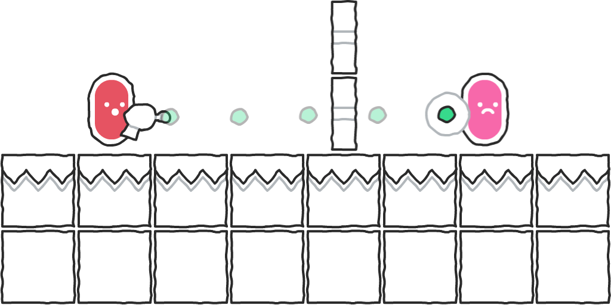
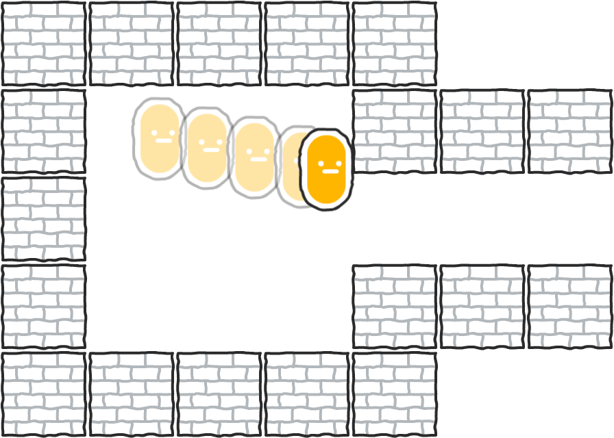
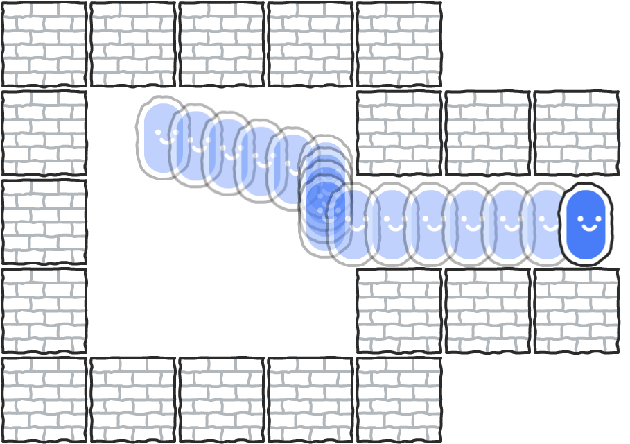

# Moving characters and objects in ct.js

Movement is often the core of any game, and it is essential to know how it works in ct.js. There are numerous approaches to code movement that we will discuss here.

## The basics of movement

### Position

Each object's position is defined by `this.x` and `this.y` parameters. `this.x` increases going from left to right, and `this.y` increases from top to bottom. It is the point of a copy's axis — the point around which a copy rotates and scales.

### Speed

The change of `this.x` and `this.y` properties define the *speed* of objects. If you have `this.speed` equal to 100, it means that a copy will move by 100 pixels at each second. The speed of an object also has direction, which is set by `this.direction` property.

The speed and its direction of an object decompose into vertical and horizontal components. In ct.js, they are defined as `this.vspeed` and `this.hspeed`. When you change `this.vspeed` or `this.hspeed`, `this.speed` and `this.direction` get updated automatically, and the other way around.

### Gravity and acceleration

Copies can be accelerated by gravity with `this.gravity` and `this.gravityDir` parameters. Gravity will change a copy's speed at each frame, enlarging it by `this.gravity` in the given direction for every second.

---

By themselves, only `this.x` and `this.y` affect the visual position of objects. To make the other properties work, ct.js has `this.move()` method and `place` provides `this.moveBullet(cgroup)` and `this.moveSmart(cgroup)`. (`place` module is enabled by default in all new projects.) You also may not need them at all. Due to that, there are several ways to program copies' movement.

## `this.move()`

`this.move()` can be called at the On Step code of any template to make a copy move according to `this.speed` and `this.direction` parameters. It doesn't check for collisions on its own, so you will need to program your collision handling logic with it or use other methods. (See below.) But it may be the only thing you need for, say, arcade space shooters. It is also the way to move bullets and other things that get destroyed on collision.

### Example: Set the speed of a copy according to a player's input and move it.

On Step code:

```js
this.hspeed = actions.MoveX.value * 5;
this.vspeed = actions.MoveY.value * 5;
this.move();
```

### Example: Set the speed and direction of a copy and move it.

On Create code:

```js
this.speed = 15;
this.direction = 90;
```

On Step code:

```js
this.move();
```

### Example: Follow a copy of a template called "Character"

On Step code:

```js
var character = templates.list['Character'][0];
// Check whether the `character` is a valid copy (if it actually exists in the game).
if (templates.valid(character)) {
    this.speed = 300;
    // Compute direction from current location to character's position.
    this.direction = u.pointDirection(this.x, this.y, character.x, character.y);
} else {
    // Stop moving if the character doesn't exist.
    this.speed = 0;
}
this.move();
```

## `this.moveBullet(cgroup)`

`this.moveBullet(cgroup)` is a method from ct.place that checks for collisions while moving copies, and it can be called from On Step code at each frame to precisely move copies with high speed.

If you, for example, have small fast-moving projectiles that fly through considerably narrow walls, the projectiles may fly through these walls. It happens because bullets jump over the walls in one frame, not causing collisions.



To prevent it, you can use `this.moveBullet(cgroup)` to move the projectiles in steps, performing several collision checks at each frame.


`cgroup` is a collision group. There is also a form of the method `this.moveBullet(cgroup, precision)`, where `precision` is the length of each step in pixels. It is set to 1 by default. For fast-moving projectiles, though, you will often set it to a value somewhere between the radius and the diameter of this projectile.

:::warning
Note that you should use `this.moveBullet(cgroup)` sparingly, setting its precision as well, as too many bullets using it will produce so many collision checks that it may slow down your game.
:::

Calling `this.moveBullet(cgroup)` doesn't clip into surfaces — it will stop right next to the obstacle unless this obstacle clips into your copy or this copy gets transformed.

To check whether your copy contacted an obstacle, you can check against a returned result of `this.moveBullet(cgroup)`. It will be `false` when there was no contact, `true` if there was a contact with a tile, and a copy if it was contacted.

### Example: Set the speed and direction of a copy and move it continuously.

On Create code:

```js
this.speed = 15;
this.direction = 90;
```

On Step code:

```js
this.moveBullet('Solid');
```

### Example: Destroy a copy and its obstacle when the copy contacts an obstacle from a collision group "Enemy"

On Create code:

```js
this.speed = 15;
this.direction = 90;
```

On Step code:

```js
var obstacle = this.moveBullet('Solid');
// `obstacle` may also return `true` if there was a contact with a tile.
// You probably will never have a tile with an "Enemy" collision group,
// but let's do an additional check :)
// Make sure that there was an obstacle and it was a copy.
if (obstacle && templates.isCopy(obstacle)) {
    // Contact!
    // The obstacle is a copy, and we can write directly to it.
    obstacle.kill = true;
    this.kill = true;
}
```

## `this.moveSmart(cgroup)`

`this.moveSmart` works mainly in the same way as `this.moveBullet`, as it performs numerous collision checks while moving in a given direction. The difference is that `this.moveSmart` computes collisions on X and Y axes separately, hence the name. It may seem like a minor change, but in the result, we get a "sliding" movement that helps avoid obstacles that happen to come along the way.

Without `this.moveSmart(cgroup)`, a copy will get stuck at the nearest obstacle:



With `this.moveSmart(cgroup)`, it will slide along the obstacle and then continue its way in the initial direction once there are no more obstacles:



Due to that, `moveSmart` is often a go-to solution to moving characters — and even mobs — in a game. Moreover, it works both with platformers and top-down views! For platformers, you only need to reset `this.vspeed` if there is an obstacle underneath. Otherwise, a copy will smash into the nearest platform at first cosmic speed due to accumulating gravity, as soon as it slips off a ledge. Resetting it when there is an obstacle above will also prevent sticking to ceilings :)

`this.moveSmart()` returns values about successful collisions, too. As a copy may still move by one axis whilst being blocked on the other, the method returns one of the following:

* `false` if there were no contacts with obstacles.
* **An object** with `x` and `y` properties if there was at least one contact on either side. Each property may equal to `false` (there was no collision on this axis), `true` (there was a contact with a tile), or some copy.

### Example: Movement for a top-down game with collisions against a group called "Solid"

Assuming you have Actions called MoveX and MoveY.

On Step:

```js
this.vspeed = actions.MoveY.value * 10;
this.hspeed = actions.MoveX.value * 10;
this.moveSmart('Solid');
```

### Example: Movement for a platformer

Assuming you have Actions called MoveX and Jump.

On Create:

```js
this.gravity = 0.5;
this.gravityDir = 270;
```

On Step:

```js
this.hspeed = actions.MoveX.value * 10;

// Is there any ground underneath?
if (place.occupied(this, this.x, this.y + 1, 'Solid')) {
    // Check whether a player wants to jump.
    if (actions.Jump.down) {
        this.vspeed = -15;
    }
}

// Move the copy
const collided = this.moveSmart('Solid');

// Check whether there was a collision, and whether it was on Y axis
if (collided && collided.y) {
    // Reset vertical speed
    this.vspeed = 0;
}
```

## Grid-based movement

To move copies precisely on grids, you usually need to use methods different from those described above. Those three methods are tailored for real-time, free movement and won't snap to the grid pixel-perfectly due to lag compensation and `u.delta`.

There are currently two relatively easy ways to move copies with grid snapping: by changing `x` and `y` values manually or by using the `tween` module.

### Example: Move a copy by 64 pixels on keypress

Assuming that you have actions MoveX and MoveY.

On Step:

```js
// Math.sign returns -1 if the value is negative, and 1 if it is positive.
// actions.ActionName.value returns values from -1 to 1, and everything
// in between when using, for example, a gamepad. Thus we will get either
// -64 or 64 in each dimension.
// For proper setup of actions, see the Actions page at Tips and Tricks.
if (actions.MoveX.pressed) {
    this.x += Math.sign(actions.MoveX.value) * 64;
}
if (actions.MoveY.pressed) {
    this.y += Math.sign(actions.MoveY.value) * 64;
}
```

### Example: Move a copy slowly but stop at grid cells

Assuming that you have actions MoveX and MoveY.
Make sure that your copy is snapped on the grid at the start of a level.

On Step:

```js
// % means "Get the remainder of a division." A 64×64px grid
// divides every axis by 64 pixels.

// If a copy is snapped on the grid...
if (this.x % 64 === 0 && this.y % 64 === 0) {
    // Stop movement
    this.speed = 0;

    // But also, if we press movement keys, apply speed.
    // This will happen if we are snapped on the grid, too,
    // as all the code is inside the `if` clause.
    if (actions.MoveX.pressed) {
        this.hspeed = Math.sign(actions.MoveX.value) * 8;
    }
    if (actions.MoveY.pressed) {
        this.vspeed = Math.sign(actions.MoveY.value) * 8;
    }
}

// Apply movement according to previously set values
this.x += this.hspeed;
this.y += this.vspeed;
```

### Example: Move a copy by a grid with `tween`

`tween` produces smooth animations of values and can be used for grid-based movement. This approach assumes that you have tween enabled at your Project settings -> Catmods and that you have actions called MoveX and MoveY.

On Create:

```js
this.moving = false;
```

On Step:

```js
// If the copy doesn't move yet…
if (!this.moving) {
    // Check for key presses
    if (actions.MoveX.down) {
        // Start moving
        this.moving = true;
        tween.add({
            obj: this,
            fields: {
                x: this.x + Math.sign(actions.MoveX.value) * 64
            },
            duration: 650 // 0.65s
        })
        .then(() => {
            // When the animation is over, change this.moving to tell
            // that the copy is not moving already.
            this.moving = false;
        });
    }
    // Same as above, but for Y axis
    if (actions.MoveY.down) {
        this.moving = true;
        tween.add({
            obj: this,
            fields: {
                y: this.y + Math.sign(actions.MoveY.value) * 64
            },
            duration: 650
        })
        .then(() => {
            this.moving = false;
        });
    }
}
```

## Strategies to avoid clipping into other objects

Say you have a game character that moves in a top-down world and walls that should not let the character pass through. There are two strategies to do the collisions part:

1. Move the character as is, then move it out of possible collisions.
2. Check for collisions first, and then move if there is free space.

`this.moveBullet` and `this.moveSmart` follow the second strategy and are often enough to avoid clipping. But if you are not using these methods, you will either follow the first strategy or check for possible collisions before movement by yourself. Here is how to do it.

### Getting out of collisions

The simplest way to get out of collisions is by jumping to previous coordinates after movement. Every copy has `this.xprev` and `this.yprev`

#### Example: Jump to previous coordinates if there is a collision, to prevent clipping

On Step:

```js
this.move();
if (place.occupied(this, 'Solid')) {
    this.x = this.xprev;
    this.y = this.yprev;
}
```

#### Example: Repel from a collider if a copy got clipped

Sometimes you inevitably get clipped into obstacles if following the strategy "first check for collisions, then move." It can happen from different cases:

* Something bumps into your copy.
* Your copy gets scaled or rotated, clipping inside other objects.
* Objects around you get rotated and scaled.


You can get the obstacle from `place.occupied` and move your copy away from it.

On Step:

```js
const obstacle = place.occupied(this, 'Solid');
// If there was an obstacle and it is a copy…
if (templates.isCopy(obstacle)) {
    // Get the direction from the obstacle to the copy
    const repelDirection = u.pointDirection(obstacle.x, obstacle.y, this.x, this.y);
    // These two lines will move the copy by 3 pixels in the given direction
    this.x += u.ldx(3, repelDirection);
    this.y += u.ldy(3, repelDirection);
} else {
    this.move();
}
```